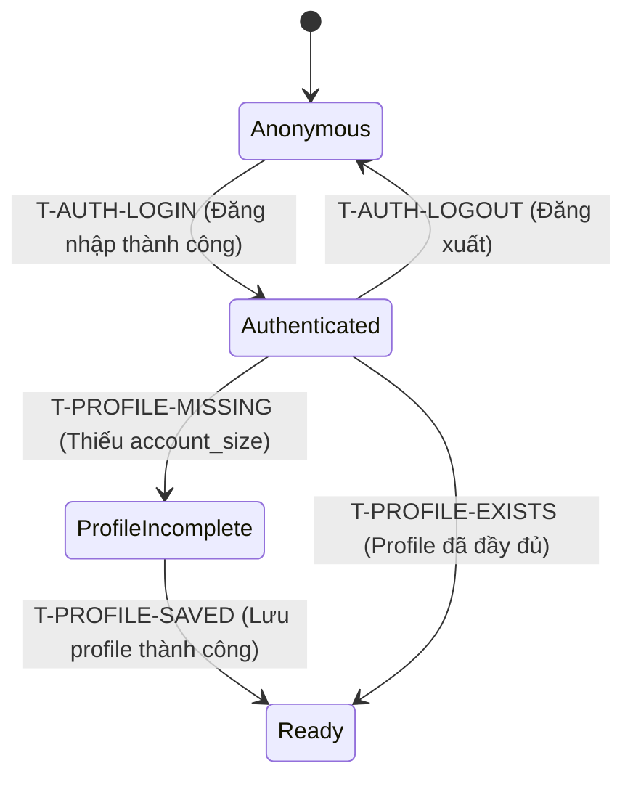

# Đặc tả chức năng: Authentication & User Profile (spec-auth-profile)

Tài liệu này đặc tả chi tiết yêu cầu nghiệp vụ, giao diện, dữ liệu và tiêu chí chấp nhận cho phân hệ Xác thực người dùng (Authentication) và Thiết lập hồ sơ rủi ro (User Profile).

---

## 1. Phạm vi nghiệp vụ (Scope)

### Trong phạm vi MVP:
*   Đăng ký tài khoản bằng Email/Password.
*   Cơ chế xác thực Email (Email verification) bắt buộc để kích hoạt tài khoản.
*   Đăng nhập, Đăng xuất và đặt lại mật khẩu khi quên (Forgot password).
*   Password Policy bảo mật (tối thiểu 8 ký tự, có chữ hoa, chữ thường và chữ số).
*   Thiết lập profile tài chính giao dịch: số dư tài khoản (`account_size`) và mức rủi ro mặc định mỗi lệnh (`default_max_risk_per_trade`).

### Ngoài phạm vi MVP:
*   Đăng nhập bằng bên thứ ba (Google login, Facebook login).
*   Phân quyền quản trị (Admin/Mentor portal).

---

## 2. Quy tắc nghiệp vụ cứng (Business Rules)

| ID | Quy tắc nghiệp vụ | Mã AC tương ứng |
|---|---|---|
| **R-AUTH-1** | Dữ liệu người dùng phải tách biệt theo `user_id`. Người dùng chỉ được phép truy cập và sửa đổi dữ liệu của chính mình. | AC-AUTH-2/v1, AC-NFR-6/v1 |
| **R-AUTH-2** | MVP hỗ trợ đăng ký, đăng nhập, đăng xuất, xác thực email, quên mật khẩu và chính sách mật khẩu. Google login ngoài phạm vi MVP. | AC-AUTH-1/v1, AC-AUTH-3/v1 |
| **R-PROFILE-1** | `account_size` (số dư tài khoản) và `default_max_risk_per_trade` (rủi ro tối đa mỗi lệnh) là dữ liệu bắt buộc để thực hiện tính toán rủi ro tài chính đầy đủ. | AC-PROFILE-1/v1, AC-PROFILE-2/v1 |
| **R-PROFILE-2** | Hệ thống tính toán rủi ro toán học phải sử dụng đúng thông số Profile của user hiện tại đang đăng nhập. | AC-PROFILE-3/v1 |

---

## 3. Bản vẽ màn hình & Luồng UI (Wireframes)

### Màn hình Đăng nhập (Login):
```text
+----------------------------------------------------+
| TRADEMIND AI - LOGIN                               |
|----------------------------------------------------|
|                  [🧠 Psychology Icon]              |
|                      TradeMind AI                  |
|       Master your trading discipline with          |
|       AI-powered coaching.                         |
|                                                    |
| EMAIL ADDRESS                                      |
| [✉ mail   | trader@firm.com                      ] |
|                                                    |
| PASSWORD                             Forgot password?|
| [🔒 lock   | ••••••••                        👁  ] |
|                                                    |
| [x] Remember me for 30 days                        |
|                                                    |
| [ Sign In                                  arrow_f ] |
|                                                    |
| ----------------------- OR ----------------------- |
|                                                    |
| [ G | Sign in with Institutional SSO             ] |
|                                                    |
| New to TradeMind? Create an account                |
|----------------------------------------------------|
| Mandatory Investment Disclaimer:                   |
| Trading financial instruments involves significant  |
| risk. Educational insights only.                   |
+----------------------------------------------------+
```

### Màn hình Đăng ký (Register):
```text
+----------------------------------------------------+
| TRADEMIND AI - CREATE ACCOUNT                      |
|----------------------------------------------------|
|                      TradeMind AI                  |
|       Mastering psychology for market precision.   |
|                                                    |
| Create Account                                     |
| Begin your journey toward disciplined trading.     |
|                                                    |
| FULL NAME                                          |
| [👤 person | Enter your full name                ] |
|                                                    |
| EMAIL ADDRESS                                      |
| [✉ mail   | email@example.com                    ] |
|                                                    |
| PASSWORD                  CONFIRM PASSWORD         |
| [🔒 lock   | ••••••••   ] [🔒 lock_reset | •••••••] |
|                                                    |
| [x] I agree to the Terms of Service and Privacy    |
|     Policy.                                        |
|                                                    |
| [ Create Account                           arrow_f ] |
|                                                    |
| Already have an account? Log in                    |
|----------------------------------------------------|
| Risk Disclosure & Investment Disclaimer:            |
| Trading involves substantial risk of loss.         |
+----------------------------------------------------+
```

### Màn hình Khôi phục mật khẩu (Forgot Password):
```text
+----------------------------------------------------+
| TRADEMIND AI - RECOVER ACCOUNT                     |
|----------------------------------------------------|
|                  [🧠 Psychology Icon]              |
|                      TradeMind AI                  |
|                      Discipline Coach              |
|                                                    |
| Recover Account                                    |
| Enter your email address and we will send you a    |
| link to reset your password.                       |
|                                                    |
| EMAIL ADDRESS                                      |
| [✉ mail   | name@firm.com                        ] |
|                                                    |
| [ Send Reset Link                          arrow_f ] |
|                                                    |
| <- Back to Login                                   |
|----------------------------------------------------|
| Mandatory Investment Disclaimer:                   |
| Trading involves significant risk.                 |
+----------------------------------------------------+
```

### Màn hình Profile Setup / Risk Profile:
```text
+------------------------------------+
| PROFILE / RISK SETUP               |
|------------------------------------|
| Name                 [ Nguyễn Văn A] |
| Email                [readonly@mail] |
| Account size (VND)   [100000000    ] |
| Max risk/trade (%)   [2            ] |
| Trading style        [Swing v      ] |
| Experience level     [Beginner v   ] |
|------------------------------------+
| [Save profile]                     |
+------------------------------------+
```

---

## 4. Dữ liệu & State Transitions

### 4.1 Bảng dữ liệu Users (Trích xuất)
*   `users`: `id` (UUID), `name`, `email` (Unique), `password_hash`, `email_verified_at`, `account_size`, `default_max_risk_per_trade`, `trading_style`, `experience_level`, `created_at`, `updated_at`.

### 4.2 Chuyển đổi trạng thái (Transitions)


---

## 5. Tiêu chí chấp nhận (Acceptance Criteria)

### 5.1 Authentication (AC-AUTH)
*   **AC-AUTH-1/v1:** Người dùng đăng ký được bằng email/password hợp lệ và hệ thống tạo dữ liệu thuộc đúng user đó.
*   **AC-AUTH-2/v1:** Người dùng đăng nhập được bằng email/password đã đăng ký và chỉ nhìn thấy dữ liệu của chính mình.
*   **AC-AUTH-3/v1:** Người dùng đăng xuất thì phiên sử dụng hiện tại không còn truy cập được dữ liệu cá nhân nếu chưa đăng nhập lại.

### 5.2 User Profile (AC-PROFILE)
*   **AC-PROFILE-1/v1:** Người dùng nhập và lưu được account size, max risk/trade, trading style và experience level.
*   **AC-PROFILE-2/v1:** Nếu thiếu account size hoặc max risk/trade thì hệ thống không hiển thị risk_percent như một kết quả đầy đủ.
*   **AC-PROFILE-3/v1:** Hệ thống dùng đúng account size và max risk/trade của user hiện tại khi kiểm tra lệnh.

---

## 6. Bảng truy vết kiểm thử (Traceability Matrix)

| AC | Screen/API | DB | Logs | Permissions | Test type |
|---|---|---|---|---|---|
| **AC-AUTH-1/v1** | Auth screens / POST /auth/register, POST /auth/login | users | auth_access, auth_failure | Owner user | UT · IT · E2E · BB |
| **AC-AUTH-2/v1** | Auth screens / POST /auth/login, POST /auth/logout | users | auth_access, auth_failure | Owner user | UT · IT · E2E · BB |
| **AC-AUTH-3/v1** | Auth screens / POST /auth/logout | users | auth_access | Owner user | IT · E2E · BB |
| **AC-PROFILE-1/v1** | Profile / GET/PUT /profile | users | profile_update | Owner user | UT · IT · E2E · BB |
| **AC-PROFILE-2/v1** | Profile / GET/PUT /profile | users | profile_update | Owner user | UT · IT · E2E · BB |
| **AC-PROFILE-3/v1** | Profile / GET/PUT /profile | users | profile_update | Owner user | UT · IT · E2E · BB |
