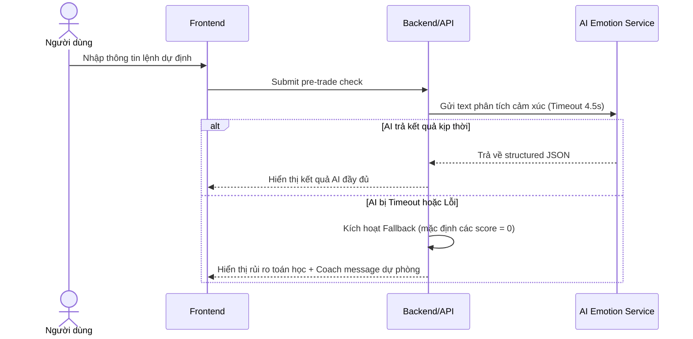

# Đặc tả chức năng: Pre-trade Check & AI Emotion Analysis (spec-pretrade-check-ai)

Tài liệu này đặc tả yêu cầu nghiệp vụ, giao diện, dữ liệu và tiêu chí chấp nhận cho biểu mẫu phân tích trước giao dịch (Pre-trade Check) và phân tích cảm xúc qua AI (Gemini/OpenAI LLM).

---

## 1. Phạm vi nghiệp vụ (Scope)

### Trong phạm vi MVP:
*   Form nhập lệnh dự định: Symbol, Action (BUY/SELL_TO_CLOSE), Price, Quantity, Stop-loss, Take-profit, Reason, Emotion text, Confidence.
*   SELL chỉ hỗ trợ `SELL_TO_CLOSE` (đóng vị thế), không hỗ trợ bán khống.
*   AI đọc text (`reason`, `emotion_text`) để phân loại cảm xúc (FOMO, Panic, Revenge, Overconfidence, Greed, Hesitation) và cho điểm từ 0-10.
*   AI sinh thông điệp kỷ luật (Coach message).
*   AI Guardrails: Cấm tuyệt đối khuyên mua/bán, hứa hẹn lợi nhuận, hoặc dự đoán giá.
*   AI Fallback: Nếu AI lỗi/timeout (đặt ngưỡng 4.5 giây), hệ thống vẫn trả về kết quả rủi ro toán học và rule check từ backend kèm thông điệp fallback.
*   Lưu trữ: Chỉ lưu kết quả cấu trúc JSON của AI thô tối đa 30 ngày. Không lưu full chat transcript cuộc đối thoại AI.

---

## 2. Quy tắc nghiệp vụ cứng (Business Rules)

| ID | Quy tắc nghiệp vụ | Mã AC tương ứng |
|---|---|---|
| **R-TCHECK-1** | Pre-trade check là phân tích trước giao dịch nhằm hỗ trợ tâm lý, không phải lệnh đặt thực tế và không kết nối sàn chứng khoán. | AC-TCHECK-1/v1, AC-REG-1/v1 |
| **R-TCHECK-2** | Kết quả thành công phải trả đầy đủ: discipline_score, risk_level, emotion_scores, rule_violations, risk_calculation, should_cooldown và coach_message. | AC-TCHECK-2/v1 |
| **R-TCHECK-3** | Input đầu vào thiếu/sai phải bị chặn ở mức nghiệp vụ đầu API và hiển thị lỗi cụ thể. | AC-TCHECK-3/v1 |
| **R-EMOTION-1** | AI bắt buộc phải trả về dữ liệu có cấu trúc định dạng JSON thô (Structured JSON Output). | AC-EMOTION-1/v1 |
| **R-EMOTION-2** | Điểm số cảm xúc từ AI phải nằm trên thang từ 0 đến 10 (0-2: Thấp, 3-5: Trung bình, 6-8: Cao, 9-10: Rất cao). | AC-EMOTION-2/v1, AC-EMOTION-3/v1 |
| **R-EMOTION-3** | Nếu AI gặp sự cố kỹ thuật hoặc timeout (4.5s), hệ thống kích hoạt luồng Fallback để tính toán rủi ro toán học và check luật. | AC-EMOTION-5/v1 |
| **R-GUARD-1** | AI coach cấm đưa ra lời khuyên mua/bán mã chứng khoán, cam kết lợi nhuận, all-in, hoặc dự đoán giá chắc chắn. | AC-GUARD-1/v1, AC-REG-2/v1 |
| **R-GUARD-2** | AI được phép cảnh báo FOMO, thiếu stop-loss, vượt rủi ro, và khuyên dừng lại. | AC-GUARD-2/v1 |
| **R-GUARD-3** | Tất cả kết quả check lệnh và báo cáo phải có disclaimer pháp lý mặc định Việt Nam (phiên bản VN-MVP-v1). | AC-GUARD-3/v1 |

---

## 3. Bản vẽ màn hình & Giao diện (Wireframes)

### 3.1 Bố cục giao diện Pre-trade Check (Bento Grid Layout)
Giao diện tuân thủ phong cách **Corporate / Modern** kết hợp **Tactile** accents với tông màu nền xanh đen sâu đậm (#131315) kết hợp các thẻ Acrylic bóng mờ (#1E293B) có viền 1px tinh tế (#334155). 

```text
+---------------------------------------------------------------------------------------------------------+
|  TradeMind AI   |  [Header] TradeMind AI      [Market Data] [Performance] [Analytics]    [Search] [Notif] [Av] |
|  Discipline     +---------------------------------------------------------------------------------------+
|  Coach          |  Pre-trade Discipline Check                                                           |
|  ---------------+  This is your behavioral mirror...                     Session Discipline Score: [ 92 ] |
|  [ ] Dashboard  +------------------------------------------------------+--------------------------------+
|  [*] Pre-trade  | [Icon] Trade Configuration                           | [Icon] Risk Guardrails         |
|  [ ] Journal    | Ticker Symbol: [ HPG      ]                          | Stop-Loss: [ Required      ]   |
|  [ ] Rules      | Action Type:   [ BUY ] [ SELL ]                      | [!] Executing without SL is... |
|  [ ] Settings   | Entry Price:   [ 28500    ]                          | Take-Profit: [ 31000    ]      |
|                 | Quantity:      [ 1000     ]                          | Risk/Reward Ratio: [ 1:2.4 ]   |
|  +------------+ +------------------------------------------------------+--------------------------------+
|  | Log Trade  | | [Icon] Strategic Rationale                           | [Icon] Mental State            |
|  +------------+ | Primary Reason for Trade:                            | How are you feeling right now? |
|                 | [ Describe the setup, timeframe...                 ] | [ Be honest. Are you chasing? ]|
|  [ ] Support    |                                                      | Tags: [Calm] [FOMO] [Frustrated]|
|  [ ] Sign Out   | Conviction Level: [--------*---] 7/10                |                                |
+-----------------+------------------------------------------------------+--------------------------------+
|                 | [Check] AI is ready to analyze...                        [Save as Draft] [Analyze Trade] |
+---------------------------------------------------------------------------------------------------------+
```

### 3.2 Đặc tả các khối thành phần (Component Specifications)

1. **Thanh điều hướng bên trái (Sidebar Navigation):**
   * **Logo & Brand:** `TradeMind AI` đi kèm nhãn phụ `Discipline Coach` viết hoa dạng nhỏ.
   * **Menu liên kết:** Dashboard, Pre-trade Check (đang active), Trade Journal, Trading Rules, Settings.
   * **Nút Action:** "Log New Trade" màu ngọc lục bảo (Emerald) có micro-interaction chuyển đổi tỷ lệ co giãn khi click.
   * **Liên kết phụ:** Support và Sign Out.

2. **Thanh công cụ phía trên (Header):**
   * **Tiêu đề phân hệ:** `TradeMind AI` chữ đậm, kích thước lớn.
   * **Sub-nav liên kết:** Market Data, Performance, Analytics.
   * **Tìm kiếm:** Input tròn tích hợp icon tìm kiếm và placeholder `"Search tickers..."`.
   * **Khu vực User:** Nút bật tắt thông báo chuông và ảnh đại diện Avatar hình tròn.

3. **Tiêu đề trang & Điểm Kỷ luật (Header Section):**
   * Tiêu đề chính: `Pre-trade Discipline Check` chữ đậm nổi bật.
   * Dòng mô tả: *"This is your behavioral mirror. Before executing, ensure your rationale outweighs your impulse. Total objectivity is the only edge."*
   * **Điểm Kỷ luật Phiên (Session Discipline Score):** Widget hiển thị điểm số lớn (ví dụ: `92` - Emerald) ở góc phải màn hình desktop để biểu thị mức độ kiểm soát kỷ luật hiện tại.

4. **Khối cấu hình giao dịch (Trade Configuration Card - 7 cột):**
   * **Ticker Symbol:** Ô nhập mã cổ phiếu (phông chữ `JetBrains Mono` đơn sắc).
   * **Action Type:** Nút chọn chuyển đổi BUY (màu xanh dương đậm `#3B82F6`) và SELL (màu đỏ Rose `#F43F5E`).
   * **Entry Price & Quantity:** Ô nhập giá vào vị thế và khối lượng giao dịch.

5. **Khối lý thuyết chiến lược (Strategic Rationale Card - 7 cột):**
   * **Primary Reason for Trade:** Hộp nhập liệu lớn dạng textarea cho phép nhập lý do mở lệnh.
   * **Conviction Level:** Thanh trượt (Slider range) chọn mức độ tự tin từ `0` (Speculative) đến `10` (High Certainty).

6. **Khối quản trị rủi ro (Risk Guardrails Card - 5 cột):**
   * **Stop-Loss:** Ô nhập điểm cắt lỗ bắt buộc. Nếu để trống hoặc nhập `0`, hiển thị cảnh báo vi phạm màu đỏ: `DANGER: Executing without SL is a violation of Rule #1.`
   * **Take-Profit:** Ô nhập điểm chốt lời mục tiêu.
   * **Risk/Reward Ratio:** Tự động tính toán tỷ lệ Lợi nhuận/Rủi ro hiển thị dạng số đơn sắc (ví dụ: `1:2.4` màu xanh lục).

7. **Khối trạng thái tâm lý (Mental State Card - 5 cột):**
   * **How are you feeling right now?:** Hộp nhập liệu lớn dạng textarea để mô tả trung thực tâm lý hiện tại.
   * **Feeling Tags:** Các chip nhãn gắn sẵn (Calm, FOMO, Determined, Frustrated) để gán nhanh trạng thái cảm xúc.

8. **Chân trang hành động (Footer Action Bar):**
   * Thiết kế dạng thanh nổi trong suốt (glassmorphism) đè trên nội dung chính.
   * Nút lưu nháp (`Save as Draft`).
   * Nút phân tích lệnh (`Analyze Trade`) sử dụng hiệu ứng phát sáng neon màu primary khi hover.

### 3.3 Hộp thoại Phân tích AI & Khóa kỷ luật (Soft Cooldown Overlay)

Khi người dùng nhấn `Analyze Trade`, hệ thống sẽ kích hoạt một màn hình phủ mờ toàn trang (backdrop blur 12px) để xử lý dữ liệu:

1. **Trạng thái Loading (Phân tích):**
   * Hiển thị vòng xoay spinner vô hạn chuyển màu cùng văn bản: *"Analyzing Psychological Edge... Deconstructing trade rationale against historic behavioral biases."*

2. **Trạng thái Cảnh báo Kỷ luật (Soft Cooldown Triggered):**
   * Nếu phát hiện lỗi hành vi (ví dụ: giao dịch trả thù - Revenge Trading), màn hình chuyển sang trạng thái cảnh báo hổ phách:
     * **Tiêu đề:** `Soft Cooldown Triggered` kèm icon cảnh báo.
     * **Nội dung lý giải cảm xúc:** Trích xuất đoạn phân tích của AI: *"Your description suggests a 'Revenge Trade' pattern. You mentioned a previous loss 14 minutes ago. This trade entry is aggressive."*
     * **Câu hỏi phản tỉnh bắt buộc (Reflective Question):** Hộp nhập liệu dạng textarea bắt buộc người dùng nhập suy nghĩ trước câu hỏi phản tỉnh: *"Does this trade meet 100% of your pre-defined strategy rules, or is it an emotional reaction?"*
     * **Nút điều hướng:** Nút hủy lệnh (`Cancel Trade`) và nút xác nhận tiếp tục (`Acknowledge & Proceed`) có độ trễ hoặc ràng buộc nhập câu hỏi phản tỉnh mới được kích hoạt.

---

## 4. Dữ liệu & State Transitions

### 4.1 Bảng dữ liệu Emotion Logs
*   `emotion_logs`: `id`, `user_id`, `trade_id`, `reason`, `emotion_text`, `emotion_tags`, `fomo_score`, `panic_score`, `revenge_score`, `overconfidence_score`, `greed_score`, `hesitation_score`, `discipline_risk`, `coach_message`, `raw_ai_response`, `created_at`.

### 4.2 Luồng Sequence xử lý AI và Fallback


---

## 5. Tiêu chí chấp nhận (Acceptance Criteria)

### 5.1 Pre-trade Check (AC-TCHECK)
*   **AC-TCHECK-1/v1:** Gửi được check với đầy đủ trường dữ liệu.
*   **AC-TCHECK-2/v1:** Kết quả check trả về đủ 7 trường đầu ra khi xử lý thành công.
*   **AC-TCHECK-3/v1:** Chặn lỗi input thiếu/sai định dạng.
*   **AC-TCHECK-4/v1:** Có thể lưu kết quả vào Trade Journal hoặc chỉnh sửa lại form.
*   **AC-TCHECK-5/v1:** Check không tự động đặt lệnh và không tự tạo khuyến nghị mua/bán.

### 5.2 Emotion Analysis (AC-EMOTION)
*   **AC-EMOTION-1/v1:** Trả về cấu trúc JSON đúng định dạng.
*   **AC-EMOTION-2/v1 / 3/v1 / 4/v1:** Câu có dấu hiệu rõ ràng được chấm điểm cao tương ứng.
*   **AC-EMOTION-5/v1:** AI lỗi không làm mất kết quả tính toán toán học.

### 5.3 AI Guardrails (AC-GUARD)
*   **AC-GUARD-1/v1:** AI coach không đưa khuyến nghị đầu tư/mua bán cụ thể.
*   **AC-GUARD-2/v1:** AI được phép đưa cảnh báo kỷ luật.
*   **AC-GUARD-3/v1:** Hiển thị disclaimer mặc định VN-MVP-v1 trên các trang kết quả/báo cáo.
*   **AC-GUARD-4/v1:** Log AI response lưu trữ tối đa 30 ngày phục vụ audit.

---

## 6. Bảng truy vết kiểm thử (Traceability Matrix)

| AC | Screen/API | DB | Logs | Permissions | Test type |
|---|---|---|---|---|---|
| **AC-TCHECK-1/v1** | POST /trade-check | users, rules | trade_check_requested | Owner user | UT · IT · E2E · BB |
| **AC-TCHECK-2/v1** | POST /trade-check | users, rules | trade_check_result | Owner user | UT · IT · E2E · BB |
| **AC-TCHECK-3/v1** | POST /trade-check | N/A | N/A | Owner user | UT · IT · E2E · BB |
| **AC-EMOTION-1/v1** | AI Emotion Service | emotion_logs | ai_request, ai_response | Service audit | UT · IT · BB |
| **AC-EMOTION-5/v1** | POST /trade-check | emotion_logs | ai_timeout | Owner user | UT · IT · E2E · BB |
| **AC-GUARD-1/v1** | AI Response Audit | emotion_logs | guardrail_violation_detected | Audit role | UT · IT · E2E · BB |
| **AC-GUARD-3/v1** | Frontend screens | N/A | N/A | Owner user | IT · E2E · BB |
