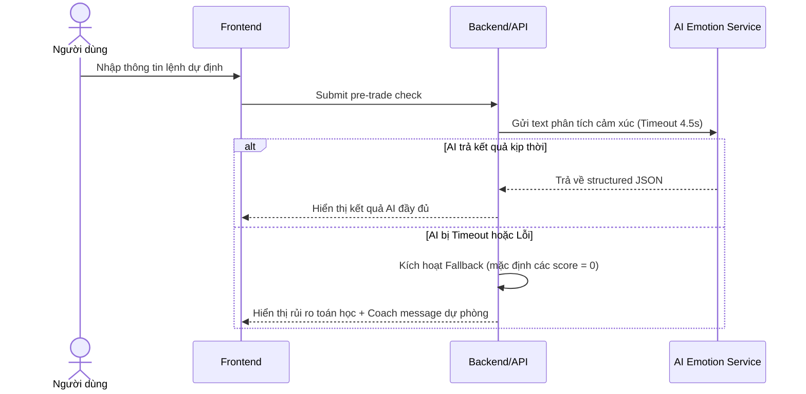

# Đặc tả chức năng: Pre-trade Check & AI Emotion Analysis (spec-pretrade-check-ai)

Tài liệu này đặc tả yêu cầu nghiệp vụ, giao diện, dữ liệu và tiêu chí chấp nhận cho biểu mẫu phân tích trước giao dịch (Pre-trade Check) và phân tích cảm xúc qua AI (Gemini/OpenAI LLM).

---

## 1. Phạm vi nghiệp vụ (Scope)

### Trong phạm vi MVP:
*   Form nhập lệnh dự định: Symbol, Action (BUY/SELL_TO_CLOSE), Price, Quantity, Stop-loss, Take-profit, Reason, Emotion text, Confidence.
*   SELL chỉ hỗ trợ `SELL_TO_CLOSE` (đóng vị thế), không hỗ trợ bán khống.
*   AI đọc text (`reason`, `emotion_text`) để phân loại cảm xúc (FOMO, Panic, Revenge, Overconfidence, Greed, Hesitation) và cho điểm từ 0-10.
*   AI sinh thông điệp kỷ luật (Coach message).
*   AI Guardrails: Cấm tuyệt đối khuyên mua/bán, hứa hẹn lợi nhuận, hoặc dự đoán giá.
*   AI Fallback: Nếu AI lỗi/timeout (đặt ngưỡng 4.5 giây), hệ thống vẫn trả về kết quả rủi ro toán học và rule check từ backend kèm thông điệp fallback.
*   Lưu trữ: Chỉ lưu kết quả cấu trúc JSON của AI thô tối đa 30 ngày. Không lưu full chat transcript cuộc đối thoại AI.

---

## 2. Quy tắc nghiệp vụ cứng (Business Rules)

| ID | Quy tắc nghiệp vụ | Mã AC tương ứng |
|---|---|---|
| **R-TCHECK-1** | Pre-trade check là phân tích trước giao dịch nhằm hỗ trợ tâm lý, không phải lệnh đặt thực tế và không kết nối sàn chứng khoán. | AC-TCHECK-1/v1, AC-REG-1/v1 |
| **R-TCHECK-2** | Kết quả thành công phải trả đầy đủ: discipline_score, risk_level, emotion_scores, rule_violations, risk_calculation, should_cooldown và coach_message. | AC-TCHECK-2/v1 |
| **R-TCHECK-3** | Input đầu vào thiếu/sai phải bị chặn ở mức nghiệp vụ đầu API và hiển thị lỗi cụ thể. | AC-TCHECK-3/v1 |
| **R-EMOTION-1** | AI bắt buộc phải trả về dữ liệu có cấu trúc định dạng JSON thô (Structured JSON Output). | AC-EMOTION-1/v1 |
| **R-EMOTION-2** | Điểm số cảm xúc từ AI phải nằm trên thang từ 0 đến 10 (0-2: Thấp, 3-5: Trung bình, 6-8: Cao, 9-10: Rất cao). | AC-EMOTION-2/v1, AC-EMOTION-3/v1 |
| **R-EMOTION-3** | Nếu AI gặp sự cố kỹ thuật hoặc timeout (4.5s), hệ thống kích hoạt luồng Fallback để tính toán rủi ro toán học và check luật. | AC-EMOTION-5/v1 |
| **R-GUARD-1** | AI coach cấm đưa ra lời khuyên mua/bán mã chứng khoán, cam kết lợi nhuận, all-in, hoặc dự đoán giá chắc chắn. | AC-GUARD-1/v1, AC-REG-2/v1 |
| **R-GUARD-2** | AI được phép cảnh báo FOMO, thiếu stop-loss, vượt rủi ro, và khuyên dừng lại. | AC-GUARD-2/v1 |
| **R-GUARD-3** | Tất cả kết quả check lệnh và báo cáo phải có disclaimer pháp lý mặc định Việt Nam (phiên bản VN-MVP-v1). | AC-GUARD-3/v1 |

---

## 3. Bản vẽ màn hình & Giao diện (Wireframes)

### Màn hình Nhập lệnh (Pre-trade Check):
```text
+------------------------------+
| PRE-TRADE CHECK              |
|------------------------------|
| Symbol         [ HPG      ]  |
| Action         [ BUY v    ]  |
| Entry Price    [ 28500    ]  |
| Quantity       [ 1000     ]  |
| Stop-loss      [ 27200    ]  |
| Take-profit    [ 31000    ]  |
| Reason         [ ...      ]  |
| Emotion text   [ ...      ]  |
| Confidence     [ 7/10     ]  |
|------------------------------|
| [Analyze trade]              |
+------------------------------+
```

---

## 4. Dữ liệu & State Transitions

### 4.1 Bảng dữ liệu Emotion Logs
*   `emotion_logs`: `id`, `user_id`, `trade_id`, `reason`, `emotion_text`, `emotion_tags`, `fomo_score`, `panic_score`, `revenge_score`, `overconfidence_score`, `greed_score`, `hesitation_score`, `discipline_risk`, `coach_message`, `raw_ai_response`, `created_at`.

### 4.2 Luồng Sequence xử lý AI và Fallback


---

## 5. Tiêu chí chấp nhận (Acceptance Criteria)

### 5.1 Pre-trade Check (AC-TCHECK)
*   **AC-TCHECK-1/v1:** Gửi được check với đầy đủ trường dữ liệu.
*   **AC-TCHECK-2/v1:** Kết quả check trả về đủ 7 trường đầu ra khi xử lý thành công.
*   **AC-TCHECK-3/v1:** Chặn lỗi input thiếu/sai định dạng.
*   **AC-TCHECK-4/v1:** Có thể lưu kết quả vào Trade Journal hoặc chỉnh sửa lại form.
*   **AC-TCHECK-5/v1:** Check không tự động đặt lệnh và không tự tạo khuyến nghị mua/bán.

### 5.2 Emotion Analysis (AC-EMOTION)
*   **AC-EMOTION-1/v1:** Trả về cấu trúc JSON đúng định dạng.
*   **AC-EMOTION-2/v1 / 3/v1 / 4/v1:** Câu có dấu hiệu rõ ràng được chấm điểm cao tương ứng.
*   **AC-EMOTION-5/v1:** AI lỗi không làm mất kết quả tính toán toán học.

### 5.3 AI Guardrails (AC-GUARD)
*   **AC-GUARD-1/v1:** AI coach không đưa khuyến nghị đầu tư/mua bán cụ thể.
*   **AC-GUARD-2/v1:** AI được phép đưa cảnh báo kỷ luật.
*   **AC-GUARD-3/v1:** Hiển thị disclaimer mặc định VN-MVP-v1 trên các trang kết quả/báo cáo.
*   **AC-GUARD-4/v1:** Log AI response lưu trữ tối đa 30 ngày phục vụ audit.

---

## 6. Bảng truy vết kiểm thử (Traceability Matrix)

| AC | Screen/API | DB | Logs | Permissions | Test type |
|---|---|---|---|---|---|
| **AC-TCHECK-1/v1** | POST /trade-check | users, rules | trade_check_requested | Owner user | UT · IT · E2E · BB |
| **AC-TCHECK-2/v1** | POST /trade-check | users, rules | trade_check_result | Owner user | UT · IT · E2E · BB |
| **AC-TCHECK-3/v1** | POST /trade-check | N/A | N/A | Owner user | UT · IT · E2E · BB |
| **AC-EMOTION-1/v1** | AI Emotion Service | emotion_logs | ai_request, ai_response | Service audit | UT · IT · BB |
| **AC-EMOTION-5/v1** | POST /trade-check | emotion_logs | ai_timeout | Owner user | UT · IT · E2E · BB |
| **AC-GUARD-1/v1** | AI Response Audit | emotion_logs | guardrail_violation_detected | Audit role | UT · IT · E2E · BB |
| **AC-GUARD-3/v1** | Frontend screens | N/A | N/A | Owner user | IT · E2E · BB |
