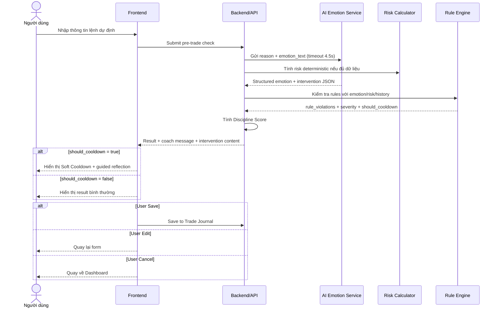

# Đặc tả module — Pre-trade Check, AI Emotion Analysis & AI Emotion Intervention Layer

> Module: `spec-pretrade-check-ai`  
> Thuộc Spec Pack cha: `../spec-pack.md`  
> Vai trò: Source of Truth chi tiết cho Pre-trade Check, AI Emotion Analysis, AI Guardrails, AI Fallback và AI Emotion Intervention Layer.

---

## 1. Phạm vi nghiệp vụ

### 1.1 Trong phạm vi MVP

- Form nhập lệnh dự định: Symbol, Action, Entry/Sell price, Quantity, Stop-loss, Take-profit, Reason, Emotion text, Confidence.
- Action hỗ trợ: `BUY`, `SELL_TO_CLOSE`.
- `SELL_TO_CLOSE` là bán/thoát vị thế đang có; không hỗ trợ bán khống.
- AI đọc `reason` và `emotion_text` để phân loại cảm xúc và trả structured JSON.
- AI chấm điểm: FOMO, Panic, Revenge, Overconfidence, Greed, Hesitation.
- AI sinh coach message an toàn.
- AI Emotion Intervention Layer tạo reflection questions, automatic thought, reframed thought, if-then plan khi cần.
- AI timeout 4.5 giây thì fallback.
- Chỉ lưu structured output; raw_ai_response lưu tối đa 30 ngày; không lưu full chat transcript.
- Kết quả phải hiển thị disclaimer VN-MVP-v1.

### 1.2 Ngoài phạm vi MVP

- AI khuyến nghị mua/bán/nắm giữ mã cổ phiếu.
- AI dự đoán chắc chắn xu hướng giá.
- AI cam kết lợi nhuận.
- AI tính risk_amount/risk_percent.
- Full AI chat history.
- Hard cooldown hoặc chặn user thao tác.
- Tự động đặt lệnh hoặc kết nối broker.

---

## 2. Quy tắc nghiệp vụ

| ID | Rule | AC |
|----|------|----|
| R-TCHECK-1 | Pre-trade Check là phân tích trước giao dịch, không phải lệnh đặt thực tế. | AC-TCHECK-1/v1, AC-TCHECK-5/v1 |
| R-TCHECK-2 | Result thành công phải trả đủ discipline_score, risk_level, emotion_scores, rule_violations, risk_calculation, should_cooldown, coach_message. | AC-TCHECK-2/v1 |
| R-TCHECK-3 | Input thiếu/sai phải bị chặn và trả lỗi field. | AC-TCHECK-3/v1 |
| R-EMOTION-1 | AI bắt buộc trả structured JSON parse được. | AC-EMOTION-1/v1 |
| R-EMOTION-2 | Emotion score nằm trong 0-10; 0-2 thấp, 3-5 trung bình, 6-8 cao, 9-10 rất cao. | AC-EMOTION-2/v1 |
| R-EMOTION-3 | AI lỗi/timeout 4.5s thì fallback; risk/rule deterministic vẫn xử lý nếu đủ dữ liệu. | AC-EMOTION-5/v1 |
| R-PROMPT-1 | AI Emotion Service phải dùng prompt namespace/version được đặc tả và trả output theo JSON schema đã khóa. | AC-PROMPT-1/v1, AC-PROMPT-2/v1 |
| R-PROMPT-2 | Backend phải validate/sanitize AI response trước khi trả UI hoặc lưu DB; output vi phạm guardrail phải bị thay bằng fallback an toàn. | AC-PROMPT-3/v1, AC-PROMPT-4/v1 |
| R-INTERVENTION-1 | Khi cảm xúc cao hoặc should_cooldown=true, AI phải tạo intervention content nếu AI response hợp lệ. | AC-INTERVENTION-1/v1, AC-INTERVENTION-3/v1 |
| R-INTERVENTION-2 | Intervention content chỉ được hướng đến tự kiểm tra cảm xúc, kế hoạch, rủi ro và kỷ luật; không được khuyến nghị mua/bán. | AC-INTERVENTION-2/v1, AC-INTERVENTION-4/v1 |
| R-GUARD-1 | AI coach cấm khuyên mua/bán/nắm giữ, all-in, cam kết lợi nhuận, dự đoán chắc chắn giá. | AC-GUARD-1/v1 |
| R-GUARD-2 | AI được phép cảnh báo FOMO, thiếu stop-loss, vượt rủi ro, không phù hợp rule, cần tạm dừng. | AC-GUARD-2/v1 |
| R-GUARD-3 | Result/Report phải có disclaimer VN-MVP-v1. | AC-GUARD-3/v1 |
| R-STORAGE-1 | Không lưu full chat transcript. raw_ai_response lưu tối đa 30 ngày. | AC-GUARD-4/v1 |

---

## 3. Input form

### 3.1 Input fields

| Field | Required | Rule |
|-------|----------|------|
| symbol | Có | Không rỗng. |
| action | Có | `BUY` hoặc `SELL_TO_CLOSE`. |
| entry_price | Có với BUY | Số dương. |
| sell_price | Có với SELL_TO_CLOSE | Số dương. |
| quantity | Có | Số nguyên dương. |
| stop_loss | Không bắt buộc, nhưng BUY thiếu sẽ cảnh báo | Với BUY nếu có thì `< entry_price`. |
| take_profit | Không bắt buộc | Nếu có thì số dương. |
| average_entry_price | Có với SELL_TO_CLOSE nếu muốn estimated P/L | Số dương. |
| reason | Có | Cơ sở để AI đánh giá kế hoạch. |
| emotion_text | Có | Cơ sở để AI đánh giá cảm xúc. |
| confidence_level | Có | 0-10. |

### 3.2 Wireframe

Bố cục giao diện tuân thủ phong cách **Corporate / Modern** kết hợp **Tactile** accents dựa trên tài liệu thiết kế tại [DESIGN.md](file:///d:/Traider/docs/changes/pretrade/raw/DESIGN.md) và mã nguồn mẫu [code.html](file:///d:/Traider/docs/changes/pretrade/raw/code.html).

#### 3.2.1 Giao diện chính (Pre-trade Check Form - Bento Grid 12-Column)
- **Nền ứng dụng (Background):** Màu xanh đen sâu đậm (`#131315`).
- **Sidebar & Header:** Khung điều hướng bên trái (`#0F172A`) cố định rộng 256px (`w-64`) và topbar (`#131315`) có viền 1px (`#334155`).
- **Bento Grid:** Gồm 12 cột cho phần nội dung chính, chia làm 2 phần lớn (Trái: 7 cột, Phải: 5 cột):
  - **Cột trái (col-span-7):**
    - **Trade Configuration Card:** Cấu hình lệnh bao gồm ô nhập Ticker Symbol (HPG), Action Type dạng toggle (BUY/SELL), Entry Price (có prefix `$`), và Quantity.
    - **Strategic Rationale Card:** Trường nhập lý do giao dịch (Textarea) và Thước đo độ tự tin (Conviction Level slider từ 0 đến 10).
  - **Cột phải (col-span-5):**
    - **Risk Guardrails Card:** Quản trị rủi ro bao gồm trường nhập Stop-Loss (Hard Exit), Take-Profit (Target), và tính toán tự động tỷ lệ Risk/Reward Ratio. Khi thiếu Stop-loss, hệ thống hiển thị cảnh báo đỏ nổi bật.
    - **Mental State Card:** Trường mô tả trạng thái tâm lý và cảm xúc của bản thân (Textarea) kèm các nhãn chọn nhanh (Calm, FOMO, Determined, Frustrated).

```text
+---------------------------------------------------------------------------------------------------------+
|  TradeMind AI   |  [Header] TradeMind AI      [Market Data] [Performance] [Analytics]    [Search] [Notif] [Av] |
|  Discipline     +---------------------------------------------------------------------------------------+
|  Coach          |  Pre-trade Discipline Check                                                           |
|  ---------------+  This is your behavioral mirror...                     Session Discipline Score: [ 92 ] |
|  [ ] Dashboard  +------------------------------------------------------+--------------------------------+
|  [*] Pre-trade  | [Icon] Trade Configuration                           | [Icon] Risk Guardrails         |
|  [ ] Journal    | Ticker Symbol: [ HPG      ]                          | Stop-Loss: [ Required      ]   |
|  [ ] Rules      | Action Type:   [ BUY ] [ SELL ]                      | [!] Executing without SL is... |
|  [ ] Settings   | Entry Price:   [ 28500    ]                          | Take-Profit: [ 31000    ]      |
|                 | Quantity:      [ 1000     ]                          | Risk/Reward Ratio: [ 1:2.4 ]   |
|  +------------+ +------------------------------------------------------+--------------------------------+
|  | Log Trade  | | [Icon] Strategic Rationale                           | [Icon] Mental State            |
|  +------------+ | Primary Reason for Trade:                            | How are you feeling right now? |
|                 | [ Describe the setup, timeframe...                 ] | [ Be honest. Are you chasing? ]|
|  [ ] Support    |                                                      | Tags: [Calm] [FOMO] [Frustrated]|
|  [ ] Sign Out   | Conviction Level: [--------*---] 7/10                |                                |
| +-----------------+------------------------------------------------------+--------------------------------+
|                 | [Check] AI is ready to analyze...                        [Save as Draft] [Analyze Trade] |
+---------------------------------------------------------------------------------------------------------+
```

#### 3.2.2 Giao diện Trạng thái Phân tích (Loading State & Soft Cooldown Overlay)
Khi người dùng bấm **Analyze Trade**, hệ thống sẽ kích hoạt một màn hình phủ (Overlay modal) toàn màn hình:
1. **Trạng thái Loading (Đang phân tích):** Hiển thị vòng tròn xoay động (Spinner) cùng tiêu đề *"Analyzing Psychological Edge..."* và mô tả *"Deconstructing trade rationale against historic behavioral biases."*.
2. **Trạng thái Soft Cooldown (Kích hoạt kỷ luật):** Nếu điểm cảm xúc `panic_score`, `revenge_score`, hoặc `fomo_score >= 8`, hệ thống hiển thị bảng cảnh báo Soft Cooldown và yêu cầu trả lời câu hỏi phản tỉnh bắt buộc (Mandatory Reflection Question).

```text
+---------------------------------------------------------------------------+
|                                                                           |
|                       [!] Soft Cooldown Triggered                         |
|                                                                           |
|     +---------------------------------------------------------------+     |
|     | AI Coaching Diagnosis:                                        |     |
|     | "Your description suggests a 'Revenge Trade' pattern.         |     |
|     |  You mentioned a previous loss 14 minutes ago.                |     |
|     |  This trade entry is aggressive."                             |     |
|     |                                                               |     |
|     | Mandatory Reflection Question:                                |     |
|     | [!] Does this trade meet 100% of your pre-defined strategy     |     |
|     |     rules, or is it an emotional reaction?                    |     |
|     |                                                               |     |
|     | [ Type your reflection answer here...                       ] |     |
|     +---------------------------------------------------------------+     |
|                                                                           |
|     [ Cancel Trade ]                         [ Acknowledge & Proceed ]    |
|                                                                           |
+---------------------------------------------------------------------------+
```

#### 3.2.3 Đặc tả các tham số thiết kế (Design Tokens)
Dựa trên hệ thống thiết kế tại [DESIGN.md](file:///d:/Traider/docs/changes/pretrade/raw/DESIGN.md):
- **Bảng màu (Colors):**
  - Nền chính (Canvas Background): `#131315`
  - Thẻ Acrylic bóng mờ (Surface Card): `#1E293B`
  - Viền thẻ (Surface Border): `#334155`
  - Màu chính (Primary - Accent): `#BEC6E0`
  - Cảnh báo rủi ro cao (Status High Risk): `#F43F5E` (áp dụng cho cảnh báo thiếu Stop-Loss, viền thẻ vi phạm)
  - Cooldown/Cảnh báo vừa (Status Caution): `#F59E0B` (áp dụng cho icon cảnh báo trong Soft Cooldown)
  - Trạng thái tốt (Status Good): `#10B981` (áp dụng cho tỷ lệ Risk/Reward, điểm kỷ luật cao)
  - Nút Mua (Action BUY): `#3B82F6` / Nút Bán (Action SELL): `#F43F5E`
- **Typography:**
  - Font chữ chính: **Inter** (cho văn bản thường, nhãn, tiêu đề).
  - Font số liệu: **JetBrains Mono** (cho Symbol, Entry Price, Quantity, Stop-Loss, Take-Profit, Risk/Reward Ratio).
  - Cỡ chữ & Trọng số:
    - Điểm Kỷ luật chính (Display Score): 48px, bold, line-height 56px.
    - Tiêu đề Card (Headline MD): 24px, semi-bold, line-height 32px.
    - Nhãn input (Label Caps): 12px, semi-bold, uppercase, letter-spacing 0.05em.
- **Bo góc (Rounded corners):**
  - Các ô nhập dữ liệu, nút bấm: 4px (`0.25rem`).
  - Các thẻ Acrylic (Cards): 8px (`0.5rem`).
  - Nút chuyển đổi (Toggle): bo tròn hoàn toàn (`9999px` hoặc `0.75rem`).
- **Hiệu ứng lớp phủ (Elevation & Depth):**
  - Soft Cooldown Overlay sử dụng lớp phủ làm mờ hậu cảnh `backdrop-filter: blur(12px)` kết hợp với lớp phủ tối mờ bán trong suốt nhằm thu hút sự tập trung cao độ của người dùng vào câu hỏi phản tỉnh.

---

## 4. AI Emotion Analysis

### 4.1 Emotion types

| Emotion | Ý nghĩa | Score |
|---------|---------|-------|
| FOMO | Sợ bỏ lỡ, muốn vào nhanh. | 0-10 |
| Panic | Hoảng loạn khi thị trường/lệnh biến động. | 0-10 |
| Revenge trading | Muốn gỡ lỗ sau thua lỗ. | 0-10 |
| Overconfidence | Quá tự tin, xem nhẹ rủi ro. | 0-10 |
| Greed | Tham lợi nhuận, tăng vị thế vì kỳ vọng. | 0-10 |
| Hesitation | Do dự, thiếu rõ ràng. | 0-10 |
| Denial | Phủ nhận khả năng sai/lỗ. | tag optional |
| Urgency | Cảm giác phải hành động ngay. | tag optional |
| Fear | Lo sợ chung. | tag optional |

### 4.2 Structured output tối thiểu

```json
{
  "emotion_tags": ["FOMO", "Urgency"],
  "fomo_score": 8,
  "panic_score": 1,
  "revenge_score": 0,
  "overconfidence_score": 4,
  "greed_score": 3,
  "hesitation_score": 1,
  "discipline_risk": "high",
  "should_cooldown": true,
  "reason": "User expresses fear of missing out and urgency.",
  "coach_message": "Bạn đang có dấu hiệu FOMO cao. Hãy kiểm tra lại kế hoạch và mức rủi ro trước khi quyết định."
}
```

---

---

## 5. AI Prompt Templates

**Mục tiêu:** khóa các prompt nghiệp vụ tối thiểu để AI Emotion Service sinh output ổn định, kiểm thử được và không vượt guardrails. Prompt có thể được tinh chỉnh wording trong implementation, nhưng không được thay đổi intent, forbidden content, JSON contract hoặc business constraints nếu chưa cập nhật spec.

### 5.1 Prompt ownership & versioning

| Thuộc tính | Quy định |
|------------|----------|
| Prompt namespace | `AI-EMOTION-PRETRADE` |
| Prompt version MVP | `v1` |
| Ngôn ngữ output mặc định | Tiếng Việt |
| Output format | JSON thuần, không Markdown, không code fence |
| Model role | Trading Discipline Coach, không phải cố vấn đầu tư |
| Người sở hữu nghiệp vụ | Product/BA |
| Người sở hữu kỹ thuật | AI/Prompt Engineer + Backend |
| Guardrail reviewer | Product/Legal/Security |
| Khi nào tăng version | Khi thay đổi JSON schema, scoring logic, guardrail wording hoặc intervention behavior |

### 5.2 System prompt — `AI-EMOTION-PRETRADE-SYSTEM/v1`

```text
Bạn là AI Trading Discipline Coach cho sản phẩm TradeMind AI.

Nhiệm vụ của bạn:
- Phân tích cảm xúc và rủi ro hành vi trong bối cảnh người dùng đang cân nhắc giao dịch chứng khoán.
- Phát hiện FOMO, Panic, Revenge trading, Overconfidence, Greed, Hesitation, Urgency, Fear và Denial nếu có.
- Tạo phản hồi dạng coach giúp người dùng kiểm tra lại kế hoạch, rủi ro và kỷ luật.
- Khi rủi ro cảm xúc cao, tạo câu hỏi phản tư, automatic thought, reframed thought và if-then plan để giúp người dùng bình tĩnh hơn.

Giới hạn bắt buộc:
- Không được khuyến nghị mua, bán hoặc nắm giữ bất kỳ mã chứng khoán nào.
- Không được dự đoán chắc chắn giá tăng/giảm.
- Không được cam kết lợi nhuận hoặc giảm lỗ.
- Không được khuyến khích all-in, gỡ lỗ, tăng khối lượng để phục thù hoặc giao dịch bằng mọi giá.
- Không được thay người dùng ra quyết định.
- Không được tính risk_amount, risk_percent hoặc các phép tính tài chính. Phần đó do backend xử lý.
- Không được dùng ngôn ngữ khiến người dùng hiểu rằng đây là tư vấn đầu tư.

Bạn chỉ được trả về JSON hợp lệ theo schema được yêu cầu.
Không trả Markdown.
Không bọc JSON trong code fence.
Không thêm lời giải thích ngoài JSON.
```

### 5.3 User prompt template — `AI-EMOTION-PRETRADE-USER/v1`

Template này được backend render từ input của user và context nghiệp vụ. Các biến không có dữ liệu phải để `null` hoặc mảng rỗng, không tự bịa.

```text
Hãy phân tích cảm xúc giao dịch của người dùng theo bối cảnh sau.

Thông tin người dùng:
- user_id: {{user_id}}
- trading_style: {{trading_style}}
- experience_level: {{experience_level}}

Thông tin lệnh dự định:
- symbol: {{symbol}}
- action: {{action}}  # BUY hoặc SELL_TO_CLOSE
- entry_price: {{entry_price}}
- sell_price: {{sell_price}}
- quantity: {{quantity}}
- stop_loss: {{stop_loss}}
- take_profit: {{take_profit}}
- confidence_level: {{confidence_level}}

Lý do và cảm xúc người dùng nhập:
- reason: "{{reason}}"
- emotion_text: "{{emotion_text}}"

Context rule/risk do backend cung cấp, chỉ dùng để hiểu ngữ cảnh, không tự tính lại:
- risk_percent: {{risk_percent}}
- max_risk_per_trade: {{max_risk_per_trade}}
- existing_rule_violations: {{existing_rule_violations}}
- consecutive_losses: {{consecutive_losses}}
- trades_today: {{trades_today}}

Yêu cầu:
1. Chấm điểm các cảm xúc trên thang 0-10.
2. Xác định emotion_tags.
3. Xác định discipline_risk: low, medium, high hoặc critical.
4. Xác định should_cooldown theo tín hiệu cảm xúc/ngôn ngữ, không dựa vào lời khuyên đầu tư.
5. Viết coach_message ngắn, an toàn, chỉ nói về kỷ luật/rủi ro/cảm xúc.
6. Nếu FOMO, Panic hoặc Revenge cao, hoặc should_cooldown=true, hãy tạo AI Emotion Intervention gồm:
   - emotion_trigger
   - automatic_thought
   - reframed_thought
   - reflection_questions
   - if_then_plan
7. Không khuyến nghị mua/bán/nắm giữ.
8. Không dự đoán giá.
9. Không cam kết lợi nhuận.
10. Chỉ trả JSON hợp lệ theo schema.
```

### 5.4 Required JSON output schema — `AI-EMOTION-PRETRADE-OUTPUT/v1`

```json
{
  "prompt_version": "AI-EMOTION-PRETRADE/v1",
  "emotion_tags": [],
  "fomo_score": 0,
  "panic_score": 0,
  "revenge_score": 0,
  "overconfidence_score": 0,
  "greed_score": 0,
  "hesitation_score": 0,
  "urgency_score": 0,
  "fear_score": 0,
  "denial_score": 0,
  "discipline_risk": "low",
  "should_cooldown": false,
  "reason": "",
  "coach_message": "",
  "intervention": {
    "is_required": false,
    "emotion_trigger": "",
    "automatic_thought": "",
    "reframed_thought": "",
    "reflection_questions": [],
    "if_then_plan": []
  },
  "guardrail_flags": {
    "contains_investment_advice": false,
    "contains_price_prediction": false,
    "contains_profit_guarantee": false,
    "contains_all_in_encouragement": false
  }
}
```

### 5.5 Field rules

| Field | Rule |
|-------|------|
| `emotion_tags` | Mảng string, chỉ chứa cảm xúc phát hiện được. |
| `*_score` | Number/integer từ 0 đến 10. Không trả null. |
| `discipline_risk` | Một trong `low`, `medium`, `high`, `critical`. |
| `should_cooldown` | True nếu FOMO/Panic/Revenge >= 8 hoặc có từ khóa/ngữ cảnh nguy hiểm. |
| `coach_message` | Tối đa 3 câu, tiếng Việt, chỉ tập trung vào kỷ luật/rủi ro/cảm xúc. |
| `intervention.is_required` | True nếu `should_cooldown=true` hoặc emotion chính >= 8. |
| `reflection_questions` | Nếu `is_required=true`, tối thiểu 3 câu hỏi; nếu không required có thể là mảng rỗng. |
| `if_then_plan` | Mảng object `{ "if": "...", "then": "..." }`; không chứa lời khuyên mua/bán. |
| `guardrail_flags` | AI tự đánh dấu nếu output có nguy cơ vi phạm; backend vẫn phải kiểm tra lại. |

### 5.6 Emotion scoring calibration examples

| Input mẫu | Expected |
|----------|----------|
| “Tôi sợ mã này chạy mất nên muốn mua ngay.” | `fomo_score` 8-10, `urgency_score` 7-10, `should_cooldown=true` |
| “Tôi vừa lỗ 3 lệnh, muốn vào mạnh để gỡ lại.” | `revenge_score` 8-10, `greed_score` 5-8, `should_cooldown=true` |
| “Giá giảm mạnh quá, tôi muốn bán hết cho đỡ sợ.” | `panic_score` 8-10, `fear_score` 7-10, `should_cooldown=true` |
| “Tôi chắc chắn mã này sẽ tăng, không cần stop-loss.” | `overconfidence_score` 8-10, `denial_score` 5-8 |
| “Tôi mua vì có điểm vào, stop-loss và rủi ro dưới 2%.” | Các score chính 0-2, `discipline_risk=low`, `should_cooldown=false` |

### 5.7 Prompt for guarded coach message — `AI-COACH-MESSAGE-GUARD/v1`

Prompt này được dùng khi cần yêu cầu AI viết lại `coach_message` nếu backend phát hiện nguy cơ vi phạm guardrail.

```text
Viết lại coach_message dưới đây để an toàn hơn.

Coach message hiện tại:
"{{coach_message}}"

Yêu cầu:
- Không nói nên mua, nên bán hoặc nên nắm giữ.
- Không dự đoán giá.
- Không cam kết lợi nhuận.
- Không khuyến khích all-in hoặc gỡ lỗ.
- Chỉ nói về cảm xúc, kỷ luật, rủi ro và việc kiểm tra lại kế hoạch.
- Tối đa 3 câu.
- Tiếng Việt.
- Chỉ trả JSON: {"coach_message": "..."}.
```

### 5.8 Prompt for AI Emotion Intervention — `AI-EMOTION-INTERVENTION/v1`

Prompt này được dùng khi tách riêng intervention generation khỏi emotion scoring, hoặc khi cần regenerate intervention content.

```text
Bạn là AI Trading Discipline Coach. Hãy tạo can thiệp cảm xúc ngắn cho người dùng dựa trên tín hiệu sau.

Emotion chính: {{primary_emotion}}
Điểm cảm xúc: {{primary_emotion_score}}
Ngữ cảnh người dùng:
- action: {{action}}
- reason: "{{reason}}"
- emotion_text: "{{emotion_text}}"
- existing_rule_violations: {{existing_rule_violations}}

Hãy trả JSON:
{
  "is_required": true,
  "emotion_trigger": "",
  "automatic_thought": "",
  "reframed_thought": "",
  "reflection_questions": [],
  "if_then_plan": []
}

Ràng buộc:
- reflection_questions có ít nhất 3 câu hỏi.
- reframed_thought phải giúp người dùng bình tĩnh hơn nhưng không bảo họ mua/bán/nắm giữ.
- if_then_plan chỉ nói về hành vi/kỷ luật/kế hoạch/rủi ro.
- Không dự đoán giá.
- Không cam kết lợi nhuận.
- Không khuyến khích all-in/gỡ lỗ.
- Chỉ trả JSON hợp lệ.
```

### 5.9 Backend validation sau khi nhận AI response

Backend phải validate AI response trước khi trả về UI hoặc lưu DB:

| Validation | Hành vi nếu fail |
|------------|------------------|
| Không parse được JSON | Kích hoạt AI fallback. |
| Thiếu field bắt buộc | Kích hoạt AI fallback hoặc điền default an toàn. |
| Score ngoài 0-10 | Clamp về 0-10 và log `ai_schema_violation`, hoặc fallback nếu quá nhiều lỗi. |
| `coach_message` chứa lời khuyên mua/bán | Loại bỏ message, dùng fallback coach message, log `guardrail_violation_detected`. |
| Intervention chứa lời khuyên mua/bán/dự đoán giá | Loại bỏ intervention, dùng default reflection questions, log `ai_intervention_fallback`. |
| `guardrail_flags.* = true` | Backend chạy guardrail sanitizer, không trả nguyên văn nội dung vi phạm. |

### 5.10 Default fallback content

Khi AI timeout, output không hợp lệ hoặc intervention vi phạm guardrail, hệ thống dùng nội dung mặc định:

```json
{
  "coach_message": "Hệ thống chưa thể phân tích cảm xúc đầy đủ. Vui lòng kiểm tra lại kế hoạch, stop-loss và mức rủi ro trước khi quyết định. Đây không phải tư vấn đầu tư.",
  "intervention": {
    "is_required": true,
    "emotion_trigger": "unknown",
    "automatic_thought": "",
    "reframed_thought": "Khi chưa chắc chắn về cảm xúc hoặc kế hoạch, việc tạm dừng để kiểm tra lại rủi ro là một hành động kỷ luật.",
    "reflection_questions": [
      "Lý do vào/thoát lệnh có nằm trong kế hoạch không?",
      "Nếu sai, bạn mất bao nhiêu và có chấp nhận mức đó không?",
      "Bạn đang hành động theo kế hoạch hay theo cảm xúc nhất thời?"
    ],
    "if_then_plan": [
      {
        "if": "Tôi không thể giải thích rõ lý do giao dịch",
        "then": "Tôi sẽ tạm dừng và viết lại kế hoạch trước khi tiếp tục"
      }
    ]
  }
}
```

## 6. AI Emotion Intervention Layer

### 5.1 Mục tiêu

AI Emotion Intervention Layer giúp user chuyển từ phản ứng cảm xúc sang tự kiểm tra có cấu trúc. Layer này không quyết định thay user và không khuyên mua/bán. Nó chỉ tạo nội dung can thiệp hành vi.

### 5.2 Khi nào tạo intervention

AI phải cố gắng tạo intervention content khi có ít nhất một điều kiện:

| Trigger | Intervention required |
|---------|-----------------------|
| `fomo_score >= 8` | Có |
| `panic_score >= 8` | Có |
| `revenge_score >= 8` | Có |
| `overconfidence_score >= 8` | Có |
| `discipline_risk = high/critical` | Có |
| `should_cooldown = true` từ backend/rule engine | Có |
| Text có keyword nguy hiểm: “all-in”, “gỡ lỗ”, “mua bằng mọi giá”, “không thể giảm nữa” | Có |

### 5.3 Output schema mở rộng

```json
{
  "intervention_level": "guided_reflection",
  "emotion_trigger": "fear_of_missing_out",
  "automatic_thought": "Nếu không mua ngay, tôi sẽ bỏ lỡ cơ hội.",
  "reframed_thought": "Bỏ qua một lệnh chưa đủ điều kiện cũng là một quyết định đúng kỷ luật.",
  "reflection_questions": [
    "Lệnh này có nằm trong kế hoạch trước đó không?",
    "Nếu sai, bạn mất bao nhiêu?",
    "Bạn có đang hành động vì sợ bỏ lỡ không?"
  ],
  "if_then_plan": [
    {
      "if": "Tôi muốn mua vì sợ mất sóng",
      "then": "Tôi kiểm tra lại entry, stop-loss, risk_percent và lý do vào lệnh trước khi tiếp tục"
    }
  ],
  "coach_message": "Bạn đang có dấu hiệu FOMO cao. Hãy tạm dừng và kiểm tra lại kế hoạch."
}
```

### 5.4 Quy tắc nội dung

| Loại nội dung | Được phép | Không được phép |
|---------------|-----------|-----------------|
| Reflection questions | Hỏi về kế hoạch, rủi ro, stop-loss, cảm xúc, lý do. | Hỏi dẫn dắt “nên mua/bán không?”. |
| Reframed thought | Viết lại suy nghĩ theo hướng bình tĩnh/kỷ luật. | Dự đoán giá hoặc kết luận lệnh tốt/xấu theo thị trường. |
| If-then plan | Nếu có cảm xúc X thì kiểm tra Y hoặc tạm dừng Z. | Nếu giá/mã X thì nên mua/bán. |
| Coach message | Nhắc tự kiểm tra, kỷ luật, rủi ro. | Khuyến nghị mua/bán/nắm giữ, all-in, cam kết lợi nhuận. |

### 5.5 Ví dụ theo emotion

#### FOMO

```json
{
  "emotion_trigger": "fear_of_missing_out",
  "automatic_thought": "Mã này đang chạy, nếu không mua ngay tôi sẽ mất cơ hội.",
  "reframed_thought": "Một cơ hội không đạt kế hoạch có thể được bỏ qua; kỷ luật quan trọng hơn việc bắt mọi nhịp tăng.",
  "reflection_questions": [
    "Setup này đã nằm trong kế hoạch trước đó chưa?",
    "Bạn có stop-loss và risk_percent rõ ràng chưa?",
    "Bạn đang hành động vì tín hiệu hay vì sợ bỏ lỡ?"
  ]
}
```

#### Revenge trading

```json
{
  "emotion_trigger": "loss_recovery_pressure",
  "automatic_thought": "Tôi cần vào lệnh mạnh để gỡ lại khoản lỗ.",
  "reframed_thought": "Một lệnh mới không nên được dùng để sửa cảm xúc từ lệnh cũ; kế hoạch phải độc lập với nhu cầu gỡ lỗ.",
  "reflection_questions": [
    "Lệnh này có setup độc lập hay chỉ nhằm gỡ lỗ?",
    "Nếu lệnh này tiếp tục sai, tổng lỗ hôm nay là bao nhiêu?",
    "Bạn có đang tăng khối lượng so với bình thường không?"
  ]
}
```

#### Panic

```json
{
  "emotion_trigger": "panic_selling",
  "automatic_thought": "Giá đang giảm, tôi phải thoát ngay cho đỡ sợ.",
  "reframed_thought": "Quyết định thoát lệnh nên dựa trên kế hoạch và ngưỡng rủi ro đã chấp nhận, không chỉ dựa trên cảm giác hoảng loạn.",
  "reflection_questions": [
    "Giá đã chạm điều kiện thoát trong kế hoạch chưa?",
    "Bạn đang thoát theo rule hay theo cảm giác sợ?",
    "Nếu chờ thêm theo kế hoạch, rủi ro tối đa là bao nhiêu?"
  ]
}
```

### 5.6 Fallback

Nếu AI không trả intervention content hợp lệ:

- Backend vẫn hiển thị cooldown warning mặc định nếu `should_cooldown = true`.
- UI hiển thị bộ câu hỏi mặc định:
  1. Lệnh này có nằm trong kế hoạch không?
  2. Nếu sai, bạn mất bao nhiêu?
  3. Bạn có sẵn sàng chấp nhận mức lỗ đó không?
- Log `ai_intervention_fallback`.

---

## 7. AI Fallback

### 6.1 Timeout

- Timeout AI emotion service: 4.5 giây.
- Nếu timeout/lỗi parse JSON, backend dùng fallback:
  - emotion scores mặc định = 0 hoặc `unknown` tùy implementation kỹ thuật.
  - coach_message fallback.
  - risk/rule/score deterministic vẫn xử lý nếu đủ dữ liệu.
  - guardrail/audit log được ghi.

### 6.2 Fallback message

```text
AI hiện không phản hồi kịp thời. Hệ thống vẫn hiển thị phần tính toán rủi ro và kiểm tra rule cố định nếu có đủ dữ liệu. Đây không phải tư vấn đầu tư.
```

---

## 8. Guardrails & Disclaimer

### 7.1 AI không được nói

- “Bạn nên mua mã này.”
- “Bạn nên bán mã này.”
- “Nên nắm giữ mã này.”
- “Mã này chắc chắn tăng/giảm.”
- “Bạn sẽ có lợi nhuận.”
- “All-in được.”
- “Hãy vào lệnh ngay.”

### 7.2 AI được phép nói

- “Lệnh này có dấu hiệu FOMO cao.”
- “Lệnh này chưa có stop-loss.”
- “Rủi ro lệnh đang vượt mức bạn đặt ra.”
- “Lệnh này không phù hợp với rule cá nhân.”
- “Bạn nên tạm dừng và kiểm tra lại kế hoạch.”

### 7.3 Disclaimer VN-MVP-v1

```text
TradeMind AI không phải là dịch vụ tư vấn đầu tư, tư vấn tài chính, môi giới chứng khoán hoặc khuyến nghị mua/bán/nắm giữ chứng khoán.

Các phân tích của hệ thống chỉ nhằm hỗ trợ người dùng tự đánh giá cảm xúc, kỷ luật giao dịch, mức độ tuân thủ kế hoạch cá nhân và rủi ro hành vi.

Người dùng tự chịu trách nhiệm với mọi quyết định đầu tư/giao dịch của mình.
```

---

## 9. Sequence Diagram



---

## 10. Acceptance Criteria

### 10.1 Pre-trade Check (AC-TCHECK)

| ID | Mô tả kiểm thử được |
|----|---------------------|
| AC-TCHECK-1/v1 | User gửi được check với các field bắt buộc hợp lệ. |
| AC-TCHECK-2/v1 | Result thành công có đủ discipline_score, risk_level, emotion_scores, rule_violations, risk_calculation, should_cooldown, coach_message. |
| AC-TCHECK-3/v1 | Input thiếu/sai định dạng bị chặn và trả lỗi đúng field. |
| AC-TCHECK-4/v1 | User có thể Save journal, Edit form hoặc Cancel từ màn result. |
| AC-TCHECK-5/v1 | Pre-trade check không đặt lệnh, không kết nối broker, không tạo khuyến nghị mua/bán. |

### 10.2 Emotion Analysis (AC-EMOTION)

| ID | Mô tả kiểm thử được |
|----|---------------------|
| AC-EMOTION-1/v1 | AI response parse được JSON và có emotion_tags, emotion scores, discipline_risk, reason, coach_message. |
| AC-EMOTION-2/v1 | Câu FOMO rõ ràng có fomo_score trong expected range cao/rất cao theo golden corpus. |
| AC-EMOTION-3/v1 | Câu revenge rõ ràng có revenge_score trong expected range cao/rất cao theo golden corpus. |
| AC-EMOTION-4/v1 | Câu panic rõ ràng có panic_score trong expected range cao/rất cao theo golden corpus. |
| AC-EMOTION-5/v1 | AI timeout/lỗi không làm mất risk/rule deterministic; hệ thống hiển thị fallback message. |
| AC-EMOTION-6/v1 | Golden corpus tối thiểu 50 câu tiếng Việt đạt ngưỡng pass đã chốt: >=85% case đúng range, 100% JSON parse, 100% cooldown case được kích hoạt, 0 guardrail violation nghiêm trọng. |

### 10.3 AI Emotion Intervention (AC-INTERVENTION)

| ID | Mô tả kiểm thử được |
|----|---------------------|
| AC-INTERVENTION-1/v1 | Given fomo_score/revenge_score/panic_score >= 8, response phải có ít nhất 3 reflection_questions nếu AI response hợp lệ. |
| AC-INTERVENTION-2/v1 | reframed_thought không được chứa khuyến nghị mua/bán/nắm giữ mã cổ phiếu. |
| AC-INTERVENTION-3/v1 | Given should_cooldown=true, UI phải hiển thị guided cooldown prompt nhưng vẫn cho Save/Edit/Cancel. |
| AC-INTERVENTION-4/v1 | if_then_plan chỉ được nói về hành vi/kỷ luật/kế hoạch/rủi ro, không được dự đoán hướng giá hoặc khuyên mua/bán. |
| AC-INTERVENTION-5/v1 | Nếu intervention content không hợp lệ, hệ thống hiển thị default cooldown questions và log `ai_intervention_fallback`. |

### 10.4 AI Prompt Templates (AC-PROMPT)

| ID | Mô tả kiểm thử được |
|----|---------------------|
| AC-PROMPT-1/v1 | AI Emotion Service phải sử dụng prompt namespace/version `AI-EMOTION-PRETRADE/v1` hoặc version mới hơn đã được spec approve. |
| AC-PROMPT-2/v1 | AI response phải parse được theo schema `AI-EMOTION-PRETRADE-OUTPUT/v1` trước khi được dùng cho UI/result. |
| AC-PROMPT-3/v1 | Nếu AI response thiếu field bắt buộc, score ngoài 0-10 hoặc không parse được JSON, hệ thống phải kích hoạt fallback hoặc default an toàn và ghi log phù hợp. |
| AC-PROMPT-4/v1 | Nếu `coach_message`, `reframed_thought` hoặc `if_then_plan` chứa khuyến nghị mua/bán, dự đoán giá hoặc cam kết lợi nhuận, backend phải loại bỏ nội dung đó và dùng fallback an toàn. |

### 10.5 Guardrails (AC-GUARD)

| ID | Mô tả kiểm thử được |
|----|---------------------|
| AC-GUARD-1/v1 | AI coach không được nói user nên mua/bán/nắm giữ/all-in/chắc chắn tăng/chắc chắn có lợi nhuận. |
| AC-GUARD-2/v1 | AI coach được phép cảnh báo FOMO, thiếu stop-loss, vượt rủi ro, không phù hợp rule. |
| AC-GUARD-3/v1 | Result và report hiển thị disclaimer VN-MVP-v1. |
| AC-GUARD-4/v1 | raw_ai_response lưu tối đa 30 ngày; không lưu full chat transcript. |

---

## 11. Traceability Matrix

| AC | Screen/API | DB | Logs | Permissions | Test type |
|----|------------|----|------|-------------|-----------|
| AC-TCHECK-1/v1 | Pre-trade Check / POST `/trade-check` | users, rules | trade_check_requested | Owner user | UT · IT · E2E · BB |
| AC-TCHECK-2/v1 | AI Analysis Result / POST `/trade-check` | users, rules | trade_check_result | Owner user | UT · IT · E2E · BB |
| AC-TCHECK-3/v1 | Pre-trade Check / POST `/trade-check` | N/A | validation_error | Owner user | UT · IT · E2E · BB |
| AC-EMOTION-1/v1 | AI Emotion Service | emotion_logs | ai_request, ai_response | Service audit | UT · IT · BB |
| AC-EMOTION-5/v1 | POST `/trade-check` | emotion_logs | ai_timeout | Owner user | UT · IT · E2E · BB |
| AC-EMOTION-6/v1 | Test corpus runner | N/A | emotion_corpus_result | QA | UT · BB |
| AC-INTERVENTION-1/v1 | AI Analysis Result | ai_intervention_logs | ai_intervention_created | Owner user | UT · IT · E2E · BB |
| AC-INTERVENTION-2/v1 | AI Response Audit | ai_intervention_logs | guardrail_violation_detected | Audit | UT · IT · BB |
| AC-INTERVENTION-3/v1 | AI Analysis Result UI | ai_intervention_logs | cooldown_triggered | Owner user | IT · E2E · BB |
| AC-INTERVENTION-4/v1 | AI Response Audit | ai_intervention_logs | guardrail_violation_detected | Audit | UT · IT · BB |
| AC-INTERVENTION-5/v1 | AI Analysis Result UI | ai_intervention_logs | ai_intervention_fallback | Owner user | IT · E2E · BB |
| AC-PROMPT-1/v1 | AI Emotion Service | N/A | ai_prompt_version_used | Service audit | UT · IT · BB |
| AC-PROMPT-2/v1 | AI Emotion Service / POST `/trade-check` | emotion_logs | ai_schema_validated | Service audit | UT · IT · BB |
| AC-PROMPT-3/v1 | POST `/trade-check` | emotion_logs | ai_schema_violation, ai_fallback | Owner user | UT · IT · E2E · BB |
| AC-PROMPT-4/v1 | AI Response Audit | emotion_logs, ai_intervention_logs | guardrail_violation_detected | Audit | UT · IT · BB |
| AC-GUARD-1/v1 | AI Response Audit | emotion_logs, ai_intervention_logs | guardrail_violation_detected | Audit | UT · IT · E2E · BB |
| AC-GUARD-3/v1 | Result/Report screens | N/A | N/A | Owner user | IT · E2E · BB |
