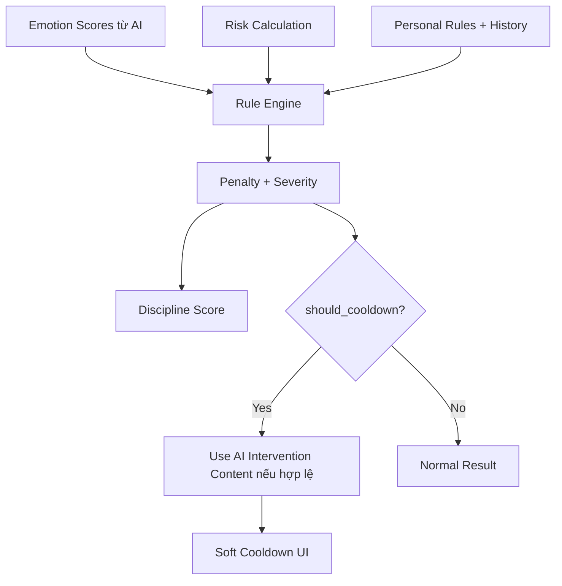

# Đặc tả module — Risk Calculator, Rule Engine, Discipline Score & Soft Cooldown

> Module: `spec-risk-engine-score`  
> Thuộc Spec Pack cha: `../spec-pack.md`  
> Vai trò: Source of Truth chi tiết cho Risk Calculator, Rule Engine, Discipline Score, penalty/severity mapping và Soft Cooldown trigger.

---

## 1. Phạm vi nghiệp vụ

### 1.1 Trong phạm vi MVP

- Tính toán rủi ro toán học cho lệnh `BUY`.
- Xử lý `SELL_TO_CLOSE` như thoát vị thế đang có; không hỗ trợ bán khống.
- Kiểm tra personal rules đang active.
- Tạo rule_violations với `rule_type`, `message`, `severity`, `penalty`.
- Tính Discipline Score bằng công thức cố định.
- Phát hiện oversized trade.
- Kích hoạt Soft Cooldown khi emotion/rule/severity đủ điều kiện.
- Tích hợp với AI Emotion Intervention Layer bằng cách cung cấp trigger `should_cooldown` và severity deterministic.

### 1.2 Ngoài phạm vi MVP

- Hard cooldown khóa Save/Edit/Cancel.
- Tự động đặt lệnh.
- Broker integration.
- AI tự tính risk_amount/risk_percent.
- Discipline rewards hoặc cộng điểm thưởng.
- Cá nhân hóa penalty theo trading_style.

---

## 2. Quy tắc nghiệp vụ

| ID | Rule | AC |
|----|------|----|
| R-RISK-1 | BUY risk dùng công thức cố định: `risk_per_share = entry_price - stop_loss`, `total_risk = risk_per_share * quantity`, `risk_percent = total_risk / account_size * 100`. | AC-RISK-1/v1 |
| R-RISK-2 | BUY thiếu stop_loss thì risk không đầy đủ và tạo cảnh báo/violation nếu rule active. | AC-RISK-2/v1 |
| R-RISK-3 | AI không được tính risk_amount/risk_percent. | AC-RISK-4/v1 |
| R-RISK-4 | SELL chỉ là SELL_TO_CLOSE; không tính risk_percent theo công thức BUY; tính estimated P/L nếu có dữ liệu vị thế. | AC-RISK-5/v1 |
| R-RENG-1 | stop_loss rỗng + `require_stop_loss` active → severity high. | AC-RENG-1/v1 |
| R-RENG-2 | consecutive_losses >= max_consecutive_losses active → severity critical. | AC-RENG-2/v1 |
| R-RENG-3 | fomo_score > max_fomo_score active → severity high. | AC-RENG-3/v1 |
| R-RENG-4 | trades_today >= max_trades_per_day active → severity medium. | AC-RENG-4/v1 |
| R-RENG-5 | Violation phải có rule_type, message, severity, penalty. | AC-RENG-5/v1 |
| R-RENG-6 | Oversized trade áp dụng theo 4 điều kiện đã chốt; penalty -15. | AC-RENG-6/v1 |
| R-SCORE-1 | Discipline Score nằm trong [0,100], tính `max(0, 100 - tổng penalty hợp lệ)`. | AC-SCORE-1/v1 |
| R-SCORE-2 | Backend/Rule Engine tính penalty/score; AI chỉ cung cấp emotion scores. | AC-SCORE-2/v1 |
| R-SCORE-3 | Duplicate penalty trong cùng nhóm lỗi chỉ tính một lần theo penalty cao nhất. | AC-SCORE-4/v1 |
| R-CD-1 | FOMO/Revenge/Panic >= 8 hoặc keyword nguy hiểm → should_cooldown=true. | AC-CD-1/v1, AC-CD-2/v1 |
| R-CD-2 | Severity critical → should_cooldown=true, nhưng chỉ soft cooldown. | AC-CD-3/v1 |
| R-CD-3 | Cooldown wording không cam kết kết quả và không nói hệ thống cấm giao dịch. | AC-CD-4/v1 |
| R-CD-4 | Nếu should_cooldown=true và AI intervention content hợp lệ, response phải đưa intervention content để UI hiển thị. | AC-CD-5/v1 |

---

## 3. Risk Calculator

### 3.1 BUY formula

```text
risk_per_share = entry_price - stop_loss
total_risk = risk_per_share * quantity
risk_percent = total_risk / account_size * 100
trade_value = entry_price * quantity
```

### 3.2 BUY validation

| Điều kiện | Hệ quả |
|-----------|--------|
| `entry_price <= 0` | Validation error. |
| `quantity <= 0` | Validation error. |
| `account_size <= 0` hoặc thiếu | Không tính được `risk_percent` đầy đủ. |
| `stop_loss` trống | Risk không đầy đủ; nếu require_stop_loss active thì violation high. |
| `stop_loss >= entry_price` với BUY | Risk không hợp lệ; validation error hoặc warning theo UX. |

### 3.3 SELL_TO_CLOSE

Với `SELL_TO_CLOSE`, hệ thống hiểu là user muốn thoát vị thế đang có.

```text
estimated_pnl_amount = (sell_price - average_entry_price) * quantity
estimated_pnl_percent = (sell_price - average_entry_price) / average_entry_price * 100
```

Quy tắc:

- Không hỗ trợ bán khống.
- Không dùng `entry_price - stop_loss` để tính risk_percent cho SELL.
- Không áp dụng `max_risk_per_trade` theo công thức BUY cho SELL.
- SELL vẫn đi qua AI Emotion Analysis và Rule Engine để kiểm tra panic, revenge, urgency, thiếu exit_reason, bán không theo kế hoạch.
- Nếu thiếu dữ liệu vị thế (`average_entry_price`) thì estimated P/L có thể không đầy đủ nhưng emotion/rule vẫn xử lý.

---

## 4. Rule Engine

### 4.1 Default rules

| Rule type | Default value | Active default | Ý nghĩa |
|-----------|---------------|----------------|---------|
| require_stop_loss | true | true | BUY cần có stop-loss. |
| max_risk_per_trade | 2% | true | Risk không vượt 2% tài khoản/lệnh. |
| max_consecutive_losses | 3 | true | Sau 3 lệnh thua liên tiếp cảnh báo critical. |
| max_fomo_score | 7 | true | FOMO vượt ngưỡng tạo violation. |
| max_trades_per_day | 5 | false | Giới hạn số lệnh/ngày nếu bật. |
| cooldown_after_loss | TBD | false | Không triển khai logic thời gian chi tiết trong MVP. |
| prevent_oversized_trade | rule-based | true | Cảnh báo lệnh quá lớn bất thường. |

### 4.2 Severity

| Severity | Ý nghĩa | Cooldown |
|----------|---------|----------|
| low | Nhắc nhẹ | Không mặc định. |
| medium | Cần cẩn trọng | Không mặc định. |
| high | Rủi ro đáng kể | Có thể cooldown nếu trigger riêng đúng. |
| critical | Rủi ro rất cao | `should_cooldown=true`, nhưng soft. |

### 4.3 Violation object

```json
{
  "rule_type": "require_stop_loss",
  "message": "Lệnh BUY chưa có stop-loss.",
  "severity": "high",
  "penalty": -25
}
```

---

## 5. Penalty & Discipline Score

### 5.1 Công thức

```text
Discipline Score = max(0, 100 - tổng penalty hợp lệ)
```

### 5.2 Classification

| Score | Nhóm hiển thị |
|-------|---------------|
| 80-100 | Tốt |
| 60-79 | Cần cẩn trọng |
| 40-59 | Rủi ro cao |
| 0-39 | Nên dừng giao dịch |

### 5.3 Bảng penalty chính thức

| Tình huống | Penalty | Severity |
|------------|---------|----------|
| BUY không có stop-loss khi `require_stop_loss` ON | -25 | high |
| `risk_percent > max_risk_per_trade` ON | -20 | high |
| `revenge_score >= 8` | -25 | critical |
| `panic_score >= 8` | -20 | critical |
| `fomo_score > max_fomo_score` ON hoặc `fomo_score >= 8` | -15 | high |
| `overconfidence_score >= 8` | -15 | medium |
| Không có reason/exit_reason rõ ràng | -15 | low |
| `consecutive_losses >= max_consecutive_losses` ON | -20 | critical |
| `prevent_oversized_trade` triggered | -15 | critical hoặc medium theo điều kiện |
| Thiếu take_profit | -5 | low |
| confidence_level >= 9 và overconfidence_score >= 7 | -10 | medium |
| Keyword nguy hiểm: “all-in”, “gỡ lỗ”, “mua bằng mọi giá”, “không thể giảm nữa” | -25 | critical |

### 5.4 Duplicate penalty

Nếu cùng một nhóm lỗi xuất hiện nhiều lần qua nhiều tín hiệu, hệ thống chỉ áp dụng penalty một lần theo penalty cao nhất trong nhóm đó.

---

## 6. Oversized Trade

### 6.1 Công thức nền

```text
trade_value = entry_price * quantity
risk_percent = ((entry_price - stop_loss) * quantity) / account_size * 100
```

### 6.2 Điều kiện oversized

Một trade BUY được xem là oversized nếu thỏa ít nhất một điều kiện:

| # | Điều kiện | Severity | should_cooldown |
|---|-----------|----------|-----------------|
| 1 | `risk_percent >= 1.5 * max_risk_per_trade` | critical | true |
| 2 | `trade_value >= 2 * median_trade_value_last_20` | medium | false |
| 3 | User có dưới 5 trade lịch sử và `trade_value > 50% account_size` | medium | false |
| 4 | User có `consecutive_losses >= 2` và `trade_value >= 1.5 * median_trade_value_last_20` | critical | true |

Penalty: `-15`.

### 6.3 SELL_TO_CLOSE

Trong MVP, oversized trade rule không áp dụng đầy đủ cho `SELL_TO_CLOSE` theo risk BUY. Với SELL:

- Không tính risk_percent BUY.
- Có thể cảnh báo hành vi nếu panic/revenge/urgency cao.
- Nếu có current_position_quantity và `sell_quantity > current_position_quantity`, tạo validation error hoặc warning.

---

## 7. Soft Cooldown

### 7.1 Trigger

`should_cooldown=true` nếu:

- `fomo_score >= 8`
- `revenge_score >= 8`
- `panic_score >= 8`
- severity critical từ Rule Engine
- keyword nguy hiểm: “all-in”, “gỡ lỗ”, “mua bằng mọi giá”, “không thể giảm nữa”
- oversized condition #1 hoặc #4

### 7.2 Behavior

| Action | Cho phép trong soft cooldown? |
|--------|-------------------------------|
| Save journal | Có |
| Edit input | Có |
| Cancel | Có |
| Place order | Không áp dụng, vì MVP không đặt lệnh |
| Hard block | Không |

### 7.3 Default cooldown questions

Nếu AI Intervention Layer không trả content hợp lệ, UI dùng câu hỏi mặc định:

```text
1. Lý do vào/thoát lệnh có nằm trong kế hoạch không?
2. Nếu sai, bạn mất bao nhiêu?
3. Bạn có sẵn sàng chấp nhận mức lỗ đó không?
```

---

## 8. Integration với AI Emotion Intervention Layer

Risk/Score module **không sinh nội dung AI intervention**. Module này chỉ quyết định trigger deterministic:

- `should_cooldown`
- severity
- penalty
- rule_violations
- risk_calculation
- discipline_score

Khi `should_cooldown=true`, response `/trade-check` phải ưu tiên hiển thị intervention content từ AI module nếu hợp lệ. Nếu không hợp lệ, hiển thị default cooldown questions.



---

## 9. Acceptance Criteria

### 9.1 Risk Calculator (AC-RISK)

| ID | Mô tả kiểm thử được |
|----|---------------------|
| AC-RISK-1/v1 | Với BUY có entry_price, stop_loss, quantity, account_size hợp lệ, hệ thống tính đúng risk_per_share, total_risk, risk_percent. |
| AC-RISK-2/v1 | Nếu BUY thiếu stop_loss, hệ thống ghi nhận risk không đầy đủ và tạo cảnh báo thiếu stop-loss. |
| AC-RISK-3/v1 | Nếu risk_percent vượt max_risk_per_trade đang active, hệ thống tạo violation tương ứng. |
| AC-RISK-4/v1 | Hệ thống không dùng AI để tính risk_amount hoặc risk_percent. |
| AC-RISK-5/v1 | Với SELL_TO_CLOSE, hệ thống không áp dụng BUY risk_percent formula và không coi SELL là bán khống. |
| AC-RISK-6/v1 | Với SELL_TO_CLOSE có sell_price, average_entry_price, quantity hợp lệ, hệ thống tính estimated_pnl_amount và estimated_pnl_percent. |

### 9.2 Rule Engine (AC-RENG)

| ID | Mô tả kiểm thử được |
|----|---------------------|
| AC-RENG-1/v1 | stop_loss rỗng + require_stop_loss active tạo violation severity high, penalty -25. |
| AC-RENG-2/v1 | consecutive_losses >= max_consecutive_losses active tạo violation severity critical. |
| AC-RENG-3/v1 | fomo_score > max_fomo_score active tạo violation severity high. |
| AC-RENG-4/v1 | trades_today >= max_trades_per_day active tạo violation severity medium. |
| AC-RENG-5/v1 | Mỗi violation có rule_type, message, severity, penalty. |
| AC-RENG-6/v1 | Oversized trade thỏa điều kiện #1/#4 tạo severity critical và should_cooldown=true; điều kiện #2/#3 tạo severity medium. |

### 9.3 Discipline Score (AC-SCORE)

| ID | Mô tả kiểm thử được |
|----|---------------------|
| AC-SCORE-1/v1 | Discipline Score luôn nằm trong 0-100. |
| AC-SCORE-2/v1 | Score giảm đúng theo bảng penalty cố định. |
| AC-SCORE-3/v1 | Score hiển thị đúng nhóm: Tốt, Cần cẩn trọng, Rủi ro cao, Nên dừng giao dịch. |
| AC-SCORE-4/v1 | Duplicate penalty trong cùng nhóm lỗi chỉ áp dụng một lần theo penalty cao nhất. |
| AC-SCORE-5/v1 | AI không được tự tính Discipline Score cuối cùng. |

### 9.4 Cooldown (AC-CD)

| ID | Mô tả kiểm thử được |
|----|---------------------|
| AC-CD-1/v1 | fomo_score/revenge_score/panic_score >= 8 làm should_cooldown=true. |
| AC-CD-2/v1 | Emotion text chứa keyword nguy hiểm làm should_cooldown=true. |
| AC-CD-3/v1 | Severity critical làm should_cooldown=true nhưng không hard block Save/Edit/Cancel. |
| AC-CD-4/v1 | Cooldown wording không nói hệ thống cấm giao dịch và không cam kết kết quả. |
| AC-CD-5/v1 | Given should_cooldown=true và AI intervention content hợp lệ, response `/trade-check` phải đưa intervention content để UI hiển thị. |

---

## 10. Traceability Matrix

| AC | Screen/API | DB | Logs | Permissions | Test type |
|----|------------|----|------|-------------|-----------|
| AC-RISK-1/v1 | POST `/trade-check` / Risk Calculator | users, rules | risk_calculated | Owner user | UT · IT · BB |
| AC-RISK-3/v1 | POST `/trade-check` | users, rules, rule_violations | risk_calculated, rule_violation_created | Owner user | UT · IT · E2E · BB |
| AC-RISK-5/v1 | POST `/trade-check` | trades | risk_calculated | Owner user | UT · IT · BB |
| AC-RENG-1/v1 | POST `/trade-check` / Rule Engine | rules, rule_violations | rule_violation_created | Owner user | UT · IT · E2E · BB |
| AC-RENG-6/v1 | POST `/trade-check` / Rule Engine | rules, trades, rule_violations | oversized_trade_detected | Owner user | UT · IT · E2E · BB |
| AC-SCORE-1/v1 | Result / POST `/trade-check` | trades, rule_violations | score_calculated | Owner user | UT · IT · E2E · BB |
| AC-SCORE-4/v1 | Result / POST `/trade-check` | rule_violations | score_calculated | Owner user | UT · IT · BB |
| AC-CD-1/v1 | Result / POST `/trade-check` | emotion_logs, trades | cooldown_triggered | Owner user | UT · IT · E2E · BB |
| AC-CD-3/v1 | Result UI | trades | cooldown_triggered | Owner user | IT · E2E · BB |
| AC-CD-5/v1 | Result UI / POST `/trade-check` | ai_intervention_logs | cooldown_triggered, ai_intervention_created | Owner user | IT · E2E · BB |
