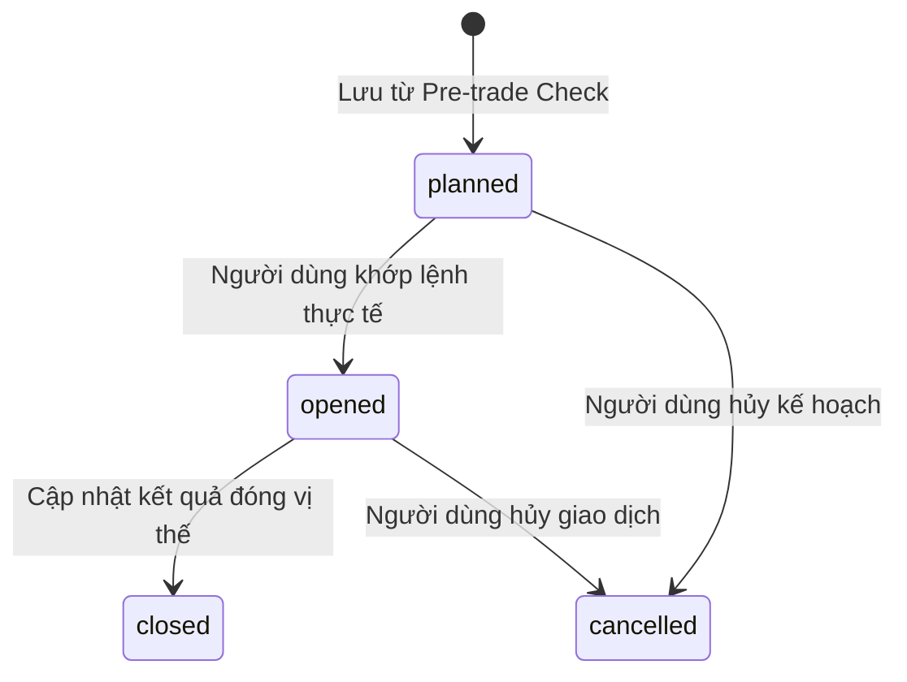

# Đặc tả chức năng: Trade Journal & Weekly Report (spec-journal-weekly-report)

Tài liệu này đặc tả yêu cầu nghiệp vụ, thuật toán tổng hợp, cấu trúc dữ liệu và tiêu chí chấp nhận cho Nhật ký giao dịch (Trade Journal), Báo cáo tuần (Weekly Report) tự động, và Chính sách lưu trữ dữ liệu/Nhật ký kiểm toán (Data Retention & Audit Logs).

---

## 1. Phạm vi nghiệp vụ (Scope)

### Trong phạm vi MVP:
*   Lưu thông tin lệnh, emotion log, score, violations từ Pre-trade Check vào Nhật ký.
*   Cập nhật kết quả giao dịch thực tế (exit price, profit/loss, closed date, notes) khi đóng lệnh.
*   Vòng đời bản ghi: `planned` -> `opened` -> `closed` / `cancelled`.
*   Lọc danh sách Nhật ký bằng bộ lọc nâng cao (Symbol, Emotion, Result, Rule, Date range).
*   Weekly Report tự động tổng hợp dữ liệu tuần (Thứ Hai 00:00:00 đến Chủ Nhật 23:59:59 Asia/Ho_Chi_Minh) dựa trên `trades.created_at`.
*   Weekly Report chỉ tính chỉ số lời/lỗ P/L từ các lệnh ở trạng thái `closed`.
*   Chính sách lưu trữ dữ liệu (User data lưu trọn đời, raw AI response xóa sau 30 ngày, error logs 30-90 ngày, audit logs 180 ngày).
*   Audit log cho các hành động đăng nhập, chỉnh sửa rule, sửa trade, tạo report, lỗi AI.

### Ngoài phạm vi MVP:
*   Import file CSV / kết nối tài khoản API của sàn (Broker integration).
*   Weekly Report so sánh chéo hiệu suất với các tuần cũ hoặc biểu đồ nâng cao.

---

## 2. Quy tắc nghiệp vụ cứng (Business Rules)

| ID | Quy tắc nghiệp vụ | Mã AC tương ứng |
|---|---|---|
| **R-JOURNAL-1** | Journal lưu đầy đủ thông tin lệnh, cảm xúc, điểm số kỷ luật, vi phạm và trạng thái. | AC-JOURNAL-1/v1 |
| **R-JOURNAL-2** | Cho phép cập nhật thông số đóng lệnh (exit_price, profit_loss_amount, profit_loss_percent, notes) và đổi status sang `closed`. | AC-JOURNAL-2/v1 |
| **R-JOURNAL-3** | Journal thuộc quyền sở hữu riêng tư từng user, không rò rỉ chéo dữ liệu và có filter. | AC-JOURNAL-3/v1, AC-JOURNAL-4/v1 |
| **R-JOURNAL-4** | MVP chỉ hỗ trợ nhập thủ công và lưu từ check; không hỗ trợ import CSV hay broker connection. | AC-JOURNAL-1/v1, AC-REG-1/v1 |
| **R-REPORT-1** | Weekly Report đại diện cho tuần calendar (Thứ Hai 00:00:00 đến Chủ Nhật 23:59:59 Asia/Ho_Chi_Minh). Gom trade theo `created_at`. | AC-REPORT-1/v1, AC-REPORT-5/v1 |
| **R-REPORT-2** | Weekly Report bao gồm planned, opened, closed, cancelled trades. Chỉ số P/L chỉ tính trên closed trades; các chỉ số cảm xúc/rule/discipline tính trên tất cả. | AC-REPORT-2/v1, AC-REPORT-3/v1 |
| **R-REPORT-3** | Insight/recommendation là coach kỷ luật, tuyệt đối không tạo khuyến nghị đầu tư hoặc mua bán mã cổ phiếu. | AC-REPORT-4/v1 |
| **R-NFR-4** | Mật khẩu người dùng không được lưu dạng plaintext, bắt buộc sử dụng thuật toán băm (hashing). | AC-NFR-4/v1 |
| **R-NFR-5** | Không được lưu hoặc lộ API key AI ở frontend. | AC-NFR-5/v1 |
| **R-NFR-6** | User A cố truy cập dữ liệu (journal, rule, report) của User B phải bị chặn ở API và báo lỗi. | AC-NFR-6/v1 |

---

## 3. Bản vẽ màn hình & Giao diện (Wireframes)

### Màn hình Weekly Report:
```text
+--------------------------------------------------------------+
| WEEKLY REPORT                                                |
| Period: 2026-06-01 to 2026-06-07                             |
|--------------------------------------------------------------|
| Total trades: 12        Win: 5        Loss: 7                |
| Avg Discipline Score: 74                                     |
| Most common emotion: FOMO                                    |
| Most common violation: require_stop_loss                     |
|--------------------------------------------------------------|
| Behavior Counts                                              |
| FOMO trades: 4 | Revenge trades: 2 | Panic trades: 1         |
|--------------------------------------------------------------|
| Best disciplined trade: HPG / Score 92                       |
| Worst disciplined trade: SSI / Score 35                      |
|--------------------------------------------------------------|
| Insights                                                     |
| - Bạn thường vào lệnh cảm tính sau khi bỏ lỡ một mã tăng.    |
| - Các lệnh có stop-loss rõ ràng có score cao hơn.            |
|--------------------------------------------------------------|
| Recommendations                                              |
| - Bắt buộc nhập stop-loss trước khi vào lệnh.                |
| - Tạm dừng và viết lại kế hoạch khi FOMO >= 8.               |
|--------------------------------------------------------------|
| Disclaimer: Đây không phải tư vấn đầu tư.                    |
+--------------------------------------------------------------+
```

---

## 4. Dữ liệu & Quy trình Chuyển đổi trạng thái

### 4.1 Bảng dữ liệu liên quan
*   `trades` (Journal records), `weekly_reports` (Report cache/snapshots), `audit_logs` (Audit metadata logs).

### 4.2 Trade Lifecycle Transitions


---

## 5. Tiêu chí chấp nhận (Acceptance Criteria)

### 5.1 Trade Journal (AC-JOURNAL)
*   **AC-JOURNAL-1/v1:** Lưu thành công Journal từ Pre-trade check.
*   **AC-JOURNAL-2/v1:** Cập nhật kết quả đóng lệnh khi thay đổi exit_price và status closed.
*   **AC-JOURNAL-3/v1:** Xem danh sách journal cá nhân bảo mật, không thấy của người khác.
*   **AC-JOURNAL-4/v1:** Lọc được danh sách journal bằng các bộ lọc chốt.
*   **AC-JOURNAL-5/v1:** Liên kết journal được với emotion logs và violations của lệnh đó.

### 5.2 Weekly Report (AC-REPORT)
*   **AC-REPORT-1/v1:** Thống kê đúng total trades, win, loss và average discipline score.
*   **AC-REPORT-2/v1:** Xác định đúng most common emotion và rule violation.
*   **AC-REPORT-3/v1:** Đếm đúng số lượng trade fomo/revenge/panic theo điểm cảm xúc >= 8.
*   **AC-REPORT-4/v1:** Lời khuyên của report không đưa ra khuyến nghị mua bán cổ phiếu.
*   **AC-REPORT-5/v1:** Hiển thị Empty state nếu tuần không có giao dịch, không bịa số liệu.

### 5.3 Non-functional Requirements (AC-NFR)
*   **AC-NFR-4/v1:** Mật khẩu được hash.
*   **AC-NFR-5/v1:** Giữ kín API key ở phía Backend.
*   **AC-NFR-6/v1:** Từ chối truy cập chéo dữ liệu người dùng (IDOR protection).

---

## 6. Bảng truy vết kiểm thử (Traceability Matrix)

| AC | Screen/API | DB | Logs | Permissions | Test type |
|---|---|---|---|---|---|
| **AC-JOURNAL-1/v1** | POST /trades | trades, emotion_logs | journal_created | Owner user | UT · IT · E2E · BB |
| **AC-JOURNAL-2/v1** | PUT /trades/:id/outcome | trades | journal_updated | Owner user | UT · IT · E2E · BB |
| **AC-REPORT-1/v1** | GET /weekly-report | trades, weekly_reports | weekly_report_generated | Owner user | UT · IT · E2E · BB |
| **AC-REPORT-5/v1** | GET /weekly-report | N/A | weekly_report_generated | Owner user | UT · IT · E2E · BB |
| **AC-NFR-6/v1** | Mọi API endpoint | users, rules, trades | journal_access_denied | Owner user | UT · IT · E2E · BB |
