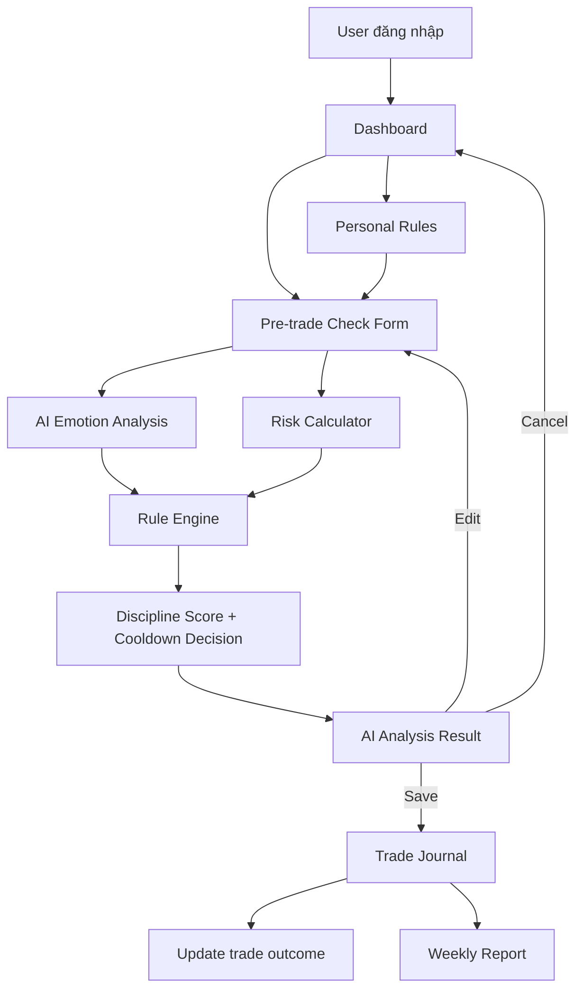
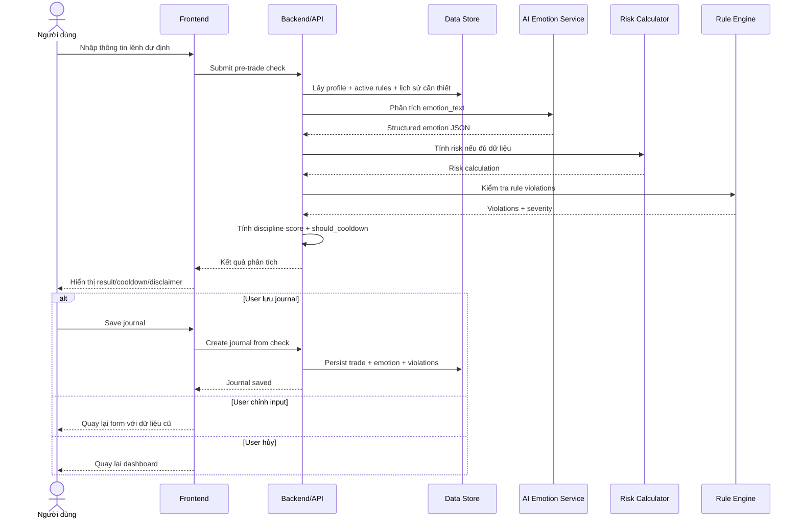
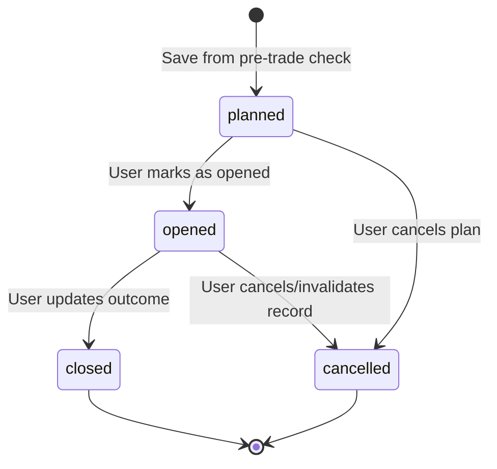
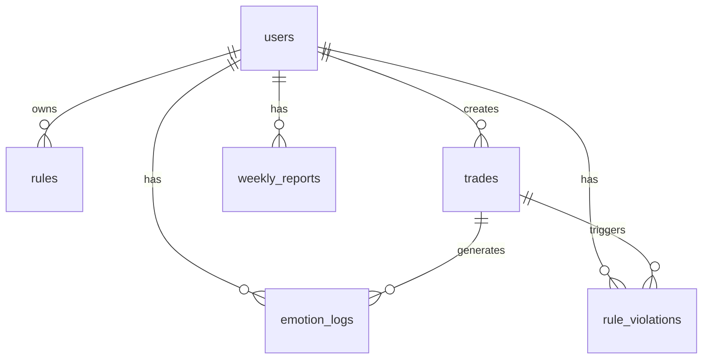
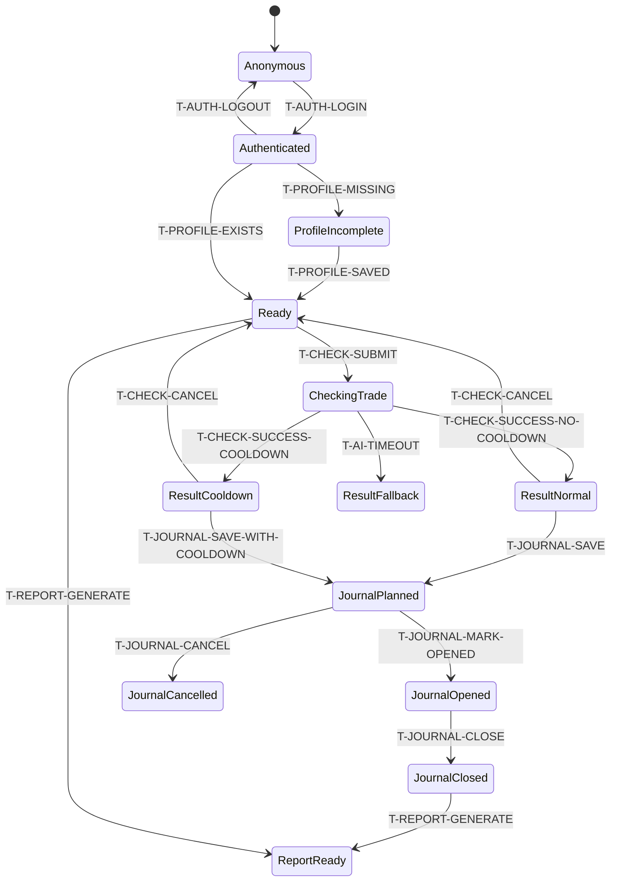

# Gói đặc tả — TRADEMIND-AI-MVP (TradeMind AI — MVP Spec Pack)

> Tạo: 2026-06-05 · Giai đoạn: Phase 1 — Spec Pack  
> **Nguồn tham chiếu duy nhất cho thay đổi này sau khi được review.**  
> Không triển khai bất kỳ nội dung nào không được viết ở đây. Các điểm chưa rõ phải được xử lý như Open Issues.

---

## 1. Bối cảnh / Mục đích

TradeMind AI là sản phẩm hỗ trợ nhà đầu tư/trader kiểm soát cảm xúc trước, trong và sau khi giao dịch chứng khoán. Giá trị cốt lõi là giúp người dùng nhìn thấy rủi ro hành vi như FOMO, panic selling, revenge trading, overconfidence; kiểm tra việc tuân thủ rule cá nhân; tính rủi ro mỗi lệnh; lưu nhật ký; và tổng hợp hành vi theo tuần.

Mục đích nghiệp vụ của MVP:

- Giúp người dùng giảm giao dịch cảm tính trước khi vào lệnh.
- Giúp người dùng kiểm tra lệnh dự định có tuân thủ bộ luật giao dịch cá nhân hay không.
- Giúp người dùng thấy rủi ro tài chính của lệnh theo account size và stop-loss.
- Giúp người dùng lưu lại bối cảnh cảm xúc/rule/risk trong Trade Journal.
- Giúp người dùng đọc báo cáo tuần để nhận diện lỗi hành vi lặp lại.
- Giảm rủi ro pháp lý bằng cách giữ AI ở vai trò coach kỷ luật, không đưa ra khuyến nghị mua/bán.

---

## 2. Phạm vi

### 2.1 Trong phạm vi

| # | Nhóm | Mô tả nghiệp vụ |
|---|------|-----------------|
| 1 | Authentication cơ bản | Email/password, login, logout, tách dữ liệu theo user. |
| 2 | User Profile | Lưu account size, max risk/trade, trading style, experience level phục vụ risk calculation. |
| 3 | Personal Trading Rules | Người dùng xem, bật/tắt, chỉnh rule cá nhân; hệ thống dùng rule active khi check lệnh. |
| 4 | Pre-trade Check | Người dùng nhập lệnh dự định và nhận phân tích kỷ luật/rủi ro/cảm xúc. |
| 5 | Emotion Analysis | AI phân tích text để trả emotion tags và score có cấu trúc. |
| 6 | Risk Calculator | Tính rủi ro bằng logic cố định, không giao AI tính toán. |
| 7 | Rule Engine | Kiểm tra rule violation và severity. |
| 8 | Discipline Score | Hiển thị điểm 0-100 và nhóm phân loại kỷ luật. |
| 9 | Soft Cooldown | Cảnh báo khi rủi ro cảm xúc cao; MVP không chặn cứng. |
| 10 | Trade Journal | Lưu, xem, lọc và cập nhật kết quả giao dịch. |
| 11 | Weekly Report cơ bản | Tổng hợp số lệnh, win/loss, score trung bình, emotion/rule phổ biến, insight và recommendation dạng coach. |
| 12 | AI Guardrails | Cấm khuyến nghị mua/bán, dự đoán chắc chắn, cam kết lợi nhuận, all-in. |
| 13 | Compliance disclaimer | Hiển thị rõ sản phẩm không phải tư vấn đầu tư. |
| 14 | Audit/log nghiệp vụ | Log các sự kiện quan trọng phục vụ debug, reliability, guardrail audit theo chính sách privacy được chốt. |

### 2.2 Ngoài phạm vi

| # | Ngoài phạm vi MVP | Lý do |
|---|-------------------|-------|
| 1 | Kết nối broker/công ty chứng khoán | Requirement loại khỏi MVP. |
| 2 | Tự động đặt lệnh/auto trading | Rủi ro pháp lý và ngoài phạm vi. |
| 3 | Khuyến nghị mua/bán mã cổ phiếu | Trái với guardrails. |
| 4 | Dự đoán giá chắc chắn tăng/giảm | Trái với định vị sản phẩm. |
| 5 | Phân tích kỹ thuật nâng cao | Roadmap sau MVP. |
| 6 | Social trading/community | Roadmap sau MVP. |
| 7 | Native mobile app | Chưa chốt; mặc định MVP web responsive. |
| 8 | Subscription/payment | Chưa cần nếu đang thử nghiệm; còn Open Issue. |
| 9 | CSV import | Could Have/Future, không thuộc MVP core. |
| 10 | Admin portal | Chưa có requirement chi tiết. |
| 11 | Hard cooldown/block giao dịch | MVP chỉ soft cooldown. |
| 12 | Học cá nhân hóa Discipline Score theo user | Chưa chốt; MVP dùng công thức cố định sau khi penalty được approve. |

---

## 3. Thuật ngữ

| # | Thuật ngữ | Định nghĩa |
|---|-----------|------------|
| 1 | Trader / Người dùng | Người sử dụng sản phẩm để kiểm tra kỷ luật trước, trong, sau giao dịch. |
| 2 | Pre-trade Check | Luồng người dùng nhập lệnh dự định và nhận phân tích trước khi quyết định. |
| 3 | Emotion Analysis | Phân tích câu chữ người dùng để phát hiện cảm xúc/rủi ro hành vi. |
| 4 | FOMO | Sợ bỏ lỡ cơ hội, thường dẫn đến quyết định vội. |
| 5 | Panic | Hoảng loạn khi thị trường biến động hoặc đang lỗ. |
| 6 | Revenge trading | Giao dịch để gỡ lỗ sau thua lỗ, thường làm tăng rủi ro. |
| 7 | Overconfidence | Quá tự tin vào nhận định/lệnh. |
| 8 | Rule Engine | Thành phần kiểm tra lệnh với bộ luật cá nhân. |
| 9 | Personal Trading Rule | Quy tắc giao dịch do hệ thống mặc định hoặc user chỉnh. |
| 10 | Risk Calculator | Logic tính risk_per_share, total_risk, risk_percent. |
| 11 | Discipline Score | Điểm 0-100 phản ánh mức tuân thủ kỷ luật của lệnh. |
| 12 | Cooldown | Cảnh báo người dùng tạm dừng và tự kiểm tra khi rủi ro cảm xúc cao. |
| 13 | Soft cooldown | Chỉ nhắc/cảnh báo, không khóa chức năng. |
| 14 | Hard cooldown | Chặn thao tác tiếp theo; không thuộc MVP. |
| 15 | Trade Journal | Nhật ký lưu thông tin lệnh, cảm xúc, risk, violation và kết quả. |
| 16 | Weekly Report | Báo cáo hành vi theo tuần dựa trên Trade Journal. |
| 17 | Coach message | Phản hồi bằng ngôn ngữ hỗ trợ kỷ luật, không phải tư vấn đầu tư. |
| 18 | Rule violation | Kết quả cho biết lệnh vi phạm rule nào, severity nào. |
| 19 | AI Guardrails | Tập giới hạn nội dung AI được/không được nói. |

| Khái niệm | Trả lời câu hỏi | Tác dụng |
|-----------|-----------------|----------|
| Pre-trade Check | “Lệnh này có dấu hiệu cảm xúc/risk/rule violation nào trước khi vào?” | Cảnh báo trước khi user quyết định. |
| Trade Journal | “Sau check hoặc sau giao dịch, chuyện gì đã xảy ra?” | Lưu lịch sử để review và báo cáo. |
| Weekly Report | “Tuần này hành vi giao dịch có pattern gì?” | Giúp cải thiện tuần sau. |
| Soft cooldown | “User có cần dừng lại và tự kiểm tra không?” | Giảm giao dịch cảm tính nhưng không khóa. |
| Rule Engine | “Lệnh có vi phạm luật cá nhân không?” | Tạo warning có căn cứ. |
| AI Coach | “Nói thế nào để người dùng tỉnh táo hơn?” | Hỗ trợ hành vi, không tư vấn đầu tư. |

---

## 4. Hiện trạng / Trạng thái mục tiêu

| # | Khía cạnh | Hiện trạng | Trạng thái mục tiêu |
|---|-----------|------------|---------------------|
| 1 | Định vị sản phẩm | Requirement draft mô tả ý tưởng AI coach kỷ luật. | Spec Pack khóa MVP theo hướng hỗ trợ kỷ luật, không dự đoán/khuyến nghị. |
| 2 | Kiểm tra trước giao dịch | Chưa có source of truth chi tiết cho flow kiểm thử được. | Có input/output, screen, rule, AC, traceability rõ ràng. |
| 3 | Cảm xúc giao dịch | Có danh sách emotion và ví dụ. | Có JSON output, score range, guardrail, fallback khi AI lỗi. |
| 4 | Risk | Có công thức cơ bản. | Có rule nghiệp vụ về stop-loss, account_size, AI không tính risk. Action SELL là đóng vị thế (SELL_TO_CLOSE). |
| 5 | Rule cá nhân | Có rule mặc định/rule types. | Có CRUD mức nghiệp vụ, active/inactive, validation, trace AC. |
| 6 | Cooldown | Có trigger và message mẫu; còn câu hỏi hard/soft. | MVP chỉ soft cooldown; hard cooldown không triển khai. |
| 7 | Journal | Có fields và status. | Có lifecycle, filter, user isolation, link emotion/violation. |
| 8 | Weekly report | Có field output. | Có AC testable, empty state, guardrail không khuyến nghị mua/bán. |
| 9 | Legal/privacy | Có disclaimer và risk. | Có guardrail AC, privacy/security NFR, chính sách retention đã chốt. |
| 10 | Implementation readiness | Nhiều TODO/Open Questions. | Sẵn sàng implementation sau khi chốt tất cả các vấn đề mở. |

---

## 5. Chi tiết đặc tả

**Index các sub-section + namespace tra cứu:**

| # | Chủ đề | Câu hỏi nghiệp vụ | Rule namespace | Transitions liên quan |
|---|--------|-------------------|----------------|-----------------------|
| 5.0 | Rule matrix tổng | Rule cứng nào áp dụng và trace AC nào? | Tất cả | — |
| 5.1 | Product flow & screen map | Người dùng đi qua các màn hình nào? | `R-TCHECK`, `R-CD`, `R-JOURNAL`, `R-REPORT` | `T-*` |
| 5.2 | Authentication & Profile | Ai được dùng dữ liệu nào? | `R-AUTH`, `R-PROFILE` | `T-AUTH-*` |
| 5.3 | Personal Trading Rules | User quản lý luật cá nhân thế nào? | `R-RULES` | `T-RULE-*` |
| 5.4 | Pre-trade Check & Result | Lệnh được phân tích và trả kết quả thế nào? | `R-TCHECK` | `T-CHECK-*` |
| 5.5 | Emotion Analysis & AI Guardrails | AI được phân tích/nói gì? | `R-EMOTION`, `R-GUARD` | `T-AI-*` |
| 5.6 | Risk & Rule Engine | Risk/rule violation được tính thế nào? | `R-RISK`, `R-RENG`, `R-SCORE` | `T-CHECK-*` |
| 5.7 | Cooldown Mode | Khi nào cần cảnh báo dừng lại? | `R-CD` | `T-CD-*` |
| 5.8 | Trade Journal | Lưu và cập nhật nhật ký ra sao? | `R-JOURNAL` | `T-JOURNAL-*` |
| 5.9 | Weekly Report | Báo cáo tuần tổng hợp gì? | `R-REPORT` | `T-REPORT-*` |
| 5.10 | Data objects & API surface | Dữ liệu nghiệp vụ nào được trao đổi/lưu? | Tất cả | — |
| 5.11 | State transitions | Sự kiện nào gây hệ quả nghiệp vụ nào? | — | Tất cả |

### 5.0 Rule matrix tổng
**Mục tiêu:** tập trung rule nghiệp vụ cứng, liên kết với AC. Các rule chưa đủ rõ được đưa vào Open Issues và không triển khai cho đến khi được chốt.

#### AUTH (R-AUTH)

| ID | Rule | AC |
|---|---|---|
| R-AUTH-1 | Dữ liệu người dùng phải tách theo user; user chỉ truy cập dữ liệu của chính mình. | AC-AUTH-2/v1, AC-JOURNAL-3/v1, AC-NFR-6/v1 |
| R-AUTH-2 | MVP hỗ trợ email/password register, login, logout, email verification, forgot password và password policy; Google login ngoài scope. | AC-AUTH-1/v1, AC-AUTH-3/v1 |

#### PROFILE (R-PROFILE)

| ID | Rule | AC |
|---|---|---|
| R-PROFILE-1 | Account size và max risk/trade là dữ liệu bắt buộc để tính risk_percent đầy đủ. | AC-PROFILE-1/v1, AC-PROFILE-2/v1 |
| R-PROFILE-2 | Risk calculation phải dùng profile của user hiện tại. | AC-PROFILE-3/v1 |

#### RULES (R-RULES)

| ID | Rule | AC |
|---|---|---|
| R-RULES-1 | Rule cá nhân có thể xem, bật/tắt, chỉnh giá trị; chỉ rule active mới áp dụng. | AC-RULES-1/v1, AC-RULES-2/v1, AC-RULES-3/v1 |
| R-RULES-2 | Giá trị rule không hợp lệ không được lưu. | AC-RULES-4/v1 |
| R-RULES-3 | Rule engine chỉ tạo cảnh báo kỷ luật, không tạo khuyến nghị mua/bán. | AC-RULES-5/v1 |
| R-RULES-4 | Rule prevent_oversized_trade phát hiện giao dịch khối lượng bất thường hoặc quá lớn dựa trên risk_percent, trade_value và lịch sử giao dịch. | AC-RULES-3/v1, AC-RISK-3/v1 |

#### TCHECK (R-TCHECK)

| ID | Rule | AC |
|---|---|---|
| R-TCHECK-1 | Pre-trade check là phân tích trước giao dịch, không phải hành động đặt lệnh. | AC-TCHECK-1/v1, AC-TCHECK-5/v1, AC-REG-1/v1 |
| R-TCHECK-2 | Kết quả thành công phải có đủ score, emotion, rule, risk, cooldown, coach message. | AC-TCHECK-2/v1 |
| R-TCHECK-3 | Input sai/thiếu phải bị chặn ở mức nghiệp vụ và hiển thị lỗi field. | AC-TCHECK-3/v1 |

#### EMOTION (R-EMOTION)

| ID | Rule | AC |
|---|---|---|
| R-EMOTION-1 | AI trả output có cấu trúc JSON cho emotion analysis. | AC-EMOTION-1/v1 |
| R-EMOTION-2 | Điểm emotion dùng thang 0-10: 0-2 thấp, 3-5 trung bình, 6-8 cao, 9-10 rất cao. | AC-EMOTION-2/v1, AC-EMOTION-3/v1, AC-EMOTION-4/v1 |
| R-EMOTION-3 | AI lỗi/timeout không được làm mất risk calculation và rule check không phụ thuộc AI. | AC-EMOTION-5/v1 |

#### RISK (R-RISK)

| ID | Rule | AC |
|---|---|---|
| R-RISK-1 | Risk calculator dùng công thức cố định cho BUY: risk_per_share = entry_price - stop_loss; total_risk = risk_per_share × quantity; risk_percent = total_risk / account_size × 100. | AC-RISK-1/v1 |
| R-RISK-2 | Không có stop-loss thì risk không đầy đủ và phải cảnh báo. | AC-RISK-2/v1, AC-RENG-1/v1 |
| R-RISK-3 | AI không được tự tính risk_amount/risk_percent. | AC-RISK-4/v1 |
| R-RISK-4 | MVP chỉ hỗ trợ SELL với nghĩa bán/thoát vị thế đang có (SELL_TO_CLOSE). Không hỗ trợ bán khống. Với SELL, không tính risk_percent; chỉ tính estimated P/L và đánh giá rủi ro kỷ luật. | AC-RISK-1/v1 |

#### RENG (R-RENG)

| ID | Rule | AC |
|---|---|---|
| R-RENG-1 | stop_loss rỗng + require_stop_loss active → severity high. | AC-RENG-1/v1 |
| R-RENG-2 | consecutive_losses >= max_consecutive_losses active → severity critical. | AC-RENG-2/v1 |
| R-RENG-3 | fomo_score > max_fomo_score active → severity high. | AC-RENG-3/v1 |
| R-RENG-4 | trades_today >= max_trades_per_day active → severity medium. | AC-RENG-4/v1 |
| R-RENG-5 | Violation phải có rule_type, message, severity. | AC-RENG-5/v1 |
| R-RENG-6 | Giao dịch oversized sẽ kích hoạt cảnh báo tùy theo điều kiện: severity critical + should_cooldown true (nếu vượt risk hoặc sau chuỗi thua), hoặc severity medium (nếu vượt quy mô trung bình hoặc chưa có lịch sử). | AC-RENG-5/v1 |

#### SCORE (R-SCORE)

| ID | Rule | AC |
|---|---|---|
| R-SCORE-1 | Discipline Score nằm trong 0-100 và tính theo công thức: Discipline Score = max(0, 100 - tổng penalty hợp lệ). | AC-SCORE-1/v1, AC-SCORE-3/v1 |
| R-SCORE-2 | AI chỉ trả emotion scores; backend/rule engine chịu trách nhiệm tính penalty và score. Severity critical chỉ kích hoạt soft cooldown, không chặn người dùng. | AC-SCORE-2/v1 |

#### CD (R-CD)

| ID | Rule | AC |
|---|---|---|
| R-CD-1 | FOMO/Revenge/Panic score >= 8 hoặc từ khóa nguy hiểm → should_cooldown/cảnh báo cooldown. | AC-CD-1/v1, AC-CD-2/v1 |
| R-CD-2 | MVP chỉ soft cooldown: nhắc dừng, yêu cầu tự kiểm tra, không chặn cứng. | AC-CD-3/v1 |
| R-CD-3 | Cooldown wording không cam kết kết quả và không nói hệ thống cấm giao dịch. | AC-CD-4/v1 |

#### JOURNAL (R-JOURNAL)

| ID | Rule | AC |
|---|---|---|
| R-JOURNAL-1 | Journal lưu thông tin lệnh, emotion, score, violations và status. | AC-JOURNAL-1/v1 |
| R-JOURNAL-2 | Journal có thể cập nhật kết quả khi lệnh đóng. | AC-JOURNAL-2/v1 |
| R-JOURNAL-3 | Journal là dữ liệu riêng tư theo user và có filter nghiệp vụ. | AC-JOURNAL-3/v1, AC-JOURNAL-4/v1 |
| R-JOURNAL-4 | MVP chỉ hỗ trợ nhập trade thủ công và lưu từ check; không hỗ trợ import CSV hay broker connection. | AC-JOURNAL-1/v1, AC-REG-1/v1 |

#### REPORT (R-REPORT)

| ID | Rule | AC |
|---|---|---|
| R-REPORT-1 | Weekly Report đại diện cho tuần calendar (Thứ Hai 00:00:00 đến Chủ Nhật 23:59:59 Asia/Ho_Chi_Minh). Gom trade theo created_at. | AC-REPORT-1/v1, AC-REPORT-5/v1 |
| R-REPORT-2 | Weekly Report bao gồm planned, opened, closed, cancelled trades. Chỉ số P/L chỉ tính trên closed trades; các chỉ số cảm xúc/rule/discipline tính trên tất cả. | AC-REPORT-2/v1, AC-REPORT-3/v1 |
| R-REPORT-3 | Insight/recommendation là coach kỷ luật, không phải khuyến nghị đầu tư. | AC-REPORT-4/v1 |

#### GUARD (R-GUARD)

| ID | Rule | AC |
|---|---|---|
| R-GUARD-1 | AI không được khuyến nghị mua/bán, all-in, dự đoán chắc chắn, cam kết lợi nhuận. | AC-GUARD-1/v1, AC-REG-2/v1 |
| R-GUARD-2 | AI được phép cảnh báo FOMO, thiếu stop-loss, vượt rủi ro, không phù hợp rule. | AC-GUARD-2/v1 |
| R-GUARD-3 | Màn hình phân tích/report phải có disclaimer không phải tư vấn đầu tư. | AC-GUARD-3/v1 |

#### NFR (R-NFR)

| ID | Rule | AC |
|---|---|---|
| R-NFR-1 | Các mục tiêu hiệu năng: trade-check 3-5 giây, dashboard 2 giây, weekly report 30 giây. | AC-NFR-1/v1, AC-NFR-2/v1, AC-NFR-3/v1 |
| R-NFR-2 | Bảo mật: hash password, không lộ secret ở frontend, phân quyền theo user. | AC-NFR-4/v1, AC-NFR-5/v1, AC-NFR-6/v1 |


### 5.1 Product flow & screen map

**Mục tiêu:** đặc tả hành trình MVP từ dashboard đến check lệnh, cảnh báo, journal và report.

**Flow nghiệp vụ tổng quan:**



**Wireframe ASCII luồng màn hình chính:**

```text
+---------------------------+       +------------------------------+       +------------------------------+
| DASHBOARD                 | ----> | PRE-TRADE CHECK              | ----> | AI ANALYSIS RESULT           |
|---------------------------|       |------------------------------|       |------------------------------|
| Avg Discipline Score      |       | Symbol         [ HPG      ]  |       | Overall: Cần cẩn trọng       |
| FOMO Risk Today           |       | Action         [ BUY v    ]  |       | Discipline Score: 68/100     |
| Trades Today              |       | Entry Price    [ 28500    ]  |       | Emotion: FOMO 6, Panic 1     |
| Rule Violations Today     |       | Quantity       [ 1000     ]  |       | Risk: 1,300,000 / 1.3%       |
| Cooldown Status           |       | Stop-loss      [ 27200    ]  |       | Rule Violations: none        |
|---------------------------|       | Take-profit    [ 31000    ]  |       | Coach Message                |
| [Check new trade]         |       | Reason         [ ...      ]  |       | Cooldown Warning if any      |
| [Trade Journal]           |       | Emotion text   [ ...      ]  |       |------------------------------|
| [Personal Rules]          |       | Confidence     [ 7/10     ]  |       | [Save journal] [Edit] [Cancel]|
| [Weekly Report]           |       |------------------------------|       +------------------------------+
+---------------------------+       | [Analyze trade]              |                         |
            |                       +------------------------------+                         v
            |                                                                         +------------------------------+
            |                                                                         | TRADE JOURNAL                |
            |                                                                         |------------------------------|
            |                                                                         | Symbol | Result | Status     |
            |                                                                         | Score  | Emotion| Date       |
            |                                                                         | Filters: Symbol/Emotion/...  |
            |                                                                         | [Update outcome]             |
            |                                                                         +------------------------------+
            |                                                                                         |
            v                                                                                         v
+---------------------------+                                                     +------------------------------+
| PERSONAL RULES            |                                                     | WEEKLY REPORT                |
|---------------------------|                                                     |------------------------------|
| require_stop_loss  ON     |                                                     | Total trades                 |
| max_risk_per_trade 2%     |                                                     | Win / Loss                   |
| max_fomo_score     7      |                                                     | Avg Discipline Score         |
| max_losses         3      |                                                     | Most common emotion          |
| [Edit] [Toggle]           |                                                     | Most common violation        |
+---------------------------+                                                     | Insights / Recommendations   |
                                                                                  +------------------------------+
```

**Screen inventory:**

| Screen | Vai trò | Main actions | Trace |
|--------|---------|--------------|-------|
| Auth | Cho phép user vào hệ thống và tách dữ liệu | Register, Login, Logout | AC-AUTH-* |
| Dashboard | Tổng quan kỷ luật và điều hướng | Check new trade, View Journal, View Rules, View Weekly Report | AC-SCORE-3, AC-CD-3, AC-NFR-2 |
| Profile | Thiết lập dữ liệu risk | Save profile | AC-PROFILE-* |
| Personal Rules | Quản lý luật cá nhân | View, Toggle, Edit | AC-RULES-* |
| Pre-trade Check | Nhập lệnh dự định | Analyze trade | AC-TCHECK-* |
| AI Analysis Result | Hiển thị kết quả phân tích | Save journal, Edit, Cancel | AC-TCHECK-2, AC-CD-*, AC-GUARD-* |
| Trade Journal | Xem/lọc/cập nhật nhật ký | Filter, Update outcome | AC-JOURNAL-* |
| Weekly Report | Review tuần | View report period | AC-REPORT-* |

**UI states cần thiết kế:**

| # | State | Screen | Ghi chú |
|---|-------|--------|---------|
| 1 | Empty | Dashboard/Journal/Report | Chưa có trade, chưa có report. |
| 2 | Loading | Check/Report | Đặc biệt khi chờ AI/report. |
| 3 | Success | Result/Journal/Report | Hiển thị dữ liệu đầy đủ. |
| 4 | Validation error | Profile/Rules/Check | Chỉ rõ field sai. |
| 5 | AI fallback | Result/Report | AI lỗi nhưng risk/rule vẫn trả nếu có đủ dữ liệu. |
| 6 | Cooldown warning | Result/Dashboard | Soft warning, không hard block. |
| 7 | Access denied | Any data screen | User cố truy cập dữ liệu không thuộc mình. |
| 8 | No stop-loss | Result | Risk không đầy đủ, violation high. |

**Ví dụ:**

- **Happy:** User login → nhập lệnh BUY có stop-loss → AI trả FOMO thấp → risk <= max risk → no violations → lưu journal → xuất hiện trong report tuần.
- **Edge:** User nhập emotion_text FOMO mạnh nhưng risk thấp → score giảm do emotion → cooldown warning nếu fomo_score >= 8.
- **Error:** AI timeout → hệ thống vẫn trả risk/rule nếu đủ dữ liệu, hiển thị fallback coach message.


### 5.2 Authentication & User Profile

**Mục tiêu:** đảm bảo dữ liệu giao dịch/rule/report là dữ liệu riêng của từng user, đồng thời profile cung cấp dữ liệu tính rủi ro.

**Auth scope MVP:**

| Nội dung | Trong MVP? | Ghi chú |
|----------|------------|---------|
| Email/password register | Có | Bắt buộc. |
| Email/password login | Có | Bắt buộc. |
| Logout | Có | Bắt buộc. |
| Google login | Không | Ngoài scope MVP. |
| Email verification | Có | Nằm trong scope MVP. |
| Forgot password | Có | Nằm trong scope MVP. |
| Password policy | Có | Nằm trong scope MVP. |
| Admin role | Không | Không có admin UI/role trong MVP. |

**Profile fields nghiệp vụ:**

| Field | Bắt buộc? | Mục đích |
|-------|-----------|----------|
| name | Không bắt buộc trong risk | Hiển thị cá nhân hóa. |
| email | Có | Đăng nhập/định danh user. |
| account_size | Có để tính risk đầy đủ | Mẫu số của risk_percent. |
| default_max_risk_per_trade | Có | Rule mặc định nếu user chưa chỉnh. |
| trading_style | Có lựa chọn | Context hành vi/báo cáo. |
| experience_level | Có lựa chọn | Context coach message/report. |

**Wireframe:**

```text
+------------------------------------+
| PROFILE / RISK SETUP               |
|------------------------------------|
| Name                 [           ] |
| Email                [read-only   ] |
| Account size (VND)   [100000000  ] |
| Max risk/trade (%)   [2          ] |
| Trading style        [Swing v    ] |
| Experience level     [Beginner v ] |
|------------------------------------|
| [Save profile]                    |
+------------------------------------+
```

**Ví dụ:**

- **Happy:** account_size = 100,000,000; max risk = 2%; pre-trade risk 1.3% không vi phạm.
- **Edge:** account_size chưa có; kết quả vẫn có thể cảnh báo stop-loss/rule không phụ thuộc risk_percent, nhưng risk_percent không đầy đủ.
- **Error:** user A gọi journal/report của user B → access denied.


### 5.3 Personal Trading Rules

**Mục tiêu:** user có bộ luật giao dịch cá nhân; hệ thống dùng rule active để kiểm tra lệnh.

**Rule mặc định MVP:**

| Rule type | Giá trị mặc định | Active mặc định | Ý nghĩa |
|-----------|------------------|-----------------|---------|
| require_stop_loss | true | true | Không vào lệnh nếu chưa có stop-loss. |
| max_risk_per_trade | 2% | true | Không rủi ro quá 2% tài khoản/lệnh. |
| max_consecutive_losses | 3 | true | Không giao dịch tiếp sau 3 lệnh thua liên tiếp. |
| max_fomo_score | 7 | true | Không mua nếu FOMO score lớn hơn 7. |
| max_trades_per_day | 5 | false | Giới hạn số lệnh giao dịch trong một ngày. |
| cooldown_after_loss | TBD | false | Khoảng thời gian dừng giao dịch sau khi lỗ. |
| prevent_oversized_trade | -15 penalty | true | Cảnh báo giao dịch khối lượng bất thường. |

**Wireframe:**

```text
+----------------------------------------------------------------+
| PERSONAL TRADING RULES                                         |
|----------------------------------------------------------------|
| Rule                            | Value | Active | Action      |
| Require stop-loss               | Yes   | ON     | [Toggle]    |
| Max risk per trade              | 2%    | ON     | [Edit]      |
| Max consecutive losses          | 3     | ON     | [Edit]      |
| Max FOMO score                  | 7     | ON     | [Edit]      |
| Max trades per day              | TBD   | OFF    | [Edit]      |
| Cooldown after loss             | TBD   | OFF    | [Edit]      |
| Prevent oversized trade         | TBD   | OFF    | [Edit]      |
|----------------------------------------------------------------|
| Message: Rule chỉ cảnh báo kỷ luật, không phải tín hiệu mua/bán.|
+----------------------------------------------------------------+
```

**Ví dụ:**

- **Happy:** user bật `max_risk_per_trade` = 2%; lệnh risk 2.5% → violation.
- **Edge:** user tắt `max_fomo_score`; fomo_score 8 vẫn có cooldown nếu trigger cooldown độc lập, nhưng không tạo rule violation `max_fomo_score`.
- **Error:** user nhập max risk = -1% → không lưu.


### 5.4 Pre-trade Check & AI Analysis Result

**Mục tiêu:** đây là luồng chính để user nhập lệnh dự định và nhận kết quả trước khi quyết định giao dịch.

**Input fields:**

| Field | Bắt buộc? | Validation nghiệp vụ |
|-------|-----------|----------------------|
| symbol | Có | Không rỗng; danh mục mã là OI nếu giới hạn thị trường. |
| action | Có | BUY tính risk đầy đủ. SELL (SELL_TO_CLOSE) để thoát vị thế đang có. Không bán khống/short. |

> **Ghi chú về Action SELL:** Với action SELL, hệ thống không tính `risk_percent` theo công thức BUY mà tính toán estimated P/L dựa trên thông tin vị thế đang đóng (nếu có) và đánh giá kỷ luật/cảm xúc thông qua AI Emotion Analysis.
| entry_price | Có | Số dương. |
| quantity | Có | Số nguyên dương. |
| stop_loss | Không bắt buộc nhưng nếu thiếu sẽ cảnh báo | Với BUY, nếu có thì nhỏ hơn entry_price để risk dương. |
| take_profit | Không bắt buộc | Nếu có thì số dương; không dùng để cam kết lợi nhuận. |
| reason | Có | Nếu rỗng/cụt lủn thì có thể bị missing_plan_penalty sau khi penalty được chốt. |
| emotion_text | Có | Text để AI phân tích. |
| confidence_level | Có | 0-10 hoặc scale UI được chốt; mặc định 0-10. |

**Output fields:**

| Field | Ý nghĩa |
|-------|---------|
| discipline_score | Điểm 0-100. |
| risk_level | low/medium/high hoặc nhóm tương ứng được chốt. |
| emotion_scores | Các điểm emotion 0-10. |
| rule_violations | Danh sách violation. |
| risk_calculation | risk_per_share, risk_amount, risk_percent nếu đủ dữ liệu. |
| should_cooldown | true/false. |
| coach_message | Nhận xét dạng coach kỷ luật. |

**Wireframe result:**

```text
+-----------------------------------------------------+
| AI ANALYSIS RESULT                                  |
|-----------------------------------------------------|
| Summary: Cần cẩn trọng                              |
| Discipline Score: 68 / 100                          |
| Risk level: Medium                                  |
|-----------------------------------------------------|
| Emotion Scores                                      |
| FOMO: 6 | Panic: 1 | Revenge: 0 | Overconfidence: 3|
| Greed: 3 | Hesitation: 1                            |
|-----------------------------------------------------|
| Risk Calculation                                    |
| Risk/share: 1,300 VND                               |
| Total risk: 1,300,000 VND                           |
| Risk percent: 1.3%                                  |
|-----------------------------------------------------|
| Rule Violations                                     |
| - None                                              |
|-----------------------------------------------------|
| Coach Message                                       |
| "Lệnh này có dấu hiệu FOMO nhẹ... hãy kiểm tra lại" |
|-----------------------------------------------------|
| Disclaimer: Đây không phải tư vấn đầu tư.           |
| [Save journal] [Edit input] [Cancel]                |
+-----------------------------------------------------+
```

**Luồng end-to-end:**



**Ví dụ:**

- **Happy:** input đủ, risk 1.3%, không violation, should_cooldown false.
- **Edge:** thiếu stop_loss, AI vẫn phân tích emotion; risk không đầy đủ; violation `require_stop_loss`.
- **Error:** entry_price = 0 hoặc quantity âm → validation error, không trả result thành công.


### 5.5 Emotion Analysis & AI Guardrails

**Mục tiêu:** AI phân tích cảm xúc và tạo coach message an toàn, có cấu trúc, không tư vấn đầu tư.

**Emotion types MVP:**

| Emotion | Ý nghĩa nghiệp vụ | Score |
|---------|-------------------|-------|
| FOMO | Sợ bỏ lỡ cơ hội, muốn vào nhanh | 0-10 |
| Panic | Hoảng loạn, phản ứng mạnh với lỗ/biến động | 0-10 |
| Revenge trading | Muốn gỡ lỗ sau thua lỗ | 0-10 |
| Overconfidence | Quá tự tin, xem nhẹ rủi ro | 0-10 |
| Greed | Tham lợi nhuận, muốn tăng vị thế vì kỳ vọng cao | 0-10 |
| Hesitation | Do dự, chưa rõ kế hoạch | 0-10 |
| Denial | Phủ nhận khả năng sai/lỗ | tag/score nếu được chốt |
| Urgency | Cảm giác phải hành động ngay | tag/score nếu được chốt |
| Fear | Lo sợ chung | tag/score nếu được chốt |

**Scoring:**

| Điểm | Nhóm |
|------|------|
| 0-2 | Thấp |
| 3-5 | Trung bình |
| 6-8 | Cao |
| 9-10 | Rất cao |

**AI output JSON tối thiểu:**

```json
{
  "emotion_tags": ["FOMO", "Urgency"],
  "fomo_score": 8,
  "panic_score": 1,
  "revenge_score": 0,
  "overconfidence_score": 4,
  "greed_score": 3,
  "hesitation_score": 1,
  "discipline_risk": "high",
  "reason": "User expresses fear of missing out and urgency.",
  "coach_message": "Bạn đang có dấu hiệu FOMO. Hãy kiểm tra lại kế hoạch và mức rủi ro trước khi quyết định."
}
```

**AI không được nói:**

| Forbidden wording category | Ví dụ không được có |
|----------------------------|---------------------|
| Khuyến nghị mua/bán | “Bạn nên mua mã này”, “Bạn nên bán mã này” |
| Dự đoán chắc chắn | “Mã này chắc chắn tăng/giảm” |
| Cam kết lợi nhuận | “Bạn sẽ có lợi nhuận” |
| Khuyến khích all-in | “All-in được” |
| Tự động quyết định thay user | “Hãy vào lệnh ngay” |

**AI được phép nói:**

| Allowed category | Ví dụ |
|------------------|-------|
| Cảnh báo emotion | “Lệnh này có dấu hiệu FOMO cao.” |
| Cảnh báo risk | “Rủi ro lệnh đang vượt mức bạn đặt ra.” |
| Cảnh báo rule | “Lệnh này chưa có stop-loss.” |
| Nhắc kiểm tra kế hoạch | “Bạn nên tạm dừng và kiểm tra lại kế hoạch.” |
| Disclaimer | “Đây không phải tư vấn đầu tư.” |

**Ví dụ:**

- **Happy:** “Tôi hơi sợ nó chạy mất” → FOMO medium/high tùy calibration, coach message nhắc kiểm tra kế hoạch.
- **Edge:** text ngắn “mua thôi” → có thể hesitation/insufficient_plan; không được suy diễn giá.
- **Error:** AI output không parse được JSON → fallback và log.

**Golden Test Corpus:**
MVP sử dụng một bộ Golden Test Corpus gồm tối thiểu 50 câu tiếng Việt chuẩn hóa chia theo các nhóm cảm xúc chính. Mỗi test case xác định rõ expected emotion tags, expected score range, expected discipline_risk và should_cooldown để kiểm tra độ tin cậy của AI Emotion Service.

**Lưu trữ hội thoại:**
Hệ thống chỉ lưu structured output (emotion_tags, emotion scores, discipline_risk, should_cooldown, reason, coach_message) đi kèm với journal/log. raw_ai_response được lưu tối đa 30 ngày để debug/audit. Không lưu full transcript cuộc trò chuyện AI.

### 5.6 Risk Calculator, Rule Engine & Discipline Score

**Mục tiêu:** tính risk bằng logic cố định, kiểm tra rule active, tạo score và cảnh báo kỷ luật.

**Risk formula trong scope BUY:**

```text
risk_per_share = entry_price - stop_loss
total_risk = risk_per_share * quantity
risk_percent = total_risk / account_size * 100
```

**Risk interpretation:**

| Điều kiện | Hệ quả |
|-----------|--------|
| Có entry_price, stop_loss, quantity, account_size hợp lệ | Tính được risk đầy đủ. |
| stop_loss trống | Không tính được risk đầy đủ, tạo warning/violation nếu rule active. |
| account_size trống | Tính được total_risk nếu có stop_loss nhưng không tính được risk_percent đầy đủ. |
| risk_percent > max_risk_per_trade active | Tạo violation. |
| action SELL/short | Chưa triển khai risk formula nếu chưa có quyết định. |

**Rule severity:**

| Severity | Ý nghĩa |
|----------|---------|
| low | Nhắc nhẹ, ít ảnh hưởng quyết định. |
| medium | Cần cẩn trọng, có thể ảnh hưởng score. |
| high | Rủi ro đáng kể, cần review trước khi tiếp tục. |
| critical | Rủi ro rất cao, nên dừng và review. |

**Discipline Score MVP:**

```text
Discipline Score = max(0, 100 - tổng penalty hợp lệ)
```
AI chỉ đóng vai trò phân tích cảm xúc để trả tag và score; Backend/Rule Engine sẽ áp dụng công thức trên để tính điểm kỷ luật cuối cùng.

**Classification:**

| Score | Nhóm hiển thị |
|-------|---------------|
| 80-100 | Tốt |
| 60-79 | Cần cẩn trọng |
| 40-59 | Rủi ro cao |
| 0-39 | Nên dừng giao dịch |

**Bảng Penalty chính thức:**

| Tình huống | Penalty | Severity Mapping |
|------------|---------|------------------|
| Không có stop-loss (khi require_stop_loss ON) | -25 | High |
| FOMO cao (fomo_score > max_fomo_score ON) | -15 | High |
| Revenge trading cao (revenge_score >= 8) | -25 | Critical (Soft Cooldown) |
| Panic cao (panic_score >= 8) | -20 | Critical (Soft Cooldown) |
| Rủi ro vượt giới hạn (risk_percent > max_risk_per_trade ON) | -20 | High |
| Không có lý do rõ ràng (reason ngắn/thiếu kế hoạch) | -15 | Low |
| Sau chuỗi thua vẫn vào lệnh (consecutive_losses >= max_consecutive_losses ON) | -20 | Critical (Soft Cooldown) |
| Khối lượng bất thường (prevent_oversized_trade ON) | -15 | Critical (nếu dk 1,4) / Medium (nếu dk 2,3) |

**Quy tắc prevent_oversized_trade:**
Hệ thống tính toán:
- `trade_value = entry_price * quantity`
- `risk_percent = ((entry_price - stop_loss) * quantity) / account_size * 100` (đối với BUY có stop-loss)

Một trade được xem là oversized nếu thỏa ít nhất một điều kiện:
1. `risk_percent >= 1.5 * max_risk_per_trade` (Severity: critical, should_cooldown: true)
2. `trade_value >= 2 * median_trade_value_last_20` (Severity: medium)
3. Nếu user có dưới 5 trade lịch sử: `trade_value > 50% account_size` (Severity: medium)
4. Nếu user có `consecutive_losses >= 2`: `trade_value >= 1.5 * median_trade_value_last_20` (Severity: critical, should_cooldown: true)

**Ví dụ:**

- **Happy:** risk 1.3%, max 2%, có stop-loss → không over-risk penalty.
- **Edge:** fomo_score 8, max_fomo_score 7 → violation high + cooldown.
- **Error:** account_size = 0 → không tính risk_percent, báo lỗi profile/risk setup.


### 5.7 Cooldown Mode

**Mục tiêu:** giảm quyết định cảm tính khi rủi ro emotion hoặc kỷ luật cao.

**Trigger MVP:**

| Trigger | Hệ quả |
|---------|--------|
| fomo_score >= 8 | should_cooldown = true |
| revenge_score >= 8 | should_cooldown = true |
| panic_score >= 8 | should_cooldown = true |
| consecutive_losses >= max_consecutive_losses active | should_cooldown = true hoặc critical warning |
| stop_loss trống | cooldown warning nếu rule/logic chốt coi là high risk |
| keyword nguy hiểm: “all-in”, “gỡ lỗ”, “mua bằng mọi giá”, “không thể giảm nữa” | cooldown warning |

**Cooldown copy tối thiểu:**

```text
Bạn đang có dấu hiệu rủi ro cảm xúc cao.
Hệ thống khuyến nghị bạn tạm dừng trước khi ra quyết định tiếp theo.

Trước khi tiếp tục, hãy trả lời:
1. Lý do vào lệnh có nằm trong kế hoạch không?
2. Nếu sai, bạn mất bao nhiêu?
3. Bạn có sẵn sàng chấp nhận mức lỗ đó không?

Lưu ý: Đây không phải tư vấn đầu tư. Bạn tự chịu trách nhiệm với quyết định của mình.
```

**Soft cooldown behavior:**

| Action | Cho phép? | Ghi chú |
|--------|-----------|---------|
| Save journal | Có | Journal có lưu flag/warning nếu có. |
| Edit input | Có | Khuyến khích user sửa kế hoạch/risk. |
| Cancel | Có | Quay lại dashboard. |
| Place order | Không áp dụng | MVP không đặt lệnh. |
| Hard block | Không | Ngoài scope MVP. |

> **Ghi chú về Cooldown:** Trong MVP chỉ áp dụng soft cooldown. Kể cả đối với các vi phạm có Severity Critical, hệ thống chỉ hiển thị cảnh báo và câu hỏi tự kiểm tra, hoàn toàn không khóa hay chặn cứng các hành động Save/Edit/Cancel của người dùng.

**Wireframe:**

```text
+------------------------------------------------+
| COOLDOWN WARNING                               |
|------------------------------------------------|
| Emotion risk: Revenge trading HIGH             |
| Reason: "vừa lỗ 3 lệnh, muốn vào mạnh gỡ lại" |
|------------------------------------------------|
| Hệ thống khuyến nghị bạn nghỉ và viết lại:     |
| 1. Lý do vào lệnh có nằm trong kế hoạch không? |
| 2. Nếu sai, bạn mất bao nhiêu?                 |
| 3. Bạn chấp nhận mức lỗ đó không?              |
|------------------------------------------------|
| [Edit trade plan] [Save journal] [Cancel]      |
+------------------------------------------------+
```


### 5.8 Trade Journal

**Mục tiêu:** lưu lại bối cảnh trước/sau giao dịch để user review và Weekly Report tổng hợp.

**Journal fields nghiệp vụ:**

| Field | Ý nghĩa |
|-------|---------|
| id | Định danh journal. |
| user_id | Chủ sở hữu. |
| symbol/action | Mã và hành động dự định/thực hiện. |
| entry_price/exit_price | Giá vào/ra. |
| quantity | Khối lượng. |
| stop_loss/take_profit | Kế hoạch quản trị rủi ro/lợi nhuận. |
| reason | Lý do vào lệnh. |
| emotion_text | Cảm xúc trước khi vào. |
| emotion scores | Kết quả emotion analysis. |
| discipline_score | Điểm kỷ luật tại thời điểm check. |
| rule_violations | Violation tại thời điểm check. |
| status | planned/opened/closed/cancelled. |
| profit_loss_amount/percent | Kết quả khi cập nhật/đóng lệnh. |
| created_at/closed_at | Thời điểm tạo/đóng. |
| notes | Ghi chú review. |

**Journal status:**



**Wireframe:**

```text
+----------------------------------------------------------------------------------+
| TRADE JOURNAL                                                                    |
|----------------------------------------------------------------------------------|
| Filters: Symbol [____] Emotion [All v] Result [All v] Rule [All v] Date [____]   |
|----------------------------------------------------------------------------------|
| Date       | Symbol | Action | Status  | Result  | Score | Main Emotion | Rules |
| 2026-06-05 | HPG    | BUY    | planned | -       | 68    | FOMO          | none  |
| 2026-06-04 | SSI    | BUY    | closed  | -1.2%   | 42    | Revenge       | 2     |
|----------------------------------------------------------------------------------|
| [Open detail] [Update outcome]                                                   |
+----------------------------------------------------------------------------------+
```

**Ví dụ:**

- **Happy:** Save from result → journal status planned → later update to closed with P/L.
- **Edge:** check had cooldown → journal detail shows cooldown flag/warning for later review.
- **Error:** user tries to update another user’s journal → access denied.

**Nhập liệu Journal:**
MVP chỉ hỗ trợ nhập trade thủ công hoặc lưu trực tiếp kết quả check từ màn hình Pre-trade Check. Các tính năng import CSV hoặc kết nối tài khoản broker tự động không thuộc phạm vi MVP.

### 5.9 Weekly Report

**Mục tiêu:** giúp user hiểu tuần vừa qua có bao nhiêu giao dịch, mức kỷ luật, emotion/rule nào lặp lại, và tuần sau nên cải thiện điều gì theo hướng kỷ luật.

**Report content:**

| Field | Ý nghĩa |
|-------|---------|
| period | Kỳ báo cáo. |
| total_trades | Tổng số journal trong kỳ. |
| win_trades/loss_trades | Số giao dịch lời/lỗ sau khi đã closed. |
| discipline_score_avg | Trung bình Discipline Score. |
| most_common_emotion | Emotion xuất hiện nhiều nhất. |
| most_common_rule_violation | Rule bị vi phạm nhiều nhất. |
| fomo_trades_count | Số trade có FOMO vượt ngưỡng định nghĩa. |
| revenge_trades_count | Số trade có revenge vượt ngưỡng định nghĩa. |
| panic_trades_count | Số trade có panic vượt ngưỡng định nghĩa. |
| best_disciplined_trade | Trade có score cao nhất hoặc đáng học. |
| worst_disciplined_trade | Trade có score thấp nhất hoặc cần review. |
| insights | Nhận định hành vi dễ hiểu. |
| recommendations | Gợi ý cải thiện kỷ luật, không khuyến nghị mua/bán. |

**Weekly Report Period & Inclusion Rules:**
- Một weekly report đại diện cho một tuần calendar bắt đầu từ 00:00:00 Thứ Hai đến 23:59:59 Chủ Nhật (múi giờ Asia/Ho_Chi_Minh).
- Hệ thống gom trade vào period dựa trên `trades.created_at`.
- Bao gồm các trade có status: `planned`, `opened`, `closed`, `cancelled`.
- Các chỉ số lời/lỗ chỉ tính trên các trade có status = `closed`.
- Các chỉ số cảm xúc, vi phạm, điểm số trung bình tính trên tất cả các trade được tạo trong tuần.

**Wireframe:**

```text
+--------------------------------------------------------------+
| WEEKLY REPORT                                                |
| Period: 2026-06-01 to 2026-06-07                             |
|--------------------------------------------------------------|
| Total trades: 12        Win: 5        Loss: 7                |
| Avg Discipline Score: 74                                     |
| Most common emotion: FOMO                                    |
| Most common violation: require_stop_loss                     |
|--------------------------------------------------------------|
| Behavior Counts                                              |
| FOMO trades: 4 | Revenge trades: 2 | Panic trades: 1         |
|--------------------------------------------------------------|
| Best disciplined trade: HPG / Score 92                       |
| Worst disciplined trade: SSI / Score 35                      |
|--------------------------------------------------------------|
| Insights                                                     |
| - Bạn thường vào lệnh cảm tính sau khi bỏ lỡ một mã tăng.    |
| - Các lệnh có stop-loss rõ ràng có score cao hơn.            |
|--------------------------------------------------------------|
| Recommendations                                              |
| - Bắt buộc nhập stop-loss trước khi vào lệnh.                |
| - Tạm dừng và viết lại kế hoạch khi FOMO >= 8.               |
|--------------------------------------------------------------|
| Disclaimer: Đây không phải tư vấn đầu tư.                    |
+--------------------------------------------------------------+
```

**Empty state:**

```text
Tuần này chưa có trade journal nào.
Hãy bắt đầu bằng cách kiểm tra một lệnh mới hoặc lưu nhật ký giao dịch thủ công.
```


### 5.10 Data objects & API surface

**Mục tiêu:** mô tả hợp đồng nghiệp vụ giữa screen/API/DB để phục vụ traceability. Đây không phải đề xuất implementation chi tiết.

**Business data objects:**



**Objects tối thiểu:**

| Object | Fields chính | Ghi chú |
|--------|--------------|---------|
| users | id, name, email, password_hash, account_size, default_max_risk_per_trade, trading_style, experience_level, email_verified_at, reset_password_token, created_at, updated_at | password_hash không được plaintext. |
| rules | id, user_id, rule_type, rule_value, is_active, created_at, updated_at | rule_value cần validation theo rule_type. |
| trades | id, user_id, symbol, action, entry_price, exit_price, quantity, stop_loss, take_profit, reason, emotion_text, status, profit_loss_amount, profit_loss_percent, created_at, updated_at, closed_at, notes | Lưu journal. |
| emotion_logs | id, user_id, trade_id, emotion_tags, fomo_score, panic_score, revenge_score, overconfidence_score, greed_score, hesitation_score, discipline_risk, raw_ai_response, created_at | raw_ai_response được lưu tối đa 30 ngày. |
| rule_violations | id, user_id, trade_id, rule_type, severity, message, created_at | Liên kết journal/check. |
| weekly_reports | id, user_id, period_start, period_end, total_trades, discipline_score_avg, summary, insights, recommendations, created_at | Gom theo tuần calendar Asia/Ho_Chi_Minh. |
| audit_logs | id, user_id, action, ip_address, user_agent, metadata, created_at | Ghi log đăng nhập, đổi rule, đổi trade, xóa data, AI fallback. |

**Chính sách Retention:**
- User Profile, Rules, Trades, Reports: Lưu trữ đến khi người dùng yêu cầu xóa tài khoản/dữ liệu.
- Raw AI Response (`emotion_logs.raw_ai_response`): Xóa hoặc anonymize sau 30 ngày.
- Error logs: Giữ 30–90 ngày.
- Audit logs (`audit_logs`): Giữ 180 ngày.

**API surface nghiệp vụ:**

| API | Mục đích nghiệp vụ |
|-----|--------------------|
| POST /trade-check | Nhận input lệnh, trả phân tích kỷ luật/risk/emotion/rule/cooldown. |
| GET /rules | Lấy rule cá nhân. |
| POST /rules | Tạo rule mới nếu rule type/value hợp lệ. |
| PUT /rules/:id | Cập nhật rule value/is_active. |
| DELETE /rules/:id | Xóa hoặc vô hiệu rule nếu được phép. |
| POST /trades | Tạo journal từ check hoặc nhập thủ công nếu được chốt. |
| GET /trades | Lấy danh sách journal theo filter. |
| PUT /trades/:id | Cập nhật outcome/status/notes. |
| GET /weekly-report | Lấy báo cáo tuần cho user hiện tại. |

**Validation rules:**

| # | Field | Rule | Lý do nghiệp vụ | Trace |
|---|-------|------|-----------------|-------|
| 1 | email | Không rỗng, định dạng email | Đăng nhập/định danh | AC-AUTH-1/v1 |
| 2 | password | Không rỗng, policy cần chốt | Bảo mật tài khoản | AC-AUTH-1/v1, OI-TRADEMIND-AI-MVP-004 |
| 3 | account_size | Số dương nếu muốn risk_percent đầy đủ | Tính risk_percent | AC-PROFILE-1/v1 |
| 4 | default_max_risk_per_trade | Số dương, thường theo % | Rule risk | AC-PROFILE-1/v1 |
| 5 | entry_price | Số dương | Risk calculation | AC-TCHECK-3/v1 |
| 6 | quantity | Số nguyên dương | Risk calculation | AC-TCHECK-3/v1 |
| 7 | stop_loss | BUY: nếu có phải nhỏ hơn entry_price | Risk BUY hợp lệ | AC-RISK-1/v1 |
| 8 | emotion scores | Integer/number 0-10 | So sánh rule/cooldown | AC-EMOTION-1/v1 |
| 9 | severity | low/medium/high/critical | Hiển thị warning nhất quán | AC-RENG-5/v1 |
| 10 | status | planned/opened/closed/cancelled | Journal lifecycle | AC-JOURNAL-2/v1 |
| 11 | period_start/end | period_start <= period_end | Report đúng kỳ | AC-REPORT-1/v1 |


### 5.11 State transitions

**Mục tiêu:** tập trung các sự kiện gây hệ quả nghiệp vụ để tránh lệch giữa screen/AC.

**State diagram tổng quan:**



**Bảng state × thuộc tính:**

| State | Mô tả | Data bắt buộc | Transitions hợp lệ |
|-------|------|---------------|--------------------|
| Anonymous | Chưa đăng nhập | Không | T-AUTH-LOGIN |
| Authenticated | Đã đăng nhập | user_id | T-PROFILE-MISSING, T-PROFILE-EXISTS, T-AUTH-LOGOUT |
| ProfileIncomplete | Thiếu dữ liệu tính risk đầy đủ | user_id | T-PROFILE-SAVED |
| Ready | Sẵn sàng dùng MVP | user_id, optional profile/rules | T-CHECK-SUBMIT, T-REPORT-GENERATE, T-AUTH-LOGOUT |
| CheckingTrade | Đang xử lý check | trade-check input | T-CHECK-SUCCESS-*, T-AI-TIMEOUT |
| ResultNormal | Có kết quả, không cooldown | result | T-JOURNAL-SAVE, T-CHECK-CANCEL |
| ResultCooldown | Có kết quả, should_cooldown true | result + warning | T-JOURNAL-SAVE-WITH-COOLDOWN, T-CHECK-CANCEL |
| ResultFallback | AI lỗi/timeout nhưng có fallback | risk/rule fallback | T-JOURNAL-SAVE, T-CHECK-CANCEL |
| JournalPlanned | Journal từ check, chưa mở/đóng | trade record | T-JOURNAL-MARK-OPENED, T-JOURNAL-CANCEL |
| JournalOpened | User đánh dấu đã mở lệnh | trade record | T-JOURNAL-CLOSE, T-JOURNAL-CANCEL |
| JournalClosed | User cập nhật kết quả | trade record + outcome | T-REPORT-GENERATE |
| ReportReady | Báo cáo đã hiển thị | report data | T-REPORT-GENERATE |

**Bảng transition:**

| # | ID | Sự kiện | Mode áp dụng | Hệ quả bắt buộc | Trace |
|---|----|---------|--------------|-----------------|-------|
| 1 | T-AUTH-LOGIN | Login thành công | Auth | User vào hệ thống, dữ liệu scope theo user_id | AC-AUTH-2/v1 |
| 2 | T-AUTH-LOGOUT | Logout | Auth | Phiên hiện tại không truy cập dữ liệu cá nhân | AC-AUTH-3/v1 |
| 3 | T-PROFILE-SAVED | Save profile hợp lệ | Profile | Profile dùng cho risk calculation | AC-PROFILE-1/v1 |
| 4 | T-RULE-UPDATED | Rule bật/tắt/chỉnh | Rules | Lần check sau dùng rule active/value mới | AC-RULES-2/v1, AC-RULES-3/v1 |
| 5 | T-CHECK-SUBMIT | Submit pre-trade check | Check | Validate input, lấy profile/rules, phân tích AI/risk/rule | AC-TCHECK-1/v1 |
| 6 | T-CHECK-SUCCESS-NO-COOLDOWN | Check thành công, no cooldown | Check | Hiển thị result đầy đủ | AC-TCHECK-2/v1 |
| 7 | T-CHECK-SUCCESS-COOLDOWN | Check thành công, cooldown | Check/Cooldown | Hiển thị result + cooldown warning | AC-CD-1/v1 |
| 8 | T-AI-TIMEOUT | AI timeout/lỗi | Check | Hiển thị fallback, vẫn có risk/rule nếu đủ dữ liệu | AC-EMOTION-5/v1 |
| 9 | T-JOURNAL-SAVE | Save journal | Journal | Persist journal + linked logs/violations | AC-JOURNAL-1/v1 |
| 10 | T-JOURNAL-SAVE-WITH-COOLDOWN | Save journal khi cooldown | Journal/Cooldown | Persist journal kèm cooldown context | AC-CD-3/v1, AC-JOURNAL-1/v1 |
| 11 | T-JOURNAL-CLOSE | Update outcome | Journal | Lưu exit/P&L/status closed | AC-JOURNAL-2/v1 |
| 12 | T-REPORT-GENERATE | Generate weekly report | Report | Tổng hợp từ journal trong kỳ | AC-REPORT-1/v1 |
| 13 | T-ACCESS-DENIED | Truy cập dữ liệu khác user | Security | Từ chối truy cập | AC-NFR-6/v1 |

---

## 6. Yêu cầu phi chức năng

| # | Danh mục | Yêu cầu |
|---|----------|---------|
| 1 | Hiệu năng | Pre-trade check trả kết quả trong mục tiêu 3-5 giây khi AI phản hồi bình thường. |
| 2 | Hiệu năng | Dashboard load trong mục tiêu 2 giây với dữ liệu user hiện tại. |
| 3 | Hiệu năng | Weekly report có thể chậm hơn nhưng tối đa 30 giây. |
| 4 | Bảo mật | Password phải được hash, không lưu plaintext. |
| 5 | Bảo mật | Không lưu hoặc lộ API key/secret ở frontend. |
| 6 | Bảo mật | Mọi dữ liệu rules/trades/reports phải tách theo user_id. |
| 7 | Bảo mật | User không truy cập được journal/report/rules của user khác. |
| 8 | Privacy | Dữ liệu giao dịch được xem là nhạy cảm. |
| 9 | Privacy | Người dùng phải được thông báo dữ liệu nào được lưu. |
| 10 | Privacy | Người dùng có quyền xóa tài khoản và dữ liệu; chi tiết retention là Open Issue. |
| 11 | Reliability | Nếu AI lỗi, hệ thống vẫn trả rule check và risk calculation nếu đủ dữ liệu. |
| 12 | Reliability | Nếu AI timeout, hiển thị fallback message dễ hiểu. |
| 13 | Observability | Log lỗi và guardrail/audit event phục vụ debug và giảm rủi ro pháp lý. |
| 14 | Compliance | Hiển thị disclaimer mặc định cho thị trường Việt Nam (VN-MVP-v1): “Sản phẩm này không phải là tư vấn đầu tư. AI chỉ hỗ trợ quản trị cảm xúc, rủi ro và kỷ luật giao dịch. Người dùng tự chịu trách nhiệm với quyết định đầu tư.” |
| 17 | Audit Logging | Lưu metadata cho các sự kiện nhạy cảm (đăng nhập, rule, trade, report, AI guardrail issues, xóa dữ liệu). |
| 15 | Usability | Mọi cảnh báo phải dễ hiểu, tránh jargon tài chính/pháp lý không cần thiết. |
| 16 | Testability | AC phải kiểm thử được bằng UT/IT/E2E/BB như §7 và trace ở §10. |

---

## 7. Tiêu chí chấp nhận

> Bảng này liệt kê AC có thể kiểm thử được theo feature group. Trace `AC ↔ screen/API/DB/log/permissions/test type` nằm ở §10.

### 7.1 Authentication (AC-AUTH)

| ID | Mô tả kiểm thử được | UT | IT | E2E | BB |
|---|---|---|---|---|---|
| AC-AUTH-1/v1 | Người dùng đăng ký được bằng email/password hợp lệ và hệ thống tạo dữ liệu thuộc đúng user đó. | ✓ | ✓ | ✓ | ✓ |
| AC-AUTH-2/v1 | Người dùng đăng nhập được bằng email/password đã đăng ký và chỉ nhìn thấy dữ liệu của chính mình. | ✓ | ✓ | ✓ | ✓ |
| AC-AUTH-3/v1 | Người dùng đăng xuất thì phiên sử dụng hiện tại không còn truy cập được dữ liệu cá nhân nếu chưa đăng nhập lại. |  | ✓ | ✓ | ✓ |

### 7.2 User Profile (AC-PROFILE)

| ID | Mô tả kiểm thử được | UT | IT | E2E | BB |
|---|---|---|---|---|---|
| AC-PROFILE-1/v1 | Người dùng nhập và lưu được account size, max risk/trade, trading style và experience level. | ✓ | ✓ | ✓ | ✓ |
| AC-PROFILE-2/v1 | Nếu thiếu account size hoặc max risk/trade thì hệ thống không hiển thị risk_percent như một kết quả đầy đủ. | ✓ | ✓ | ✓ | ✓ |
| AC-PROFILE-3/v1 | Hệ thống dùng đúng account size và max risk/trade của user hiện tại khi kiểm tra lệnh. | ✓ | ✓ | ✓ | ✓ |

### 7.3 Personal Trading Rules (AC-RULES)

| ID | Mô tả kiểm thử được | UT | IT | E2E | BB |
|---|---|---|---|---|---|
| AC-RULES-1/v1 | Người dùng xem được danh sách rule cá nhân, gồm rule mặc định và trạng thái bật/tắt. |  | ✓ | ✓ | ✓ |
| AC-RULES-2/v1 | Người dùng bật/tắt một rule và lần kiểm tra lệnh tiếp theo chỉ áp dụng rule đang bật. | ✓ | ✓ | ✓ | ✓ |
| AC-RULES-3/v1 | Người dùng chỉnh được giá trị rule hợp lệ và hệ thống dùng giá trị mới khi kiểm tra lệnh. | ✓ | ✓ | ✓ | ✓ |
| AC-RULES-4/v1 | Nếu người dùng nhập giá trị rule không hợp lệ, hệ thống từ chối lưu và hiển thị lỗi dễ hiểu. | ✓ | ✓ | ✓ | ✓ |
| AC-RULES-5/v1 | Rule mặc định không được tự động biến thành khuyến nghị mua/bán; rule chỉ dùng để cảnh báo kỷ luật. | ✓ | ✓ | ✓ | ✓ |

### 7.4 Pre-trade Check (AC-TCHECK)

| ID | Mô tả kiểm thử được | UT | IT | E2E | BB |
|---|---|---|---|---|---|
| AC-TCHECK-1/v1 | Người dùng gửi được pre-trade check với symbol, action, entry_price, quantity, stop_loss, take_profit, reason, emotion_text và confidence_level. | ✓ | ✓ | ✓ | ✓ |
| AC-TCHECK-2/v1 | Kết quả pre-trade check luôn trả về discipline_score, risk_level, emotion_scores, rule_violations, risk_calculation, should_cooldown và coach_message khi xử lý thành công. | ✓ | ✓ | ✓ | ✓ |
| AC-TCHECK-3/v1 | Nếu input bắt buộc bị thiếu hoặc sai định dạng, hệ thống không tạo kết quả thành công và hiển thị lỗi đúng field. | ✓ | ✓ | ✓ | ✓ |
| AC-TCHECK-4/v1 | Người dùng có thể lưu kết quả check vào Trade Journal hoặc quay lại chỉnh thông tin lệnh. |  | ✓ | ✓ | ✓ |
| AC-TCHECK-5/v1 | Một pre-trade check không tự động đặt lệnh, không tự động gửi lệnh đến broker và không tạo khuyến nghị mua/bán. | ✓ | ✓ | ✓ | ✓ |

### 7.5 Emotion Analysis (AC-EMOTION)

| ID | Mô tả kiểm thử được | UT | IT | E2E | BB |
|---|---|---|---|---|---|
| AC-EMOTION-1/v1 | Emotion analysis trả về JSON có emotion_tags, fomo_score, panic_score, revenge_score, overconfidence_score, greed_score, hesitation_score, discipline_risk, reason. | ✓ | ✓ |  | ✓ |
| AC-EMOTION-2/v1 | Câu có dấu hiệu FOMO rõ ràng được gắn tag FOMO và fomo_score thuộc nhóm cao hoặc rất cao theo thang 0-10. | ✓ | ✓ |  | ✓ |
| AC-EMOTION-3/v1 | Câu có dấu hiệu revenge trading rõ ràng được gắn tag Revenge trading và revenge_score thuộc nhóm cao hoặc rất cao theo thang 0-10. | ✓ | ✓ |  | ✓ |
| AC-EMOTION-4/v1 | Câu có dấu hiệu panic rõ ràng được gắn tag Panic và panic_score thuộc nhóm cao hoặc rất cao theo thang 0-10. | ✓ | ✓ |  | ✓ |
| AC-EMOTION-5/v1 | Nếu AI lỗi hoặc timeout, hệ thống vẫn trả được risk calculation và rule check không phụ thuộc AI, kèm fallback message. | ✓ | ✓ | ✓ | ✓ |

### 7.6 Risk Calculator (AC-RISK)

| ID | Mô tả kiểm thử được | UT | IT | E2E | BB |
|---|---|---|---|---|---|
| AC-RISK-1/v1 | Với lệnh BUY có entry_price, stop_loss, quantity và account_size hợp lệ, hệ thống tính risk_per_share, total_risk và risk_percent theo công thức đã đặc tả. | ✓ | ✓ |  | ✓ |
| AC-RISK-2/v1 | Nếu stop_loss trống, hệ thống ghi nhận không tính được risk đầy đủ và tạo cảnh báo thiếu stop-loss. | ✓ | ✓ | ✓ | ✓ |
| AC-RISK-3/v1 | Nếu risk_percent vượt max_risk_per_trade đang bật, hệ thống tạo rule violation tương ứng. | ✓ | ✓ | ✓ | ✓ |
| AC-RISK-4/v1 | Hệ thống không dùng AI để tính risk_amount hoặc risk_percent. | ✓ | ✓ |  | ✓ |

### 7.7 Rule Engine (AC-RENG)

| ID | Mô tả kiểm thử được | UT | IT | E2E | BB |
|---|---|---|---|---|---|
| AC-RENG-1/v1 | Nếu stop_loss rỗng và rule require_stop_loss đang bật, hệ thống tạo violation severity high. | ✓ | ✓ | ✓ | ✓ |
| AC-RENG-2/v1 | Nếu consecutive_losses đạt hoặc vượt max_consecutive_losses đang bật, hệ thống tạo violation severity critical. | ✓ | ✓ | ✓ | ✓ |
| AC-RENG-3/v1 | Nếu fomo_score vượt max_fomo_score đang bật, hệ thống tạo violation severity high. | ✓ | ✓ | ✓ | ✓ |
| AC-RENG-4/v1 | Nếu trades_today đạt hoặc vượt max_trades_per_day đang bật, hệ thống tạo violation severity medium. | ✓ | ✓ | ✓ | ✓ |
| AC-RENG-5/v1 | Danh sách rule_violations trong kết quả check thể hiện rule_type, message và severity cho từng vi phạm. | ✓ | ✓ | ✓ | ✓ |

### 7.8 Discipline Score (AC-SCORE)

| ID | Mô tả kiểm thử được | UT | IT | E2E | BB |
|---|---|---|---|---|---|
| AC-SCORE-1/v1 | Discipline Score được hiển thị theo thang 0-100 và không thấp hơn 0 hoặc cao hơn 100. | ✓ | ✓ | ✓ | ✓ |
| AC-SCORE-2/v1 | Khi có penalty do rule, emotion, thiếu kế hoạch hoặc vượt rủi ro, score giảm theo cấu hình đã được chốt. | ✓ | ✓ |  | ✓ |
| AC-SCORE-3/v1 | Score 80-100 hiển thị nhóm Tốt, 60-79 Cần cẩn trọng, 40-59 Rủi ro cao, 0-39 Nên dừng giao dịch. | ✓ | ✓ | ✓ | ✓ |
| AC-SCORE-4/v1 | Kết quả score không được diễn giải thành lời khuyên mua hoặc bán mã cổ phiếu. | ✓ | ✓ | ✓ | ✓ |

### 7.9 Cooldown Mode (AC-CD)

| ID | Mô tả kiểm thử được | UT | IT | E2E | BB |
|---|---|---|---|---|---|
| AC-CD-1/v1 | Nếu fomo_score >= 8, revenge_score >= 8 hoặc panic_score >= 8, should_cooldown = true. | ✓ | ✓ | ✓ | ✓ |
| AC-CD-2/v1 | Nếu emotion_text chứa từ khóa nguy hiểm đã chốt như all-in hoặc gỡ lỗ, hệ thống hiển thị cooldown warning. | ✓ | ✓ | ✓ | ✓ |
| AC-CD-3/v1 | Cooldown MVP là soft cooldown: người dùng vẫn có thể lưu hoặc hủy journal nhưng phải thấy cảnh báo và câu hỏi tự kiểm tra. |  | ✓ | ✓ | ✓ |
| AC-CD-4/v1 | Cooldown warning không được nói rằng hệ thống cấm giao dịch hoặc đảm bảo kết quả nếu người dùng nghỉ. | ✓ | ✓ | ✓ | ✓ |

### 7.10 Trade Journal (AC-JOURNAL)

| ID | Mô tả kiểm thử được | UT | IT | E2E | BB |
|---|---|---|---|---|---|
| AC-JOURNAL-1/v1 | Người dùng lưu được trade journal từ kết quả pre-trade check, gồm thông tin lệnh, emotion scores, discipline_score và rule violations. | ✓ | ✓ | ✓ | ✓ |
| AC-JOURNAL-2/v1 | Người dùng cập nhật được exit_price, status, profit_loss_amount, profit_loss_percent, closed_at và notes khi đóng lệnh. | ✓ | ✓ | ✓ | ✓ |
| AC-JOURNAL-3/v1 | Người dùng xem được danh sách trade journal của chính mình, không thấy journal của user khác. |  | ✓ | ✓ | ✓ |
| AC-JOURNAL-4/v1 | Người dùng lọc journal theo symbol, emotion, result, rule violation và date range. | ✓ | ✓ | ✓ | ✓ |
| AC-JOURNAL-5/v1 | Mỗi journal đã lưu liên kết được với emotion log và rule violations phát sinh từ lần check tương ứng. | ✓ | ✓ |  | ✓ |

### 7.11 Weekly Report (AC-REPORT)

| ID | Mô tả kiểm thử được | UT | IT | E2E | BB |
|---|---|---|---|---|---|
| AC-REPORT-1/v1 | Weekly report tổng hợp total_trades, win_trades, loss_trades và discipline_score_avg từ journal trong kỳ. | ✓ | ✓ | ✓ | ✓ |
| AC-REPORT-2/v1 | Weekly report xác định most_common_emotion và most_common_rule_violation từ dữ liệu journal trong kỳ. | ✓ | ✓ | ✓ | ✓ |
| AC-REPORT-3/v1 | Weekly report hiển thị fomo_trades_count, revenge_trades_count và panic_trades_count. | ✓ | ✓ | ✓ | ✓ |
| AC-REPORT-4/v1 | Weekly report tạo insight và recommendation dạng coach nhưng không đưa khuyến nghị mua/bán mã cổ phiếu. | ✓ | ✓ | ✓ | ✓ |
| AC-REPORT-5/v1 | Nếu kỳ báo cáo không có giao dịch, hệ thống hiển thị trạng thái empty dễ hiểu và không tạo số liệu giả. | ✓ | ✓ | ✓ | ✓ |

### 7.12 AI Guardrails & Disclaimer (AC-GUARD)

| ID | Mô tả kiểm thử được | UT | IT | E2E | BB |
|---|---|---|---|---|---|
| AC-GUARD-1/v1 | AI coach không được nói người dùng nên mua, nên bán, all-in, chắc chắn tăng/giảm hoặc chắc chắn có lợi nhuận. | ✓ | ✓ | ✓ | ✓ |
| AC-GUARD-2/v1 | AI coach được phép nói lệnh có dấu hiệu FOMO, thiếu stop-loss, vượt rủi ro hoặc không phù hợp rule cá nhân. | ✓ | ✓ | ✓ | ✓ |
| AC-GUARD-3/v1 | Mọi màn hình chính liên quan đến phân tích lệnh hoặc báo cáo hiển thị disclaimer không phải tư vấn đầu tư. |  | ✓ | ✓ | ✓ |
| AC-GUARD-4/v1 | Raw AI response hoặc output đã chuẩn hóa được log phục vụ audit theo chính sách privacy đã chốt. | ✓ | ✓ |  | ✓ |

### 7.13 Non-functional Requirements (AC-NFR)

| ID | Mô tả kiểm thử được | UT | IT | E2E | BB |
|---|---|---|---|---|---|
| AC-NFR-1/v1 | Pre-trade check thành công trả kết quả trong mục tiêu 3-5 giây khi AI service phản hồi bình thường. |  | ✓ | ✓ |  |
| AC-NFR-2/v1 | Dashboard tải dữ liệu tổng quan trong mục tiêu 2 giây với dữ liệu user hiện tại. |  | ✓ | ✓ |  |
| AC-NFR-3/v1 | Weekly report hoàn tất trong tối đa 30 giây với dữ liệu journal trong kỳ. |  | ✓ | ✓ |  |
| AC-NFR-4/v1 | Mật khẩu không được lưu dạng plaintext. | ✓ | ✓ |  | ✓ |
| AC-NFR-5/v1 | Không có API key AI hoặc secret nào xuất hiện ở frontend. | ✓ | ✓ |  | ✓ |
| AC-NFR-6/v1 | Nếu user A gọi dữ liệu của user B, hệ thống từ chối truy cập. | ✓ | ✓ | ✓ | ✓ |

### 7.14 Không hồi quy / Out-of-scope guardrails (AC-REG)

| ID | Mô tả kiểm thử được | UT | IT | E2E | BB |
|---|---|---|---|---|---|
| AC-REG-1/v1 | Các tính năng MVP không tạo broker order, không kết nối broker và không tự động đặt lệnh. | ✓ | ✓ | ✓ | ✓ |
| AC-REG-2/v1 | Các tính năng MVP không tạo dự đoán giá chắc chắn hoặc cam kết lợi nhuận. | ✓ | ✓ | ✓ | ✓ |


---

## 8. Các vấn đề mở (Đã chốt)

| # | ID | Câu hỏi / Vấn đề mở | Quyết định MVP |
|---|----|---------------------|----------------|
| 1 | OI-TRADEMIND-AI-MVP-001 | MVP platform chính thức là web app responsive hay native mobile? | **Chốt:** Web app responsive. |
| 2 | OI-TRADEMIND-AI-MVP-002 | Dashboard là Must Have hay Should Have cho MVP đầu tiên? | **Chốt:** Must Have. |
| 3 | OI-TRADEMIND-AI-MVP-003 | MVP chỉ soft cooldown hay có hard block trong tình huống critical? | **Chốt:** Chỉ áp dụng soft cooldown. |
| 4 | OI-TRADEMIND-AI-MVP-004 | Auth scope: Google login, email verification, forgot password, password policy? | **Chốt:** Bổ sung email verification, forgot password, password policy. Google login ngoài scope. |
| 5 | OI-TRADEMIND-AI-MVP-005 | Ngôn ngữ và thị trường ban đầu? | **Chốt:** Tiếng Việt / thị trường Việt Nam. |
| 6 | OI-TRADEMIND-AI-MVP-006 | Ý nghĩa action SELL và công thức risk tương ứng? | **Chốt:** SELL để đóng vị thế (SELL_TO_CLOSE). Không hỗ trợ bán khống. SELL không tính risk_percent; chỉ tính estimated P/L và đánh giá rủi ro kỷ luật. |
| 7 | OI-TRADEMIND-AI-MVP-008 | Công thức tính Discipline Score và penalty mapping? | **Chốt:** `Discipline Score = max(0, 100 - tổng penalty)`. AI chỉ chấm điểm cảm xúc; backend chịu trách nhiệm tính penalty và score. Severity critical chỉ trigger soft cooldown. |
| 8 | OI-TRADEMIND-AI-MVP-010 | Weekly report timezone, period và basis date? | **Chốt:** Tuần từ Thứ Hai 00:00 đến Chủ Nhật 23:59 Asia/Ho_Chi_Minh. Gom trade theo `created_at`. Include all status types (P/L only on closed). |
| 9 | OI-TRADEMIND-AI-MVP-011 | Chính sách lưu/xóa dữ liệu, raw AI response, audit log và retention? | **Chốt:** Dữ liệu user lưu trọn đời đến khi xóa. Raw AI response lưu 30 ngày. Error logs 30-90 ngày. Audit logs 180 ngày. |
| 10 | OI-TRADEMIND-AI-MVP-007 | Xác định quy tắc oversized trade và penalty? | **Chốt:** Tính theo prevent_oversized_trade rule. Thỏa 1 trong 4 điều kiện (vượt risk_percent, trade_value vượt 2x trung bình, <5 trades vượt 50% account size, hoặc sau thua lỗ vượt 1.5x trung bình). Penalty: -15. |
| 11 | OI-TRADEMIND-AI-MVP-009 | Bộ câu kiểm thử chuẩn cho emotion scoring? | **Chốt:** Sử dụng golden test corpus 50 câu tiếng Việt với nhóm cảm xúc và khoảng điểm kỳ vọng. |
| 12 | OI-TRADEMIND-AI-MVP-012 | Payment/subscription có loại khỏi MVP không? | **Chốt:** Loại bỏ hoàn toàn khỏi MVP. Không có pricing hay checkout portal. |
| 13 | OI-TRADEMIND-AI-MVP-013 | Có phân quyền admin/mentor/coach trong MVP không? | **Chốt:** Không có admin UI. Hạn chế quyền và log audit đầy đủ. |
| 14 | OI-TRADEMIND-AI-MVP-014 | Nhập trade thủ công hay import CSV/broker? | **Chốt:** Chỉ nhập thủ công và lưu từ check. Không có CSV/broker import. |
| 15 | OI-TRADEMIND-AI-MVP-015 | Lưu full conversation hay structured output? | **Chốt:** Chỉ lưu structured output. Raw AI response lưu 30 ngày để debug. Không lưu full chat transcript. |
| 16 | OI-TRADEMIND-AI-MVP-016 | Disclaimer pháp lý riêng theo quốc gia? | **Chốt:** Chỉ dùng disclaimer mặc định cho Việt Nam (phiên bản VN-MVP-v1). |
| 17 | OI-TRADEMIND-AI-MVP-017 | Phân biệt hành vi/rules theo trading_style trong MVP? | **Chốt:** `trading_style` chỉ lưu ở profile để tham khảo, sử dụng cùng một bộ logic rules cho mọi style. |

---

## 9. Rủi ro

| # | Rủi ro | Khả năng xảy ra | Mức độ ảnh hưởng | Biện pháp giảm thiểu |
|---|--------|------------------|------------------|----------------------|
| 1 | AI đưa ra khuyến nghị mua/bán trực tiếp | Trung bình | Rất cao | Guardrails, AC-GUARD, disclaimer, log audit, test blacklist câu cấm. |
| 2 | AI trả emotion score sai/không ổn định | Trung bình | Cao | Structured JSON, fallback, test corpus, rule engine không phụ thuộc AI cho risk/rule cố định. |
| 3 | Risk calculation sai do action SELL/short chưa rõ | Cao nếu cho SELL | Cao | Không triển khai SELL risk đầy đủ cho đến khi OI-006 được chốt. |
| 4 | Discipline Score gây hiểu nhầm là tín hiệu đầu tư | Trung bình | Cao | Copy rõ là điểm kỷ luật, không phải khuyến nghị mua/bán; disclaimer trên result/report. |
| 5 | User phụ thuộc AI quá mức | Trung bình | Cao | Ngôn ngữ coach, nhắc user tự chịu trách nhiệm, không cam kết kết quả. |
| 6 | Lộ dữ liệu giao dịch riêng tư | Thấp-Trung bình | Rất cao | User isolation, access control, privacy disclosure, retention policy. |
| 7 | Weekly report tạo insight sai khi dữ liệu ít | Trung bình | Trung bình | Empty/low-data state, không bịa số liệu, nói rõ dữ liệu dựa trên journal hiện có. |
| 8 | Cooldown không đủ mạnh để giảm hành vi xấu | Trung bình | Trung bình | MVP soft cooldown; đo metric cooldown trigger và quyết định hard cooldown sau. |
| 9 | Mâu thuẫn scope Must/Should gây trễ build | Cao | Trung bình | Chốt OI P0 trước implementation. |
| 10 | Log raw AI response vi phạm privacy kỳ vọng user | Trung bình | Cao | Chốt retention/raw log policy trước triển khai AI logs. |

---

## 10. Bảng truy vết

| # | AC | Screen/API | DB | Logs | Permissions | Test type |
|---|---|---|---|---|---|---|
| 1 | AC-AUTH-1/v1 | Auth screens / POST /auth/register, POST /auth/login, POST /auth/logout | users | auth_access, auth_failure | Owner user | UT · IT · E2E · BB |
| 2 | AC-AUTH-2/v1 | Auth screens / POST /auth/register, POST /auth/login, POST /auth/logout | users | auth_access, auth_failure | Owner user | UT · IT · E2E · BB |
| 3 | AC-AUTH-3/v1 | Auth screens / POST /auth/register, POST /auth/login, POST /auth/logout | users | auth_access, auth_failure | Owner user | IT · E2E · BB |
| 4 | AC-PROFILE-1/v1 | Profile / onboarding / GET/PUT /profile | users | profile_update | Owner user | UT · IT · E2E · BB |
| 5 | AC-PROFILE-2/v1 | Profile / onboarding / GET/PUT /profile | users | profile_update | Owner user | UT · IT · E2E · BB |
| 6 | AC-PROFILE-3/v1 | Profile / onboarding / GET/PUT /profile | users | profile_update | Owner user | UT · IT · E2E · BB |
| 7 | AC-RULES-1/v1 | Personal Rules / GET/POST/PUT/DELETE /rules | rules | rule_change, rule_validation | Owner user | IT · E2E · BB |
| 8 | AC-RULES-2/v1 | Personal Rules / GET/POST/PUT/DELETE /rules | rules | rule_change, rule_validation | Owner user | UT · IT · E2E · BB |
| 9 | AC-RULES-3/v1 | Personal Rules / GET/POST/PUT/DELETE /rules | rules | rule_change, rule_validation | Owner user | UT · IT · E2E · BB |
| 10 | AC-RULES-4/v1 | Personal Rules / GET/POST/PUT/DELETE /rules | rules | rule_change, rule_validation | Owner user | UT · IT · E2E · BB |
| 11 | AC-RULES-5/v1 | Personal Rules / GET/POST/PUT/DELETE /rules | rules | rule_change, rule_validation | Owner user | UT · IT · E2E · BB |
| 12 | AC-TCHECK-1/v1 | Pre-trade Check, AI Analysis Result / POST /trade-check | users, rules, trades(optional), emotion_logs(optional), rule_violations(optional) | trade_check_requested, trade_check_result | Owner user | UT · IT · E2E · BB |
| 13 | AC-TCHECK-2/v1 | Pre-trade Check, AI Analysis Result / POST /trade-check | users, rules, trades(optional), emotion_logs(optional), rule_violations(optional) | trade_check_requested, trade_check_result | Owner user | UT · IT · E2E · BB |
| 14 | AC-TCHECK-3/v1 | Pre-trade Check, AI Analysis Result / POST /trade-check | users, rules, trades(optional), emotion_logs(optional), rule_violations(optional) | trade_check_requested, trade_check_result | Owner user | UT · IT · E2E · BB |
| 15 | AC-TCHECK-4/v1 | Pre-trade Check, AI Analysis Result / POST /trade-check | users, rules, trades(optional), emotion_logs(optional), rule_violations(optional) | trade_check_requested, trade_check_result | Owner user | IT · E2E · BB |
| 16 | AC-TCHECK-5/v1 | Pre-trade Check, AI Analysis Result / POST /trade-check | users, rules, trades(optional), emotion_logs(optional), rule_violations(optional) | trade_check_requested, trade_check_result | Owner user | UT · IT · E2E · BB |
| 17 | AC-EMOTION-1/v1 | Pre-trade Check, AI Analysis Result / POST /trade-check / AI Emotion Service | emotion_logs | ai_request, ai_response, ai_timeout | Owner user; service audit | UT · IT · BB |
| 18 | AC-EMOTION-2/v1 | Pre-trade Check, AI Analysis Result / POST /trade-check / AI Emotion Service | emotion_logs | ai_request, ai_response, ai_timeout | Owner user; service audit | UT · IT · BB |
| 19 | AC-EMOTION-3/v1 | Pre-trade Check, AI Analysis Result / POST /trade-check / AI Emotion Service | emotion_logs | ai_request, ai_response, ai_timeout | Owner user; service audit | UT · IT · BB |
| 20 | AC-EMOTION-4/v1 | Pre-trade Check, AI Analysis Result / POST /trade-check / AI Emotion Service | emotion_logs | ai_request, ai_response, ai_timeout | Owner user; service audit | UT · IT · BB |
| 21 | AC-EMOTION-5/v1 | Pre-trade Check, AI Analysis Result / POST /trade-check / AI Emotion Service | emotion_logs | ai_request, ai_response, ai_timeout | Owner user; service audit | UT · IT · E2E · BB |
| 22 | AC-RISK-1/v1 | Pre-trade Check, AI Analysis Result / POST /trade-check / Risk Calculator | users, rules | risk_calculated | Owner user | UT · IT · BB |
| 23 | AC-RISK-2/v1 | Pre-trade Check, AI Analysis Result / POST /trade-check / Risk Calculator | users, rules | risk_calculated | Owner user | UT · IT · E2E · BB |
| 24 | AC-RISK-3/v1 | Pre-trade Check, AI Analysis Result / POST /trade-check / Risk Calculator | users, rules | risk_calculated | Owner user | UT · IT · E2E · BB |
| 25 | AC-RISK-4/v1 | Pre-trade Check, AI Analysis Result / POST /trade-check / Risk Calculator | users, rules | risk_calculated | Owner user | UT · IT · BB |
| 26 | AC-RENG-1/v1 | AI Analysis Result / POST /trade-check / Rule Engine | rules, rule_violations | rule_violation_created | Owner user | UT · IT · E2E · BB |
| 27 | AC-RENG-2/v1 | AI Analysis Result / POST /trade-check / Rule Engine | rules, rule_violations | rule_violation_created | Owner user | UT · IT · E2E · BB |
| 28 | AC-RENG-3/v1 | AI Analysis Result / POST /trade-check / Rule Engine | rules, rule_violations | rule_violation_created | Owner user | UT · IT · E2E · BB |
| 29 | AC-RENG-4/v1 | AI Analysis Result / POST /trade-check / Rule Engine | rules, rule_violations | rule_violation_created | Owner user | UT · IT · E2E · BB |
| 30 | AC-RENG-5/v1 | AI Analysis Result / POST /trade-check / Rule Engine | rules, rule_violations | rule_violation_created | Owner user | UT · IT · E2E · BB |
| 31 | AC-SCORE-1/v1 | AI Analysis Result, Dashboard, Journal / POST /trade-check | trades, emotion_logs, rule_violations | score_calculated | Owner user | UT · IT · E2E · BB |
| 32 | AC-SCORE-2/v1 | AI Analysis Result, Dashboard, Journal / POST /trade-check | trades, emotion_logs, rule_violations | score_calculated | Owner user | UT · IT · BB |
| 33 | AC-SCORE-3/v1 | AI Analysis Result, Dashboard, Journal / POST /trade-check | trades, emotion_logs, rule_violations | score_calculated | Owner user | UT · IT · E2E · BB |
| 34 | AC-SCORE-4/v1 | AI Analysis Result, Dashboard, Journal / POST /trade-check | trades, emotion_logs, rule_violations | score_calculated | Owner user | UT · IT · E2E · BB |
| 35 | AC-CD-1/v1 | AI Analysis Result, Dashboard / POST /trade-check | emotion_logs, trades(optional) | cooldown_triggered | Owner user | UT · IT · E2E · BB |
| 36 | AC-CD-2/v1 | AI Analysis Result, Dashboard / POST /trade-check | emotion_logs, trades(optional) | cooldown_triggered | Owner user | UT · IT · E2E · BB |
| 37 | AC-CD-3/v1 | AI Analysis Result, Dashboard / POST /trade-check | emotion_logs, trades(optional) | cooldown_triggered | Owner user | IT · E2E · BB |
| 38 | AC-CD-4/v1 | AI Analysis Result, Dashboard / POST /trade-check | emotion_logs, trades(optional) | cooldown_triggered | Owner user | UT · IT · E2E · BB |
| 39 | AC-JOURNAL-1/v1 | Trade Journal / POST/GET/PUT /trades | trades, emotion_logs, rule_violations | journal_created, journal_updated, journal_access_denied | Owner user | UT · IT · E2E · BB |
| 40 | AC-JOURNAL-2/v1 | Trade Journal / POST/GET/PUT /trades | trades, emotion_logs, rule_violations | journal_created, journal_updated, journal_access_denied | Owner user | UT · IT · E2E · BB |
| 41 | AC-JOURNAL-3/v1 | Trade Journal / POST/GET/PUT /trades | trades, emotion_logs, rule_violations | journal_created, journal_updated, journal_access_denied | Owner user | IT · E2E · BB |
| 42 | AC-JOURNAL-4/v1 | Trade Journal / POST/GET/PUT /trades | trades, emotion_logs, rule_violations | journal_created, journal_updated, journal_access_denied | Owner user | UT · IT · E2E · BB |
| 43 | AC-JOURNAL-5/v1 | Trade Journal / POST/GET/PUT /trades | trades, emotion_logs, rule_violations | journal_created, journal_updated, journal_access_denied | Owner user | UT · IT · BB |
| 44 | AC-REPORT-1/v1 | Weekly Report / GET /weekly-report | trades, emotion_logs, rule_violations, weekly_reports | weekly_report_generated | Owner user | UT · IT · E2E · BB |
| 45 | AC-REPORT-2/v1 | Weekly Report / GET /weekly-report | trades, emotion_logs, rule_violations, weekly_reports | weekly_report_generated | Owner user | UT · IT · E2E · BB |
| 46 | AC-REPORT-3/v1 | Weekly Report / GET /weekly-report | trades, emotion_logs, rule_violations, weekly_reports | weekly_report_generated | Owner user | UT · IT · E2E · BB |
| 47 | AC-REPORT-4/v1 | Weekly Report / GET /weekly-report | trades, emotion_logs, rule_violations, weekly_reports | weekly_report_generated | Owner user | UT · IT · E2E · BB |
| 48 | AC-REPORT-5/v1 | Weekly Report / GET /weekly-report | trades, emotion_logs, rule_violations, weekly_reports | weekly_report_generated | Owner user | UT · IT · E2E · BB |
| 49 | AC-GUARD-1/v1 | AI Analysis Result, Weekly Report / POST /trade-check, GET /weekly-report | emotion_logs, weekly_reports | guardrail_violation_detected, ai_response_audit | Owner user; audit | UT · IT · E2E · BB |
| 50 | AC-GUARD-2/v1 | AI Analysis Result, Weekly Report / POST /trade-check, GET /weekly-report | emotion_logs, weekly_reports | guardrail_violation_detected, ai_response_audit | Owner user; audit | UT · IT · E2E · BB |
| 51 | AC-GUARD-3/v1 | AI Analysis Result, Weekly Report / POST /trade-check, GET /weekly-report | emotion_logs, weekly_reports | guardrail_violation_detected, ai_response_audit | Owner user; audit | IT · E2E · BB |
| 52 | AC-GUARD-4/v1 | AI Analysis Result, Weekly Report / POST /trade-check, GET /weekly-report | emotion_logs, weekly_reports | guardrail_violation_detected, ai_response_audit | Owner user; audit | UT · IT · BB |
| 53 | AC-NFR-1/v1 | All MVP screens / All MVP APIs | users, rules, trades, emotion_logs, rule_violations, weekly_reports | security, performance, reliability | Owner user; service | IT · E2E |
| 54 | AC-NFR-2/v1 | All MVP screens / All MVP APIs | users, rules, trades, emotion_logs, rule_violations, weekly_reports | security, performance, reliability | Owner user; service | IT · E2E |
| 55 | AC-NFR-3/v1 | All MVP screens / All MVP APIs | users, rules, trades, emotion_logs, rule_violations, weekly_reports | security, performance, reliability | Owner user; service | IT · E2E |
| 56 | AC-NFR-4/v1 | All MVP screens / All MVP APIs | users, rules, trades, emotion_logs, rule_violations, weekly_reports | security, performance, reliability | Owner user; service | UT · IT · BB |
| 57 | AC-NFR-5/v1 | All MVP screens / All MVP APIs | users, rules, trades, emotion_logs, rule_violations, weekly_reports | security, performance, reliability | Owner user; service | UT · IT · BB |
| 58 | AC-NFR-6/v1 | All MVP screens / All MVP APIs | users, rules, trades, emotion_logs, rule_violations, weekly_reports | security, performance, reliability | Owner user; service | UT · IT · E2E · BB |
| 59 | AC-REG-1/v1 | All MVP screens / All MVP APIs | N/A | guardrail_audit | N/A | UT · IT · E2E · BB |
| 60 | AC-REG-2/v1 | All MVP screens / All MVP APIs | N/A | guardrail_audit | N/A | UT · IT · E2E · BB |


---

## 11. Phán định implementation readiness

**Chỉ với Spec Pack này đã có thể bắt đầu implementation chưa? — YES.**

Lý do:
- Tất cả 17 vấn đề mở (Open Issues) cả P0, P1 và P2 đã được thống nhất và chốt phương án giải quyết cụ thể.
- Các quy tắc tính toán (công thức Discipline Score, quy tắc oversized trade, cách xử lý action SELL, múi giờ và chu kỳ Weekly Report) đã được định nghĩa chi tiết, rõ ràng và không còn mơ hồ.
- Kiến trúc lưu trữ dữ liệu, chính sách bảo mật/retention và disclaimer pháp lý đã được thống nhất đầy đủ.
- Dự án đã sẵn sàng để chuyển sang giai đoạn thiết kế kỹ thuật chi tiết và triển khai code.

---

## 12. Danh sách quyết định thiết kế chính thức cho các Open Issues

1. **P0 — OI-TRADEMIND-AI-MVP-001:** Chốt platform đầu tiên: web responsive.
2. **P0 — OI-TRADEMIND-AI-MVP-002:** Chốt Dashboard là Must Have cho MVP đầu tiên.
3. **P0 — OI-TRADEMIND-AI-MVP-003:** Chốt cooldown MVP chỉ soft.
4. **P0 — OI-TRADEMIND-AI-MVP-004:** Chốt auth scope/policy: email verification, forgot password, password policy. Google login ngoài scope.
5. **P0 — OI-TRADEMIND-AI-MVP-005:** Chốt ngôn ngữ tiếng việt.
6. **P0 — OI-TRADEMIND-AI-MVP-006:** Chốt MVP chỉ hỗ trợ SELL với nghĩa bán/thoát vị thế đang có (SELL_TO_CLOSE). Không hỗ trợ bán khống. Với SELL, hệ thống không tính risk_percent theo công thức BUY; thay vào đó tính estimated P/L và đánh giá rủi ro hành vi/kỷ luật.
7. **P0 — OI-TRADEMIND-AI-MVP-008:** Chốt Trong MVP, Discipline Score được tính bằng công thức cố định: `Discipline Score = max(0, 100 - tổng penalty hợp lệ)`. Penalty và severity được xác định theo bảng mapping cố định. AI không được tự tính Discipline Score. AI chỉ trả emotion scores và tín hiệu cảm xúc; backend/rule engine chịu trách nhiệm tính điểm cuối cùng. Severity gồm low, medium, high, critical. Với MVP, severity critical chỉ kích hoạt soft cooldown, không chặn cứng người dùng.
8. **P0 — OI-TRADEMIND-AI-MVP-010:** Chốt Weekly Report Period:
   - Một weekly report đại diện cho một tuần calendar.
   - Tuần bắt đầu lúc 00:00:00 Thứ Hai.
   - Tuần kết thúc lúc 23:59:59 Chủ Nhật.
   - Timezone mặc định: Asia/Ho_Chi_Minh.
   - Gom trade vào report dựa trên `trades.created_at`.
   - Bao gồm trade có status: planned, opened, closed, cancelled.
   - Các chỉ số lời/lỗ chỉ tính trên trade có status = closed.
   - Các chỉ số cảm xúc/rule/discipline tính trên tất cả trade được tạo trong period.
9. **P0 — OI-TRADEMIND-AI-MVP-011:** Chốt:
   - Privacy: MVP chỉ lưu dữ liệu cần thiết, tách biệt theo user_id. Không chia sẻ bên thứ ba.
   - Retention: Profile, rules, journal, reports lưu trọn đời. Raw AI response lưu tối đa 30 ngày. Error logs giữ 30-90 ngày. Audit logs giữ 180 ngày.
   - Raw AI Response: Lưu tối đa 30 ngày để debug/audit, không huấn luyện model.
   - Audit Log: Ghi log login, rules changes, trades changes, report generation, AI fallback, delete data. Chỉ lưu metadata cần thiết.
10. **P1 — OI-TRADEMIND-AI-MVP-007:** Chốt: Xác định oversized trade theo rule prevent_oversized_trade. Thỏa 1 trong 4 điều kiện (vượt 1.5x max_risk, 2x median_trade_value_last_20, >50% account size nếu <5 trades, hoặc 1.5x median_trade_value_last_20 sau khi thua >= 2). Penalty: -15.
11. **P1 — OI-TRADEMIND-AI-MVP-009:** Chốt: Cần golden test corpus tối thiểu 50 câu tiếng Việt với nhóm cảm xúc và khoảng điểm kỳ vọng.
12. **P1 — OI-TRADEMIND-AI-MVP-012:** Chốt: Loại bỏ hoàn toàn payment/subscription khỏi MVP.
13. **P1 — OI-TRADEMIND-AI-MVP-013:** Chốt: MVP không có admin UI. Hạn chế tối thiểu quyền và lưu log audit đầy đủ.
14. **P1 — OI-TRADEMIND-AI-MVP-014:** Chốt: Chỉ nhập trade thủ công và lưu từ check. Không có CSV/broker import.
15. **P1 — OI-TRADEMIND-AI-MVP-015:** Chốt: Lưu structured output, raw AI response lưu 30 ngày. Không lưu full chat transcript.
16. **P2 — OI-TRADEMIND-AI-MVP-016:** Chốt: Chỉ áp dụng disclaimer Việt Nam (VN-MVP-v1).
17. **P2 — OI-TRADEMIND-AI-MVP-017:** Chốt: `trading_style` chỉ lưu ở profile để tham khảo, sử dụng cùng một logic rules cho mọi style.
