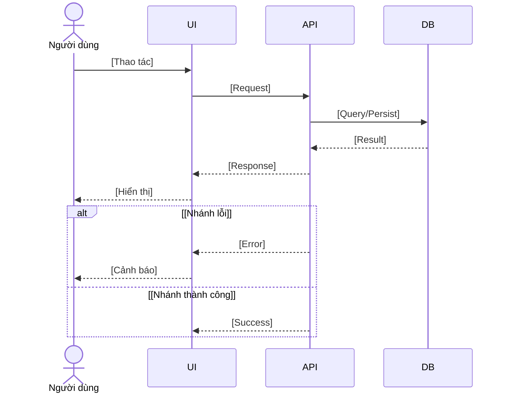
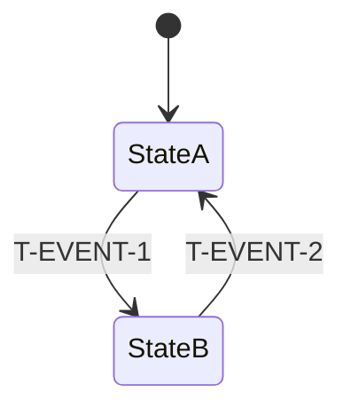
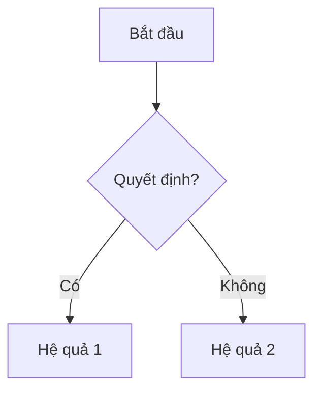
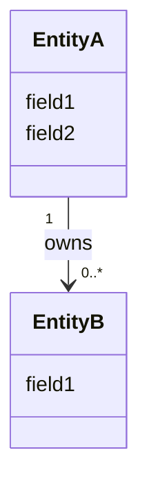

# Gói đặc tả — {{TICKET}} ({{FEATURE_NAME}})

> Tạo: [YYYY-MM-DD] · Giai đoạn: Phase 1 — Spec Pack
> **Nguồn tham chiếu duy nhất cho thay đổi này sau khi được review.**
> Không triển khai bất kỳ nội dung nào không được viết ở đây. Các điểm chưa rõ phải được xử lý như Open Issues.

---

## 1. Bối cảnh / Mục đích

<!-- Hiện trạng hệ thống có gì, vì sao cần thay đổi, ticket này bổ sung/đổi cái gì. Viết theo hướng thuần nghiệp vụ. -->

Mục đích nghiệp vụ:

-
-

## 2. Phạm vi

### 2.1 Trong phạm vi

-

### 2.2 Ngoài phạm vi

-

## 3. Thuật ngữ

| #   | Thuật ngữ | Định nghĩa |
| --- | --------- | ---------- |
| 1   |           |            |

<!-- Nếu có nhiều khái niệm dễ nhầm (vd. condition A vs condition B), bổ sung bảng phân biệt. -->

| Khái niệm | Trả lời câu hỏi | Tác dụng |
| --------- | --------------- | -------- |
|           |                 |          |

## 4. Hiện trạng / Trạng thái mục tiêu

| #   | Khía cạnh | Hiện trạng | Trạng thái mục tiêu |
| --- | --------- | ---------- | ------------------- |
| 1   |           |            |                     |

## 5. Chi tiết đặc tả

**Index các sub-section + namespace tra cứu:**

| #   | Chủ đề            | Câu hỏi nghiệp vụ            | Rule namespace    | Transitions liên quan |
| --- | ----------------- | ---------------------------- | ----------------- | --------------------- |
| 5.0 | Rule matrix tổng  | Toàn bộ rule cứng + AC trace | (tất cả)          | —                     |
| 5.1 | [Topic 1]         |                              | `R-[NS]-*`        | `T-*`                 |
| 5.2 | State transitions | Sự kiện nào gây hệ quả nào?  | — (state machine) | (tất cả `T-*`)        |
| 5.3 | [Topic 3]         |                              | `R-[NS]-*`        |                       |

**Cấu trúc chuẩn mỗi sub-section:** Mục tiêu → UI/Wireframe (nếu có) → Sự kiện→Hệ quả (trỏ [5.2](#52-state-transitions)) → Ví dụ [Happy/Edge/Error] → OI liên quan.

Rule trace tra ở [5.0](#50-rule-matrix-tổng) theo namespace ở bảng trên — sub-section không lặp lại. Phần nào không áp dụng ghi `N/A` thay vì bỏ trống.

### 5.0 Rule matrix tổng

**Mục tiêu:** Tập trung toàn bộ rule cứng tại một bảng duy nhất kèm trace AC, loại test và OI liên quan. Sub-section còn lại chỉ giải thích, ví dụ, UI — không lặp lại rule, AC hay test type.

ID rule được đặt theo namespace ngữ nghĩa (`R-[NS1]`, `R-[NS2]`, ...) đồng bộ với namespace AC ở [§7](#7-tiêu-chí-chấp-nhận).

> **Single source of truth:** Bảng 5.0 là nơi duy nhất khai báo trace `Rule → AC → Test → OI`. §7 là _view_ liệt kê đầy đủ AC text theo namespace, không lặp lại cột Test.

#### [Namespace 1] (R-[NS1])

| ID        | Rule | AC  |
| --------- | ---- | --- |
| R-[NS1]-1 |      |     |

#### [Namespace 2] (R-[NS2])

| ID        | Rule | AC  |
| --------- | ---- | --- |
| R-[NS2]-1 |      |     |

### 5.1 [Topic 1]

**Mục tiêu:** <!-- Mục tiêu của sub-section -->

**UI/Wireframe (nếu có):**

```text
+-----------------------------------------+
| Tiêu đề màn hình                        |
|-----------------------------------------|
| Vùng ①  | Vùng ②                        |
|         |                               |
+-----------------------------------------+
```

| Vùng | Tên | Trace |
| ---- | --- | ----- |
| ①    |     |       |

**UI states cần thiết kế (checklist designer):**

| #   | State | Ghi chú |
| --- | ----- | ------- |
| 1   |       |         |

**Message lỗi cần xử lý:**

**Luồng end-to-end:**



**Ví dụ:**

- **[Happy]**
- **[Edge]**
- **[Error]**

**OI:** [OI-{{TICKET}}-XXX](#8-các-vấn-đề-mở).

### 5.2 State transitions

**Mục tiêu:** Tập trung toàn bộ sự kiện gây hệ quả nghiệp vụ tại một bảng để tránh lệch giữa các sub-section. Mọi sub-section khi nhắc đến "sự kiện → hệ quả" đều trỏ về đây.

**State diagram:**



**Bảng state × thuộc tính (đặc tả từng state):**

| State  | Mô tả | [Thuộc tính 1] | [Thuộc tính 2] | Transitions hợp lệ |
| ------ | ----- | -------------- | -------------- | ------------------ |
| StateA |       |                |                |                    |
| StateB |       |                |                |                    |

**Bảng state transition (Event × Mode × Effect):**

| #   | ID        | Sự kiện | Mode áp dụng | Hệ quả bắt buộc | Trace |
| --- | --------- | ------- | ------------ | --------------- | ----- |
| 1   | T-EVENT-1 |         |              |                 |       |

**UI/Wireframe:** N/A.

**Ví dụ:** N/A (xem sub-section gọi transition tương ứng).

**OI:**

### 5.3 [Topic tiếp theo]

**Mục tiêu:** <!-- Rule/Transition: tra [5.0](#50-rule-matrix-tổng) (`R-[NS]-*`) và [5.2](#52-state-transitions) (`T-*`). -->

**UI/Wireframe:**



**Ví dụ:**

- **[Happy]**
- **[Error]**

**OI:**

### 5.4 [Cấu trúc dữ liệu / Schema]

**Mục tiêu:** Định nghĩa schema, validation. Rule: tra [5.0](#50-rule-matrix-tổng) (`R-[NS]-*`).

**Class diagram — schema chi tiết:**



**Validation rules:**

| #   | Field | Rule | Lý do nghiệp vụ | Trace |
| --- | ----- | ---- | --------------- | ----- |
| 1   |       |      |                 |       |

**Ví dụ:**

- **[Happy]**
- **[Error]**
- **[Edge]**

**OI:**

## 6. Yêu cầu phi chức năng

| #   | Danh mục          | Yêu cầu |
| --- | ----------------- | ------- |
| 1   | Hiệu năng         |         |
| 2   | Bảo mật           |         |
| 3   | Tính sẵn sàng     |         |
| 4   | Khả năng quan sát |         |
| 5   | Khả năng sử dụng  |         |
| 6   | Khả năng kiểm thử |         |

## 7. Tiêu chí chấp nhận

> **View của §5.0.** Bảng này chỉ liệt kê AC text đầy đủ theo namespace. Trace `Rule → Test → OI` lookup tại [§5.0](#50-rule-matrix-tổng).
> Cột Test dùng 4 cột tách rời (UT/IT/E2E/BB) — `✓` nghĩa là test loại đó **bắt buộc** cho rule này.

### 7.1 [Feature group 1] (AC-[NS1])

| ID            | Mô tả | UT  | IT  | E2E | BB  |
| ------------- | ----- | --- | --- | --- | --- |
| AC-[NS1]-1/v1 |       |     |     |     |     |
| AC-[NS1]-2/v1 |       |     |     |     |     |

### 7.2 [Feature group 2] (AC-[NS2])

| ID            | Mô tả | UT  | IT  | E2E | BB  |
| ------------- | ----- | --- | --- | --- | --- |
| AC-[NS2]-1/v1 |       |     |     |     |     |

### 7.3 Không hồi quy (AC-REG)

| ID          | Mô tả | UT  | IT  | E2E | BB  |
| ----------- | ----- | --- | --- | --- | --- |
| AC-REG-1/v1 |       |     |     |     |     |

## 8. Các vấn đề mở

| #   | ID                | Câu hỏi | Ưu tiên | Người phụ trách | Hạn chót             |
| --- | ----------------- | ------- | ------- | --------------- | -------------------- |
| 1   | OI-{{TICKET}}-001 |         | P0      | Product/BA      | Trước implementation |
| 2   | OI-{{TICKET}}-002 |         | P1      | Product/BA      | Trước test design    |
| 3   | OI-{{TICKET}}-003 |         | P2      | Product/BA      | Trước UAT            |

## 9. Rủi ro

| #   | Rủi ro | Khả năng xảy ra | Mức độ ảnh hưởng | Biện pháp giảm thiểu |
| --- | ------ | --------------- | ---------------- | -------------------- |
| 1   |        |                 |                  |                      |

---

## 10. Bảng truy vết

| #   | AC            | Màn hình/API | DB  | Logs | Quyền | Loại kiểm thử |
| --- | ------------- | ------------ | --- | ---- | ----- | ------------- |
| 1   | AC-[NS1]-1/v1 |              |     |      |       | UT · BB       |

---

## 11. Phán định implementation readiness

**Chỉ với Spec Pack này đã có thể bắt đầu implementation chưa? — [Yes / No].**

Lý do:

-
-
-

## 12. Thứ tự ưu tiên Open Issues cần con người quyết định

1. **P0 — OI-{{TICKET}}-XXX:** <!-- Câu hỏi cần chốt -->
2. **P0 — OI-{{TICKET}}-XXX:**
3. **P1 — OI-{{TICKET}}-XXX:**
4. **P2 — OI-{{TICKET}}-XXX:**
